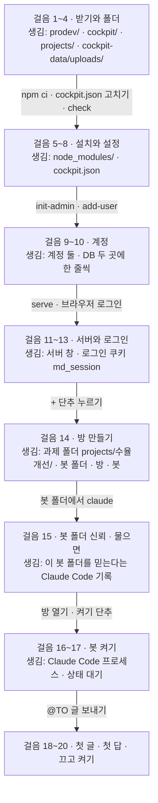
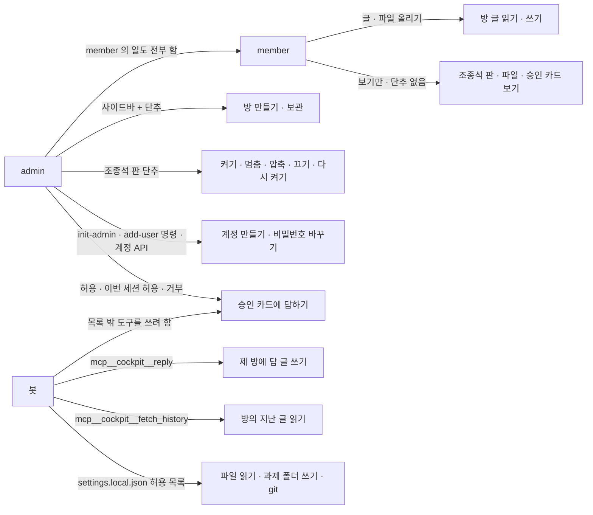
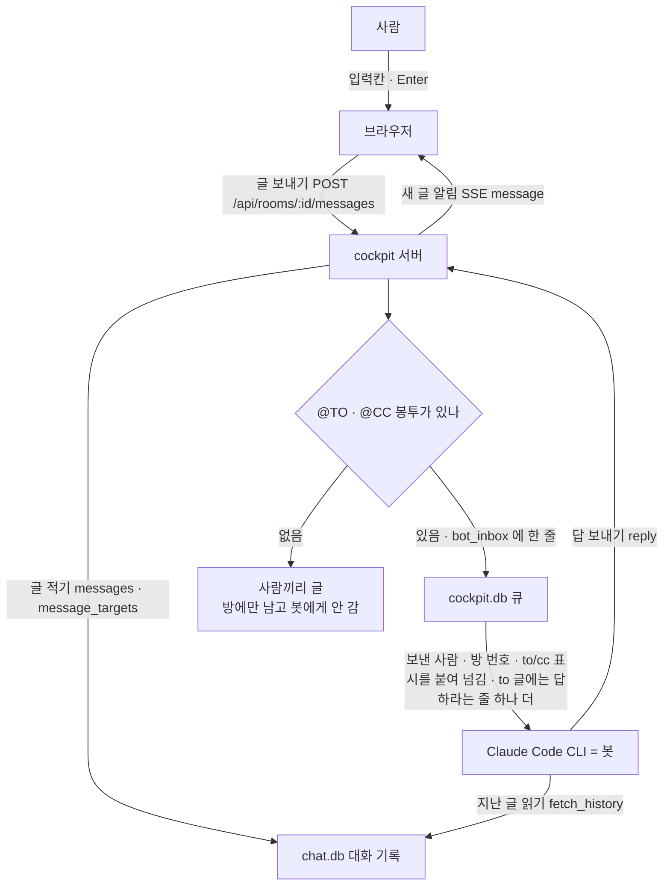

# cockpit

cockpit 은 **prodev 봇 세션을 붙들고, 사람이 브라우저로 들어와 채팅 · 진행 보기 · 승인을 하는 웹 앱**입니다.
봇은 Claude Code 세션입니다. cockpit 서버가 그 세션을 대신 켜 두고, 사람의 글을 넣어 주고, 봇의 답을 방에 옮겨 줍니다.

이 문서는 `git clone` 부터 봇의 첫 답을 받을 때까지를 순서대로 적습니다. **3절의 걸음 1 부터 걸음 20 까지 위에서부터 따라 하세요.**
걸음은 "걸음 7" 처럼, 문서의 절은 "7절" 처럼 부릅니다. 괄호 속 `ADR-015` 같은 번호는 "왜 이렇게 정했는지" 적은 기록의 번호라서, 몰라도 따라 하는 데 지장이 없습니다.

## 1. 먼저 알아 둘 말

### 1.1 용어 아홉
| 말 | 뜻 | 예 |
|---|---|---|
| **봇** | 과제마다 하나 있는 Claude Code 세션의 이름입니다. 봇 폴더(`prodev/bots/…`)에서 돌아갑니다 | `prodev-수율개선-bot` |
| **방** | 채팅 창 하나입니다. 과제 하나에 방 하나입니다. 폴더가 아니라 DB 파일 `chat.db` 안의 한 줄입니다 (ADR-015) | `prodev-수율개선` |
| **봉투** (`@TO` · `@CC`) | 글 안에 적는 "받는 봇" 표시입니다. `@TO(봇)` 은 "답해 주세요", `@CC(봇)` 은 "참고만 하세요" 입니다. 봉투가 없는 글은 봇에게 가지 않습니다 (ADR-018) | `@TO(prodev-수율개선-bot) 안녕하세요` |
| **승인 카드** | 봇이 허용 목록 밖의 도구를 쓰려 할 때 조종석 판에 뜨는 카드입니다. admin 이 `허용` · `이번 세션 허용` · `거부` 중 하나를 누릅니다. 10분 동안 답이 없으면 거부됩니다 (ADR-009) | 방에 `🔒 Bash 요청 · …` |
| **조종석 판** | 방 화면 오른쪽의 접이식 칸입니다. 안에 셋이 있습니다: 승인 카드 · 조종석(상태 · 모델 · 계정 · 값 · 문맥 · 도구 호출 · 단추) · 파일 (ADR-019) | 위쪽의 `조종석` 단추로 접고 폅니다 |
| **세션** | 봇 하나의 살아 있는 대화입니다. 상태는 여섯입니다: `꺼짐` · `켜는 중` · `대기` · `일하는 중` · `승인 대기` · `오류` | 조종석 판의 "상태" 칸 |
| **압축** | 대화가 길어지면 앞부분을 요약해 줄이는 일입니다. 조종석 판의 `압축` 단추로 하거나, 봇 설정이 자동으로 합니다 | 방에 `문맥을 정리 중입니다. 곧 이어서 합니다.` |
| **이어 붙기** (resume) | 서버를 껐다 켜도 같은 대화를 이어 가는 일입니다. resume 은 "이어서 하기" 라는 뜻의 영어입니다 | 서버 창에 `resume 수율개선 → …` |
| **과제 폴더** | 봇이 자료를 읽고 쓰는 폴더입니다. `projects` 폴더 안의 과제 이름 폴더이고, git 으로 기록이 남습니다 | `projects/수율개선/house.md` |

### 1.2 그 밖에 나오는 말
| 말 | 한 줄 풀이 |
|---|---|
| prodev | cockpit 과 짝인 저장소입니다. 봇의 지침 · 스킬 · 훅과, 과제마다 봇 폴더를 만드는 `scripts/setup.js` 가 들어 있습니다 |
| 도구 | 봇이 할 수 있는 일 하나입니다. 예: 파일 읽기(`Read`), 명령 치기(`Bash`), 방에 답 쓰기(`reply`) |
| 턴 | 봇이 글을 받고 한 번 일하는 차례입니다 |
| 문맥 | 봇이 지금 기억하고 있는 대화의 양입니다. 조종석 판에 퍼센트로 보입니다 |
| 사이드바 · 방 머리 · 봇 칩 | 사이드바는 화면 왼쪽의 방 목록 칸, 방 머리는 방 제목 줄, 봇 칩은 방 머리에 붙은 봇 이름표(`⚪` 꺼짐 · `🟢` 켜짐)입니다 |
| SDK | 프로그램이 Claude Code 를 부를 수 있게 해 주는 부품 묶음입니다 (ADR-001) |
| MCP | 봇에게 "방에 답 쓰기" 같은 새 도구를 달아 주는 방식입니다. cockpit 은 `mcp__cockpit__reply` · `mcp__cockpit__fetch_history` 둘을 답니다 |
| SSE | 서버가 브라우저로 새 소식을 계속 밀어 보내는 길입니다 (ADR-012) |
| API | 화면 대신 명령으로 서버에게 일을 시키는 주소입니다. 예: `POST /api/accounts` |
| 쿠키 | 브라우저가 "이 사람은 로그인했다" 를 기억하는 작은 표입니다. cockpit 의 쿠키 이름은 `md_session` 이고 7일 동안 유효합니다 |
| CSP | 브라우저에게 "이 사이트의 파일에 든 스크립트만 실행하라" 고 알리는 보안 규칙입니다 |
| 훅 | 정해진 순간(켤 때 · 압축 직전 · 답 보내기 직전)에 자동으로 도는 작은 프로그램입니다. 봇 폴더의 `.claude/settings.json` 에 적힙니다 |

## 2. 준비

### 2.1 명령을 치는 창 열기
- **맥:** 응용 프로그램 → 유틸리티 → **터미널** 을 엽니다. 이 문서에서 "맥 (터미널)" 이라고 적힌 칸을 칩니다.
- **윈도우:** 시작 메뉴에서 **PowerShell** 을 검색해 엽니다. **명령 프롬프트(cmd) 가 아닙니다.** "윈도우 (PowerShell)" 칸을 칩니다. 명령은 한 줄에 하나씩 칩니다. 긴 명령을 줄 끝 백틱(`` ` ``, 숫자 1 왼쪽 글쇠)으로 다음 줄에 이어 쓰지 않습니다. 붙여 넣을 때 깨진 적이 있습니다.
- 한 창에서 서버를 띄우면 그 창은 서버가 차지합니다. 그 뒤의 명령은 **새 창**에서 칩니다. 새 창은 어느 폴더에서 열어도 됩니다.

### 2.2 필요한 것 다섯
아래 "확인" 명령을 쳐서 기대 출력이 나오는지 먼저 보세요. 다르면 표 아래의 설치 방법을 따릅니다.

| # | 무엇 | 확인 (맥 · 윈도우 같음) | 이렇게 보이면 됨 |
|---|---|---|---|
| 1 | **Node 22.13 이상** | `node -v` | `v22.13.0` 이상 (예 `v24.14.0`) |
| 2 | **Git** | `git --version` | `git version 2.` 로 시작하는 줄 |
| 3 | **Claude Code 설치 + 로그인** | `claude --version` | 버전 한 줄 (예 `2.1.270 (Claude Code)`) |
| 4 | **prodev 와 cockpit 이 같은 부모 폴더 안에 나란히** | 걸음 3 에서 확인합니다 | — |
| 5 | **공백 없는 경로** | 걸음 1 에서 확인합니다 | — |

- **Node 가 없거나 낮으면:** 공식 사이트 **nodejs.org** 에서 LTS 를 받아 깝니다. `npm`(부품을 받아 까는 도구)도 같이 깔립니다. 무엇이든 새로 깔았으면 **창을 새로 열어야** 방금 깐 명령을 찾습니다.
- **Git 이 없으면:** 공식 사이트 **git-scm.com** 에서 받아 깝니다. 윈도우의 Git 에는 봇이 쓰는 명령 창 Git Bash 가 같이 들어 있습니다.
- **Claude Code 가 없으면:** 맥은 `curl -fsSL https://claude.ai/install.sh | bash`, 윈도우는 `irm https://claude.ai/install.ps1 | iex` 를 칩니다 (cockpit · prodev 를 담는 상위 저장소 crew-workspace 의 `README.md` "무엇이 필요한가" · `docs/INSTALL-WINDOWS.md` 3번). **설치가 끝나면 창을 닫고 새로 연 뒤** `claude --version` 을 봅니다. 그다음 `claude` 를 한 번 켜서 화면 안내대로 로그인하고 `/exit` 로 나옵니다. cockpit 은 로그인을 미리 검사하지 않고, 로그인이 없으면 걸음 17 의 켜기가 `오류` 가 됩니다.
- 윈도우 회사 PC 의 더 자세한 준비(Git Bash 자리 · 프록시 등)는 `docs/INSTALL-WINDOWS.md` 에 있습니다.
- (참고) 봇이 xlsx · 그림 · 분석 일을 하려면 `python3` 도 있어야 합니다. 없어도 첫 답까지는 갑니다.
**윈도우만 한 가지 더:** 새 PowerShell 창에서 `(Get-Command claude).Source` 를 칩니다. `C:\Users\나\.local\bin\claude.exe` 같은 긴 줄이 나옵니다. **이 줄을 메모장에 복사해 두세요.** 걸음 7 에서 씁니다. 윈도우에서는 이 값이 반드시 있어야 합니다. 맥은 필요 없습니다.

## 3. 설치 걸음

### 3.1 걸음 지도
이 그림은 걸음들을 차례로 밟을 때 무엇(폴더 · DB · 계정 · 방 · 봇)이 생기는지 보여 줍니다.



읽는 법:
- 맨 위 `걸음 1~4` 에서 시작해 화살표를 따라 아래로 내려갑니다. 화살표에는 그 사이에 치는 명령이나 누르는 단추가, 네모에는 그 결과로 생긴 것이 적혀 있습니다.
- 눈여겨볼 화살표는 `+ 단추 누르기` 입니다. 누르면 cockpit 이 속에서 `POST /api/rooms` 로 prodev 의 `setup.js` 를 부릅니다. setup.js 가 **먼저** 성공해야 방과 봇이 생기고, 실패하면 만든 것을 되돌립니다 (ADR-017).

**처음 해 볼 때는 자리를 바꾸지 마세요.** 아래 예는 맥 `~/work/crew-workspace`, 윈도우 `C:\work\crew-workspace` 입니다. DB 와 첨부는 코드 폴더 밖에 따로 두려고 맥 `~/cockpit-data`, 윈도우 `C:\cockpit-data` 에 둡니다.

### 걸음 1 — 작업 폴더를 만듭니다
**맥 (터미널)**
```
mkdir -p ~/work/crew-workspace && cd ~/work/crew-workspace && pwd
```
**윈도우 (PowerShell)**
```
New-Item -ItemType Directory -Force -Path C:\work\crew-workspace | Out-Null
cd C:\work\crew-workspace
(Get-Location).Path
```
이렇게 보이면 됨: 맥은 `/Users/<내 이름>/work/crew-workspace`, 윈도우는 `C:\work\crew-workspace`. **이 줄에 빈칸이 없어야 합니다.** 빈칸이 있으면 봇의 명령이 조용히 깨집니다.

### 걸음 2 — prodev 를 받습니다
**맥 · 윈도우 같음** (걸음 1 의 창에서)
```
git clone https://github.com/bjw202/prodev.git
```
이렇게 보이면 됨: `Cloning into 'prodev'...` 와 받는 중 숫자 몇 줄 뒤에 프롬프트가 돌아옵니다. 아이디 · 비밀번호를 물으면 저장소를 볼 권한이 없는 것입니다.

### 걸음 3 — cockpit 을 받습니다
**아래 `https://…` 주소는 모양만 보여 주는 예입니다. 그대로 치지 말고, PL(과제 담당자)이 알려 준 주소로 바꿔 칩니다.** 원격 저장소(인터넷에 올려 둔 저장소)가 아직 없으면 아래 "이미 받은 폴더가 있을 때" 를 따릅니다.
**맥 · 윈도우 같음** (주소를 바꿔서)
```
git clone https://github.com/bjw202/cockpit.git cockpit
cd cockpit
```
**이미 받은 cockpit 폴더가 다른 자리에 있을 때** (로컬 경로 복제) — 첫 줄만 아래로 바꾸고 `cd cockpit` 은 같습니다. 예: 받은 폴더가 `/Users/hong/Downloads/crew-workspace/cockpit` 이면 `<이름>` 은 `hong`, `…` 은 `Downloads` 입니다.
**맥 (터미널)**
```
git clone /Users/<이름>/…/crew-workspace/cockpit cockpit
```
**윈도우 (PowerShell)** — 탐색기로 그 폴더를 `C:\work\crew-workspace` 안에 `cockpit` 이름으로 복사해도 됩니다.
```
git clone C:/Users/<이름>/…/crew-workspace/cockpit cockpit
```
이렇게 보이면 됨: `Cloning into 'cockpit'...`. 이어서 prodev 가 나란히 있는지 봅니다: 맥 `ls ../prodev/scripts/setup.js` 가 그 경로 한 줄, 윈도우 `Test-Path ..\prodev\scripts\setup.js` 가 `True`.

### 걸음 4 — DB · 첨부 폴더와 과제 폴더를 만듭니다
이 폴더들은 미리 있어야 합니다.
**맥 (터미널)**
```
mkdir -p ~/cockpit-data/uploads ~/work/crew-workspace/projects
```
**윈도우 (PowerShell)**
```
New-Item -ItemType Directory -Force -Path C:\cockpit-data\uploads | Out-Null
New-Item -ItemType Directory -Force -Path C:\work\crew-workspace\projects | Out-Null
```
이렇게 보이면 됨: 맥 `ls ~/cockpit-data` 가 `uploads`, 윈도우 `Test-Path C:\cockpit-data\uploads` 가 `True`.

### 걸음 5 — 부품을 깝니다
cockpit 폴더에서 칩니다. 창을 새로 열었다면 먼저 `cd ~/work/crew-workspace/cockpit`(윈도우 `cd C:\work\crew-workspace\cockpit`).
**맥 · 윈도우 같음**
```
npm ci
```
이렇게 보이면 됨: `added … packages` 줄. `npm warn` 줄은 괜찮고, `npm error` 로 시작하는 줄이 나오면 멈춥니다.

### 걸음 6 — 설정 파일을 복사합니다
**맥 (터미널)**
```
cp cockpit.example.json cockpit.json
```
**윈도우 (PowerShell)**
```
Copy-Item cockpit.example.json cockpit.json
```
이렇게 보이면 됨: 맥 `ls cockpit.json` 이 `cockpit.json`, 윈도우 `Test-Path cockpit.json` 이 `True`.

### 걸음 7 — 설정을 이 PC 에 맞게 고칩니다
맥은 `open -e cockpit.json`(텍스트 편집기), 윈도우는 `notepad cockpit.json` 으로 엽니다.
복사한 파일에는 윈도우 예의 값이 들어 있습니다. **맥의 `claudePath` 한 줄만 예외로 하고, 경로가 든 줄의 값만 바꿉니다.** 따옴표 · 쉼표 · 나머지 줄(`host` · `port` 등)은 그대로 두고 따옴표를 새로 치지 마세요. 줄 순서는 아래 예와 달라도 됩니다. 다 고치면 Ctrl+S(맥 command+S)로 저장합니다.
**맥** — `echo $HOME` 이 `/Users/hong` 을 내면 `<이름>` 은 `hong` 입니다. 예외인 `claudePath` 는 값을 따옴표째 지우고 `null` 로 둡니다. 그러면 걸음 5 의 `npm ci` 가 함께 받은 Claude Code 실행 파일을 씁니다. 로그인은 2.2절에서 이 PC 에 한 것을 그대로 쓰므로, 2.2절의 설치 · 로그인은 맥에서도 필요합니다:
```json
{
  "claudePath":  null,
  "prodevDir":   "/Users/<이름>/work/crew-workspace/prodev",
  "botsDir":     "/Users/<이름>/work/crew-workspace/prodev/bots",
  "projectsDir": "/Users/<이름>/work/crew-workspace/projects",
  "uploadsDir":  "/Users/<이름>/cockpit-data/uploads",
  "dataDir":     "/Users/<이름>/cockpit-data",
  "host": "127.0.0.1", "port": 3000, "maxSessions": 3, "approvalTimeoutMin": 10,
  "extraEnvKeys": [], "tls": null
}
```
**윈도우** — 자리를 안 바꿨다면 경로 다섯은 그대로입니다. `claudePath` 에는 2.2절에서 복사해 둔 줄을 넣되, **`\` 를 모두 `/` 로 바꿉니다:**
```json
{
  "prodevDir":   "C:/work/crew-workspace/prodev",
  "botsDir":     "C:/work/crew-workspace/prodev/bots",
  "projectsDir": "C:/work/crew-workspace/projects",
  "uploadsDir":  "C:/cockpit-data/uploads",
  "dataDir":     "C:/cockpit-data",
  "claudePath":  "C:/Users/pl/.local/bin/claude.exe",
  "host": "127.0.0.1", "port": 3000, "maxSessions": 3, "approvalTimeoutMin": 10,
  "extraEnvKeys": [], "tls": null
}
```
`botsDir` 는 반드시 `prodevDir` 끝에 `/bots` 를 붙인 값입니다. 키마다의 뜻은 9절에 있습니다.
이렇게 보이면 됨: 저장한 뒤 걸음 8 의 검사가 `✗` 를 내지 않습니다.

### 걸음 8 — 설정을 검사합니다
**맥 · 윈도우 같음**
```
node bin/cockpit.js check --config cockpit.json
```
이렇게 보이면 됨: **`✗` 로 시작하는 줄이 없고, 마지막 줄이 `✓ 경로 공백 없음`** 입니다. `·` 로 시작하는 줄은 알림이라 괜찮습니다. `✗` 가 있으면 7.5절을 봅니다.

### 걸음 9 — admin 계정을 만듭니다
admin 은 방을 만들고, 봇을 켜고, 승인 카드에 답하는 사람입니다.
처음 따라 할 때는 이름을 `김피엘` 그대로 써도 됩니다. 실제 과제에서는 과제 담당자(PL)의 이름을 쓰고, 나중에 과제 헌장(`charter.md`)을 두면 그 안의 `PL:` 과 글자가 같아야 합니다.
**맥 · 윈도우 같음**
```
node bin/cockpit.js init-admin 김피엘 --config cockpit.json
```
`비밀번호: ` 와 `한 번 더: ` 를 묻습니다. **치는 글자는 화면에 안 보입니다.** 8자 이상을 치고 Enter 를 누릅니다.
이렇게 보이면 됨: `admin 김피엘 (id 1) 을 만들었다`
두 번이 다르면 `오류: 두 비밀번호가 다르다`, 짧으면 `오류: 비밀번호는 8자 이상이어야 합니다` 가 나옵니다. 명령을 다시 칩니다.

### 걸음 10 — member 계정을 만듭니다
member 는 방에서 글을 읽고 쓰는 사람입니다. 첫 답까지는 없어도 되지만, 6절 시나리오 2 · 4 에서 씁니다.
**맥 · 윈도우 같음**
```
node bin/cockpit.js add-user 김과제 --config cockpit.json
```
걸음 9 와 똑같이 비밀번호를 두 번 묻습니다.
이렇게 보이면 됨: `member 김과제 (id 2) 을 만들었다`

### 걸음 11 — 서버를 띄웁니다
**맥 · 윈도우 같음**
```
node bin/cockpit.js serve --config cockpit.json
```
이렇게 보이면 됨: `cockpit 듣는 중 http://127.0.0.1:3000`. 그 뒤 창이 멈춘 것처럼 보이면 정상입니다. **이 창은 켜 두고 더 치지 않습니다.** 끄는 법은 걸음 20 에 있습니다.

### 걸음 12 — 서버가 대답하는지 봅니다
**새 창**을 열어 칩니다.
**맥 (터미널)**
```
curl -s http://127.0.0.1:3000/api/health
```
**윈도우 (PowerShell)**
```
Invoke-RestMethod http://127.0.0.1:3000/api/health
```
이렇게 보이면 됨: 맥은 `{"ok":true}`, 윈도우는 `ok` 줄 아래 `--` 줄, 그 아래 `True` 입니다.

### 걸음 13 — 브라우저로 로그인합니다
크롬 · 엣지 · 사파리의 주소창에 `http://127.0.0.1:3000` 을 치고 Enter → `사용자 이름` 에 `김피엘`, `비밀번호` 에 걸음 9 의 비밀번호 → `들어가기`.
이렇게 보이면 됨: 사이드바 위에 `방` 제목과 `+` 단추, 아래 계정 줄에 `김피엘` 이 보입니다. (`+` 는 admin 에게만 보입니다.) 화면에 가입 단추는 없습니다. 계정은 걸음 9 · 10 의 명령으로 만듭니다.

### 걸음 14 — `+` 로 방을 만듭니다
사이드바의 `+` → `새 방(과제) 이름` 칸에 `수율개선` → `확인`.
처음에는 `수율개선` 을 그대로 쓰세요. (규칙: 이름에 `/ \ ( )` 와 빈칸을 쓸 수 없고, 앞에 `prodev-` 를 붙이지 않습니다.)
cockpit 이 prodev 의 `setup.js` 를 불러 과제 폴더와 봇 폴더를 만듭니다. 길어야 60초입니다. 기다리는 동안 화면에 따로 기다림 표시는 없습니다. **`+` 를 다시 누르지 마세요.**
이렇게 보이면 됨: 사이드바에 `# prodev-수율개선` 이 생깁니다. **방은 저절로 열리지 않습니다.** 걸음 16 에서 엽니다.
실패하면 빨간 알림에 `setup 실패: …` 가 뜨고, 만든 것은 되돌려집니다 (7.2절).

### 걸음 15 — 봇 폴더를 신뢰합니다 (물으면)
방을 만들면 그 방의 봇 폴더가 새로 생깁니다. 그 봇 폴더에서 Claude Code 를 한 번 켜 봅니다. **이 폴더를 믿겠냐고 물으면 믿는다고 고릅니다.** 믿지 않은 폴더에서는 봇이 허용 목록을 못 써서 파일을 못 씁니다. 새 방을 만들 때마다 그 봇 폴더에서 이 걸음을 합니다. 걸음 12 에서 연 창을 써도 됩니다.
**맥 (터미널)**
```
cd ~/work/crew-workspace/prodev/bots/prodev-수율개선-bot
claude
```
**윈도우 (PowerShell)** — 한글 폴더 이름이 `?` 로 깨져 보이면 먼저 `chcp 65001` 을 칩니다.
```
cd C:\work\crew-workspace\prodev\bots\prodev-수율개선-bot
claude
```
믿겠냐고 물으면 믿는다는 쪽을 골라 Enter 를 누릅니다. 묻지 않으면 그대로 두고, 어느 쪽이든 `/exit` 로 나옵니다.
이렇게 보이면 됨: (확인하고 싶을 때만) 같은 자리에서 `claude` 를 다시 켜면 믿겠냐고 묻지 않습니다. `/exit` 로 나옵니다.

### 걸음 16 — 방을 엽니다
**브라우저로 돌아가** 사이드바의 `# prodev-수율개선` 을 누릅니다.
이렇게 보이면 됨: 입력칸에 `@TO(prodev-수율개선-bot) ` 가 미리 채워져 있고, 방 머리의 봇 칩이 `⚪ prodev-수율개선-bot`(꺼짐)입니다. 오른쪽 조종석 판은 admin 에게 펼쳐져 있습니다. member 에게는 접혀 있어서 위쪽 `조종석` 단추로 폅니다.

### 걸음 17 — 봇을 켭니다
조종석 판의 `켜기` 를 누릅니다 (admin 에게만 보입니다).
이렇게 보이면 됨: 상태가 `켜는 중` → `대기` 로 바뀌고, 봇 칩이 `🟢 prodev-수율개선-bot` 이 됩니다.
`오류: …` 가 뜨거나, 1분이 넘도록 `켜는 중` 이면 7.2절 표의 `오류` · `켜는 중` 줄을 봅니다.

### 걸음 18 — 첫 글을 보냅니다
입력칸에는 이미 `@TO(prodev-수율개선-bot) ` 가 있습니다. **그 뒤에** 아래 글만 붙입니다 (봉투를 또 넣지 않습니다):
```
안녕하세요. 이 과제 폴더에 어떤 폴더와 파일이 있는지 짧게 알려 주세요.
```
Enter 로 보냅니다 (Shift+Enter 는 줄바꿈).
이렇게 보이면 됨: 방에 내 글이 뜨고, 상태가 `일하는 중` 이 되며, 봇 칩 뒤에 `(입력 중…)` 이 붙습니다.
봇이 꺼져 있을 때 보낸 글도 사라지지 않습니다. 기다렸다가 켜지면 배달됩니다.

### 걸음 19 — 첫 답을 받습니다
이렇게 보이면 됨: 방에 `prodev-수율개선-bot` 이름과 `BOT` 표시가 붙은 글이 뜹니다. 조종석 판의 "이번 턴 도구 호출" 에 `reply` 줄이 생기고, 상태는 다시 `대기` 입니다.
몇 분이 지나도 `일하는 중` 에서 안 바뀌면 7.2절 표의 `일하는 중` 줄을 봅니다. 판의 "값" 칸(`$0.01 추정치` 꼴)은 SDK 가 계산한 추정치이고 청구서가 아닙니다.

### 걸음 20 — 서버를 끄고 다시 켭니다
걸음 11 의 서버 창에서 Ctrl+C 를 누릅니다 (맥도 command 가 아니라 **control** + C).
이렇게 보이면 됨: `끄는 중 — 세션 상태는 그대로 두고 다음 기동에 resume 한다`
같은 창에서 걸음 11 명령을 다시 치면 `cockpit 듣는 중 …` 다음에 `resume 수율개선 → …` 줄이 나옵니다. 브라우저는 보통 새로고침(F5)만 합니다. 방에서 `@TO(prodev-수율개선-bot) 방금 제가 무엇을 물었나요?` 를 보내 보면 이어 붙었는지 볼 수 있습니다.

## 4. 누가 무엇을 하나

이 그림은 admin · member · 봇이 각각 할 수 있는 일을 보여 줍니다.



읽는 법:
- 왼쪽의 `admin` 과 `봇` 에서 시작해 오른쪽의 할 일로 갑니다. `admin` 은 `member` 로도 이어져, member 의 일도 모두 합니다.
- 눈여겨볼 네모는 `승인 카드에 답하기` 입니다. 봇의 `목록 밖 도구를 쓰려 함` 과 admin 의 답이 여기서 만납니다. 봇 혼자서는 허용 목록 밖의 도구를 못 씁니다 (ADR-006 · `src/permissions/relay.js:63-95`).

## 5. 글 하나가 가는 길

이 그림은 사람이 쓴 글이 방을 거쳐 봇에게 가고 답이 돌아오는 길을, 봉투가 있을 때와 없을 때로 나눠 보여 줍니다.



읽는 법:
- 맨 위 `사람` 에서 시작해 `cockpit 서버` 다음의 마름모 `봉투가 있나` 에서 둘로 나뉩니다.
- 봉투가 **없으면** `사람끼리 글` 에서 끝나고 봇의 턴이 생기지 않습니다.
- 봉투가 **있으면** 큐를 거쳐 봇에게 갑니다. 이때 서버가 to 글에는 "reply 로 답하라" 는 줄을 붙여 넘깁니다. cc 글에 답하지 말라는 규칙은 세션을 켤 때 한 번 넣는 기본 지시문에 있습니다. 봇이 `reply` 로 답하면 서버가 `SSE message` 로 모든 브라우저에 새 글을 보여 줍니다.
- `chat.db` 의 `messages` 는 사람 글과 봇 답을, `message_targets` 는 그 글을 받을 봇 표시를 적는 표입니다.

### 5.1 봉투 규칙
| 쓴 글 | 결과 |
|---|---|
| `@TO(prodev-수율개선-bot) …` | 봇에게 갑니다. `reply` 로 답하라는 지시문이 함께 붙습니다 (`src/envelope/wrap.js:21`) |
| `@CC(prodev-수율개선-bot) …` | 봇에게 갑니다. 참고만 하고 답하지 말라는 지시문을 따릅니다 (`src/envelope/wrap.js:22`) |
| 봉투 없음 | 봇에게 안 갑니다. 입력칸 안내가 `봇에게 가지 않습니다 — 부르려면 @` 로 바뀝니다 |
| `@to(…)` · `@To(…)` (소문자) | 봉투로 안 칩니다. 봉투 없음과 같습니다. 대문자 `TO` · `CC` 만 됩니다 |
| `@TO(prodev 수율개선 bot)` (괄호 안에 빈칸) | 봉투로 안 칩니다. 봇 이름은 빈칸 · 괄호가 없어야 합니다 |
| `@TO(다른-봇)` | 보내기가 거절됩니다: `다른-봇 봇은 이 방에 초대되지 않았습니다` |
| 같은 봉투를 두 번 (`@TO(…) … @TO(…)`) | 두 번 모두 셉니다. 봇이 같은 글을 두 번 받습니다 |

봉투는 글 어디에 있어도 됩니다 (`src/envelope/mention.js` · `src/db/chat-db.js:176-197`).

## 6. 사용 시나리오

아래 입력 글에는 봉투까지 들어 있습니다. **입력칸을 먼저 모두 지운 뒤** 붙여 넣으세요. 봇은 켜져 있다고 가정합니다.
봇의 답 문장은 매번 다릅니다. "기대 결과" 는 cockpit 이 보장하는 화면 모양입니다.
member 로 들어가려면 계정 줄의 로그아웃 단추를 누르거나, 다른 브라우저(또는 시크릿 창)에서 `김과제` 로 로그인합니다. 시나리오 4 는 admin 창과 member 창을 나란히 두면 좋습니다.

### 시나리오 1 — 봇에게 묻기 (`@TO`)
```
@TO(prodev-수율개선-bot) house.md 에 무엇을 적는 파일인지 세 줄로 알려 주세요.
```
기대 결과: 상태가 `일하는 중` 이 되고, "이번 턴 도구 호출" 에 `Read` 같은 줄과 `reply` 줄이 생깁니다. 방에 `BOT` 표시가 붙은 답 글이 뜹니다.

### 시나리오 2 — 사람끼리 이야기한 뒤 봇이 따라잡기
1) `김과제` 로 들어가 입력칸을 비웁니다. 입력칸 왼쪽의 클립 단추(`파일 첨부`)로 아무 작은 파일(예 `yield.csv`)을 고르고, 아래 글과 함께 보냅니다:
```
어제 라인 3 수율 자료 올려요
```
2) 봉투 없이 한 줄 더 보냅니다:
```
B 로트가 좀 낮네요. 봇한테는 이따 물어볼게요
```
3) 이제 봇을 부릅니다:
```
@TO(prodev-수율개선-bot) 위에 올린 수율 자료 파일 봐 주세요. B 로트가 왜 낮은지 짐작 가는 게 있나요?
```
기대 결과: 1 · 2) 뒤에는 조종석 판에 새 턴이 **생기지 않습니다.** 3) 뒤에는 판에 `fetch_history` 줄이 생기고, 봇 답이 앞의 두 글과 파일 내용을 말합니다. 봇은 부른 글의 첨부만 바로 받고, 앞의 첨부는 따라잡기로 찾습니다 (ADR-020).

### 시나리오 3 — 참고만 시키기 (`@CC`)
```
@CC(prodev-수율개선-bot) 다음 주 월요일 회의는 오후 2시로 옮겼습니다.
```
기대 결과: 글이 봇에게 배달되어 조종석 판에 새 턴이 생깁니다. 봇은 세션을 켤 때 cockpit 이 한 번 넣는 기본 지시문(`delivery="cc"로 받은 메시지는 참고만 하고 절대 답변하지 마세요.`, `src/envelope/wrap.js:22` · `src/session/options.js:25`)에 따라 방에 답 글을 쓰지 않습니다.

### 시나리오 4 — 승인 카드에 답하기
```
@TO(prodev-수율개선-bot) Bash 로 curl --version 을 실행해서 나온 버전 번호를 알려 주세요.
```
기대 결과: `curl` 은 허용 목록(`Bash(git:*)` · `Bash(node:*)` 등)에 없습니다. 봇이 이 명령을 부르면:
1. 상태가 `승인 대기` 가 되고, 방에 `🔒 Bash 요청 · …` 줄이 뜹니다.
2. 조종석 판의 "승인 카드" 칸에 카드가 뜹니다. admin 창에는 `허용` · `이번 세션 허용` · `거부` 단추가, member 창에는 `admin 이 답합니다` 가 보입니다.
3. admin 이 `허용` 을 누르면 방에 `✅ 김피엘 허용 · Bash` 가 뜨고 봇이 이어서 일합니다. `거부` 면 `⛔ 김피엘 거부 · Bash` 입니다.
4. 10분 동안 아무도 안 누르면 `⛔ 시간 초과 거부 (10분) · Bash` 가 뜹니다.

봇이 다른 방법을 고르면 카드가 안 뜰 수도 있습니다. 그때는 실패가 아닙니다.

### 시나리오 5 — 대화 줄이기 (압축)
조종석 판의 `압축` 을 누릅니다 (admin, 봇이 켜져 있을 때).
기대 결과: 방에 `문맥을 정리 중입니다. 곧 이어서 합니다.` 가 뜨고, 끝나면 `정리가 끝났습니다. 이어서 하려면 말을 걸어 주세요.` 가 뜹니다. "문맥" 칸의 퍼센트가 줄어듭니다. 압축 중에 보낸 글은 끝날 때까지 기다렸다가 배달됩니다.

### 시나리오 6 — 봉투를 잘못 썼을 때
```
@TO(prodev-수율-bot) 안녕하세요
```
기대 결과: 글이 방에 올라가지 않고 빨간 알림에 `prodev-수율-bot 봇은 이 방에 초대되지 않았습니다` 가 뜹니다. 봉투 안의 이름을 봇 칩의 이름과 똑같이 고쳐 다시 보냅니다.

## 7. 막혔을 때

### 7.1 로그인이 안 됩니다
| 보이는 것 | 까닭 | 할 일 |
|---|---|---|
| `이름이나 비밀번호가 맞지 않습니다` | 계정이 없거나 비밀번호가 틀렸습니다. 둘을 가르지 않습니다 | 걸음 9 · 10 의 이름을 글자 그대로 칩니다. 잊었으면 8.3절로 바꿉니다 |
| `로그인은 됐지만 세션을 유지하지 못했습니다 — 브라우저 쿠키 설정을 확인하세요` | 쿠키가 저장되지 않았습니다 | 브라우저의 쿠키 차단을 풉니다. 설정에 `tls` 를 켰다면 `https://` 로 엽니다 |
| 문구 없이 로그인 화면으로 돌아감 | 쿠키가 없거나, 7일이 지났거나, 비밀번호가 바뀌어 쿠키가 지워졌습니다 | 다시 로그인합니다 |
| `다른 출처의 요청은 받지 않습니다` | 브라우저가 연 주소와 서버가 받은 주소가 다릅니다 (중간에 다른 서버를 거친 경우 등) | 서버 주소 그대로 엽니다 |
| 다른 PC 에서 접속이 아예 안 됨 | 기본 `host` 가 `127.0.0.1`(이 PC 만)입니다 | 사내망에 열지는 사람이 정합니다. 열기로 하면 `host` 를 `0.0.0.0` 으로 바꾸고 서버를 껐다 켭니다(걸음 20) |

### 7.2 봇이 안 뜹니다 (켜지지 않음 · 답이 없음)
| 보이는 것 | 까닭 | 할 일 |
|---|---|---|
| 조종석 판에 `오류: …` | Claude Code 가 못 떴습니다. 로그인이 없거나 실행 파일을 못 찾았을 수 있습니다. 문구는 세션을 멈춘 오류 메시지의 첫 줄입니다 | 2.2절의 `claude --version` 과 로그인을 다시 봅니다. 윈도우는 `claudePath` 를 봅니다 |
| `켜는 중` 이 1분 넘게 안 바뀜 | Claude Code 가 로그인 · 네트워크를 기다리고 있을 수 있습니다 | `끄기` → `켜기` 를 한 번 하고, 그래도 같으면 조종석 판에 보이는 상태 · 경고 글자와 누른 시각을 적어 PL 에게 줍니다 |
| `일하는 중` 이 몇 분 넘게 안 바뀜 | 봇이 긴 일을 하는 중이거나, 로그인 · 네트워크를 기다리고 있을 수 있습니다 | 조종석 판의 "이번 턴 도구 호출" 에 도는 줄이 있는지 봅니다. 아무 줄도 없으면 `끄기` → `켜기` 를 한 번 하고, 그래도 같으면 조종석 판에 보이는 상태 · 경고 글자와 누른 시각을 적어 PL 에게 줍니다 |
| 봇이 파일을 못 쓰고, 봇 첫 줄에 폴더를 신뢰하지 않았다는 영어 경고가 뜸 | 그 방의 봇 폴더를 믿지 않아 허용 목록이 무시됐습니다. 새로 만든 방마다 생길 수 있습니다 (cockpit · prodev 를 담는 상위 저장소 crew-workspace 의 `README.md`) | 그 방의 봇 폴더에서 걸음 15 를 합니다 |
| `동시 세션 상한 3 에 닿았다 — 다른 과제의 세션을 끄고 켜라` | 켜진 봇이 `maxSessions` 에 닿았습니다 | 다른 과제의 `끄기` 를 누르거나 설정을 올립니다 |
| 글을 보냈는데 턴이 안 생김 | ① 봉투가 없음 ② 봇이 꺼져 있음(글은 큐 `bot_inbox` 에 쌓임) ③ 압축 중 | ① 봉투를 붙입니다 ② `켜기` ③ 끝날 때까지 기다립니다 |
| 방 만들기 `setup 실패: setup.js 가 없다: …` | `prodevDir` 폴더는 있지만 그 안에 `scripts/setup.js` 가 없습니다. prodev 가 아닌 폴더를 가리키거나, `prodevDir` 를 빼서 `botsDir` 의 부모로 짐작한 자리에 setup.js 가 없는 경우입니다 | 걸음 8 의 검사를 돌려 `prodevDir` 줄을 보고, 걸음 2 에서 받은 `prodev` 폴더를 가리키게 고칩니다 |
| 방 만들기 `setup 실패: settings.local.json 이 안 생겼다: …` | setup.js 는 끝났는데 봇 폴더에 `settings.local.json` 이 없습니다. prodev 버전이 cockpit 버전과 맞지 않을 수 있습니다 | prodev 를 최신으로 당기고(10절 3번) 방을 다시 만듭니다. 그래도 같으면 빨간 알림 글자를 복사해 PL 에게 줍니다 |
| 방 만들기 `setup 실패: 시간 초과 60000ms` | setup 이 60초를 넘겼습니다 | 빨간 알림 글자를 복사해 PL 에게 줍니다 |
| `과제가 이미 있습니다: …` · `봇 폴더가 이미 있습니다: …` | 같은 이름이 있거나, 앞에서 실패한 봇 폴더가 `prodev/bots/` 에 남았습니다 | 다른 이름을 쓰거나, 남은 폴더를 PL 과 확인합니다 |
| `✗ 127.0.0.1:3000 에서 듣지 못했다 — …` | 다른 프로그램이 3000 번을 씁니다 (서버를 두 번 띄운 경우 포함) | 그 프로그램을 끄거나 `port` 를 바꿉니다 |

### 7.3 승인 카드가 안 옵니다
| 보이는 것 | 까닭 | 할 일 |
|---|---|---|
| 도구가 카드 없이 그냥 돎 | 그 도구가 봇 폴더 `.claude/settings.local.json` 의 허용 목록에 있습니다 | 정상입니다 |
| 허용 규칙을 넣었는데 카드가 또 옴 | 규칙을 `settings.json` 에 넣었습니다. 봇 세션은 `settings.json` 의 허용 목록을 읽지 않습니다 | `settings.local.json` 에 넣습니다. setup 을 다시 돌리면 덮이니 주의합니다 |
| 판에 카드가 안 보임 | 판은 **지금 연 방의 과제** 카드만 보여 줍니다. 판이 접혀 있으면 `조종석 (1)` 처럼 수만 붙고, 이 수는 모든 과제를 합친 수입니다 | 그 과제의 방을 열고 판을 폅니다 |
| 카드는 있는데 단추가 없음 | member 화면입니다 (`admin 이 답합니다`) | admin 으로 로그인합니다 |
| 방에 `⛔ 거둬 감 · <도구>` | 멈춤 · 끄기 · 다시 켜기 · 보관 · 서버 재시작이 기다리던 요청을 닫았습니다 | 봇에게 다시 시킵니다 |
| 누르면 `이미 답이 있습니다` | 다른 탭이나 다른 admin 이 먼저 답했습니다 | 할 일 없음. 카드는 곧 사라집니다 |

### 7.4 옛 화면이 보입니다
| 보이는 것 | 까닭 | 할 일 |
|---|---|---|
| 새 판(업데이트)을 받은 뒤에도 전과 같은 화면 | 서버를 다시 띄우지 않았을 수 있습니다 | 10절 6번(서버 다시 띄우기)을 확인합니다 |
| 새로고침을 해도 안 바뀐다고 느낌 | 화면 파일은 매번 서버에 "바뀌었나" 를 묻습니다(`no-cache` · `etag`). 강력 새로고침은 필요 없습니다 | 보통 새로고침(F5)을 한 번 합니다. 그래도 옛 모양이면 그 모양을 적어 둡니다 |
| 버튼이 아예 반응이 없음 | CSP 규칙(`script-src 'self'`) 때문에 페이지 안에 직접 쓴 스크립트는 막힙니다. 화면은 `web/boot.js` 파일로 켭니다 | F12 → Console 탭의 빨간 줄을 그대로 적어 둡니다 |

### 7.5 check 에 `✗` 가 나옵니다
| `✗` 줄 | 까닭 | 할 일 |
|---|---|---|
| `✗ node v… — node:sqlite 에 22.13 이상이 필요하다` | Node 가 낮습니다 | nodejs.org 에서 LTS 를 새로 깔고 창을 새로 엽니다 |
| `✗ (파일) 설정을 못 읽었다: …` | `cockpit.json` 이 없거나, 쉼표 · 따옴표가 틀렸습니다 | 걸음 6 · 7 을 다시 합니다 |
| `✗ <키> 절대 경로가 아니다: …` | `./data` 같은 짧은 경로입니다 | `/Users/…` · `C:/…` 로 시작하게 씁니다 |
| `✗ <키> 경로에 공백이 있다 (Git Bash 가 깨진다): …` | 경로에 빈칸이 있습니다 | 빈칸 없는 자리로 옮깁니다 |
| `✗ <키> 없다: …` | 그 폴더 · 파일이 없습니다 (`claudePath` 오타 포함) | 걸음 4 로 만들거나 오타를 고칩니다 |
| `✗ <키> 쓸 수 없다: …` | `uploadsDir` · `dataDir` 에 쓰기 권한이 없습니다 | 내 계정이 쓸 수 있는 자리로 옮깁니다 |
| `✗ botsDir <prodevDir>/bots 가 아니다: …` | 두 값의 짝이 틀렸습니다 | `botsDir` 를 `prodevDir` + `/bots` 로 씁니다 |
| `✗ prodevDir … — scripts/setup.js 가 없다` | `prodevDir` 가 prodev 폴더가 아닙니다 | 걸음 2 에서 받은 `prodev` 폴더를 가리킵니다 |
| `✗ claudePath 윈도우에서는 반드시 준다 (pathToClaudeCodeExecutable)` | 윈도우인데 `claudePath` 가 없습니다 | 2.2절 끝의 줄을 넣습니다 |
| `✗ claudePath 실행이 안 된다 (--version) — …` | 그 파일이 실행되지 않거나 30초를 넘겼습니다 | 2.2절의 설치 · 로그인부터 다시 봅니다 |
| `✗ maxSessions …` · `✗ port …` · `✗ approvalTimeoutMin …` · `✗ extraEnvKeys …` · `✗ tls.cert …` | 값의 모양이 틀렸습니다 | 9절 표의 모양으로 고칩니다 |

## 8. 계정 관리

계정은 `admin` 과 `member` 두 종류입니다. 비밀번호는 8자 이상이고, 원래 글자로 저장하지 않고 풀 수 없는 암호(scrypt 해시)로만 저장합니다 (ADR-011).

### 8.1 명령으로 만들기
| 할 일 | 친다 (맥 · 윈도우 같음, cockpit 폴더에서) | 이렇게 보이면 됨 |
|---|---|---|
| 첫 admin | `node bin/cockpit.js init-admin 김피엘 --config cockpit.json` | `admin 김피엘 (id 1) 을 만들었다` |
| member 더하기 | `node bin/cockpit.js add-user 김과제 --config cockpit.json` | `member 김과제 (id 2) 을 만들었다` |
| admin 더하기 | `node bin/cockpit.js add-user 이피엘 --role admin --config cockpit.json` | `admin 이피엘 (id 3) 을 만들었다` |

- `init-admin` 은 admin 이 이미 있으면 `✗ admin 이 이미 있다 — 계정은 add-user 로 더한다` 로 멈춥니다.
- 비밀번호는 화면에 안 보이게 두 번 묻습니다. 파이프로 주면 첫 줄 하나만 읽습니다.

### 8.2 계정 API 셋 (admin 로그인 쿠키가 있어야 합니다)
| 길 | 보내는 것 | 받는 것 |
|---|---|---|
| `GET /api/accounts` | — | `{"accounts":[{"id":1,"username":"김피엘","role":"admin","created_at":"…"}, …]}` |
| `POST /api/accounts` | `{"username":"박과제","password":"여덟자이상비번","role":"member"}` | 201 `{"id":3,"username":"박과제","role":"member"}` |
| `POST /api/accounts/:id/password` | `{"password":"새비밀번호1234"}` | `{"ok":true}` |

### 8.3 비밀번호 바꾸기
**비밀번호를 바꾸는 명령이나 화면 단추는 없습니다.** admin 이 위의 `POST /api/accounts/:id/password` 를 직접 불러야 합니다. 바꾸면 그 사람의 로그인이 모두 풀려 다시 로그인해야 합니다 (`src/auth/sessions.js:85-91`).

순서는 셋입니다: ① admin 으로 로그인해 쿠키를 받습니다 ② 계정 목록에서 바꿀 사람의 `id` 를 찾습니다(예 `"id":2,"username":"김과제"` 면 `2`) ③ `<바꿀 사람 id>` 자리에 그 수를 넣어 새 비밀번호를 보냅니다. `< >` 는 꺾쇠째 지우고 값을 넣습니다.
**맥 (터미널)**
```
curl -s -c ~/cockpit-cookie.txt -H 'content-type: application/json' -d '{"username":"김피엘","password":"<admin 비밀번호>"}' http://127.0.0.1:3000/api/auth/login
curl -s -b ~/cockpit-cookie.txt http://127.0.0.1:3000/api/accounts
curl -s -b ~/cockpit-cookie.txt -H 'content-type: application/json' -d '{"password":"새비밀번호1234"}' http://127.0.0.1:3000/api/accounts/<바꿀 사람 id>/password
rm ~/cockpit-cookie.txt
```
**윈도우 (PowerShell)**
```
$login = [System.Text.Encoding]::UTF8.GetBytes('{"username":"김피엘","password":"<admin 비밀번호>"}')
Invoke-RestMethod -Method Post -Uri http://127.0.0.1:3000/api/auth/login -ContentType 'application/json' -Body $login -SessionVariable ck
(Invoke-RestMethod -Uri http://127.0.0.1:3000/api/accounts -WebSession $ck).accounts
$pw = [System.Text.Encoding]::UTF8.GetBytes('{"password":"새비밀번호1234"}')
Invoke-RestMethod -Method Post -Uri http://127.0.0.1:3000/api/accounts/<바꿀 사람 id>/password -ContentType 'application/json' -Body $pw -WebSession $ck
```
이렇게 보이면 됨: 첫 줄 `{"ok":true,"user":{"id":1,"username":"김피엘","role":"admin"}}`, 둘째 줄 계정 목록, 마지막 `{"ok":true}` (윈도우는 `ok` 칸이 `True`). 로그인이 틀리면 `{"error":"이름이나 비밀번호가 맞지 않습니다"}`, 새 비밀번호가 짧으면 `{"error":"비밀번호는 8자 이상이어야 합니다"}` 입니다.

**admin 자신의 비밀번호를 잊었을 때:** 다른 admin 이 위 순서로 바꿔 줍니다. admin 이 한 명뿐이면, 서버 PC 에서 `node bin/cockpit.js session-token 김피엘 --config cockpit.json` 을 칩니다. 64자 한 줄이 나오는데, 이것이 로그인 쿠키 값입니다. 맥은 위 명령의 ① 을 건너뛰고 `-b ~/cockpit-cookie.txt` 대신 `-H "cookie: md_session=<64자 값>"` 을 붙여 ② · ③ 을 칩니다. 윈도우는 cockpit 폴더에서 아래 셋으로 쿠키를 만들고, ① 을 건너뛰어 ② · ③ 의 `-WebSession $ck` 를 그대로 씁니다:
```
$t = node bin/cockpit.js session-token 김피엘 --config cockpit.json
$ck = New-Object Microsoft.PowerShell.Commands.WebRequestSession
$ck.Cookies.Add((New-Object System.Net.Cookie('md_session', $t, '/', '127.0.0.1')))
```

## 9. 설정 키 표 (`cockpit.json`)

처음에는 걸음 7 의 예 그대로 두면 됩니다. 이 표는 무엇을 바꿀 수 있는지 볼 때 씁니다. 표에 없는 키는 검사 없이 그대로 실립니다. 긴 풀이는 `docs/ARCHITECTURE.md` 10절입니다. prodev `setup.js` 도 이 파일에서 `dataDir` · `uploadsDir` · `projectsDir` · `botsDir` 를 읽습니다.

| 키 | 뜻 | 기본값 | 꼭 적나 | 검사 · 오류 문구 |
|---|---|---|---|---|
| `prodevDir` | prodev 폴더. 방 만들기가 `<prodevDir>/scripts/setup.js` 를 부릅니다 | 없으면 `botsDir` 의 부모로 짐작 (check 가 `·` 한 줄로 알림) | 아니오 | 경로 검사. 짝이 틀리면 `botsDir <prodevDir>/bots 가 아니다: …` |
| `botsDir` | 봇 폴더들의 부모. 반드시 `<prodevDir>/bots` | — | 예 | `값이 없다` · `절대 경로가 아니다: …` · `경로에 공백이 있다 (Git Bash 가 깨진다): …` · `없다: …` |
| `projectsDir` | 과제 폴더들의 부모 · 파일 칸의 뿌리 · 봇 첨부의 뿌리 | — | 예 | 위와 같음 |
| `uploadsDir` | 사람 · 봇 첨부를 저장하는 자리 (사람이 올리는 파일은 하나 100MB 까지) | — | 예 | 위 + `쓸 수 없다: …` |
| `dataDir` | `chat.db` · `cockpit.db` 자리. DB 파일은 없으면 만듭니다 | — | 예 | 위 + `쓸 수 없다: …` |
| `claudePath` | Claude Code 실행 파일 (`pathToClaudeCodeExecutable`). 맥 · 리눅스는 비우면 SDK 에 들어 있는 것을 씁니다 | `null` | 윈도우만 예 | 경로 검사. 윈도우에 없으면 `윈도우에서는 반드시 준다 (pathToClaudeCodeExecutable)` |
| `maxSessions` | 동시에 켤 수 있는 봇 수 | `3` | 아니오 | `1 이상의 정수여야 한다: …` |
| `host` | 듣는 주소. 사내망에 열려면 `0.0.0.0` (사람이 정합니다) | `"127.0.0.1"` | 아니오 | 없음 |
| `port` | 듣는 포트 번호 | `3000` | 아니오 | `포트가 아니다: …` (1~65535) |
| `approvalTimeoutMin` | 승인 카드에 답이 없으면 거부하기까지의 분 | `10` | 아니오 | `0 보다 커야 한다: …` |
| `extraEnvKeys` | 봇 · setup 에 더 넘길 환경변수 이름 (예 회사 프록시 `["HTTPS_PROXY","HTTP_PROXY","NO_PROXY"]`). 봇에게는 허락된 이름의 환경변수만 넘깁니다 (ADR-007) | `[]` | 아니오 | `문자열 배열이어야 한다` |
| `tls` | `{"cert":"…","key":"…"}` 면 HTTPS 로 듣고 쿠키에 `Secure` 를 붙입니다 | `null` | 아니오 | `tls.cert` · `tls.key` 경로 검사 |

## 10. 새 판 받기 (업데이트)

처음 세울 때는 건너뜁니다. cockpit · prodev 에 새 판(업데이트)이 나왔을 때만 합니다. 차례는 `docs/INSTALL-WINDOWS.md` 의 "판 올리기" 절과 같습니다. `git pull --ff-only` 는 "내 폴더를 저장소의 새 판으로 앞으로만 당긴다" 는 뜻입니다.

| # | 할 일 | 맥 (터미널) | 윈도우 (PowerShell) | 이렇게 보이면 됨 |
|---|---|---|---|---|
| 1 | 서버 끄기 | 서버 창에서 control+C | 서버 창에서 Ctrl+C | `끄는 중 — 세션 상태는 그대로 두고 다음 기동에 resume 한다` |
| 2 | cockpit 당기기 | `cd ~/work/crew-workspace/cockpit` 다음 `git pull --ff-only` | `cd C:\work\crew-workspace\cockpit` 다음 `git pull --ff-only` | `Fast-forward` 또는 `Already up to date.` |
| 3 | prodev 당기기 | `cd ../prodev` 다음 `git pull --ff-only` | `cd ..\prodev` 다음 `git pull --ff-only` | 2번과 같음 |
| 4 | 부품 다시 깔기 | `cd ../cockpit` 다음 `npm ci` | `cd ..\cockpit` 다음 `npm ci` | `added … packages` |
| 5 | (prodev 의 봇 설정이 바뀌었을 때만, cockpit 폴더에서) 봇 설정 다시 쓰기 | `node ../prodev/scripts/setup.js --project <과제> --cockpit "$PWD/cockpit.json"` | `node ..\prodev\scripts\setup.js --project <과제> --cockpit C:\work\crew-workspace\cockpit\cockpit.json` | `씀  bots/prodev-<과제>-bot/.claude/settings.local.json …` 줄 |
| 6 | (cockpit 폴더에서) 서버 다시 띄우기 | `node bin/cockpit.js serve --config cockpit.json` | 같음 | `cockpit 듣는 중 http://127.0.0.1:3000` |
| 7 | 브라우저 | 보통 새로고침(F5) | 같음 | 새 화면 |

- 2 · 3번에서 `Not possible to fast-forward` 가 나오면 멈추고 그 출력을 복사해 PL 에게 줍니다.
- 5번의 `<과제>` 는 `수율개선` 같은 과제 이름으로 바꿉니다. 5번은 `settings.local.json` 을 **덮어씁니다.** 손으로 더한 허용 규칙은 사라집니다 (prodev ADR-038). 봇이 명령을 찾는 폴더 목록(PATH)에 `python3` 가 없으면 이 출력에 `!! 못 찾음: python3` 가 나옵니다.
- 6번에서 켜져 있던 봇은 이어 붙습니다. 앞 서버에서 답을 못 받은 승인 요청이 있으면 `앞 프로세스에서 답을 못 받은 승인 요청 N 건을 거둬 감으로 닫았다` 가 나옵니다.
- (v1 DB 를 이어 쓸 때만) 서버가 `! 옛 files 방 N 개 — migrate-v2 --apply 를 돌린다` 로 알립니다. `node bin/cockpit.js migrate-v2 --config cockpit.json` 으로 먼저 보고, `--apply` 를 붙여 보관합니다. 새로 세운 자리에서는 필요 없습니다.

## 11. 명령 표 (`bin/cockpit.js`)

모든 명령은 cockpit 폴더에서 치고, `--config <파일>` 을 받습니다(없으면 현재 폴더의 `cockpit.json`). 설정이 틀리면 `✗ <키> <까닭>` 을 내고 실패로 끝납니다(exit 1).
**`--` 로 시작하는 옵션은 과제 이름 같은 값 뒤에 씁니다.** 값 없는 옵션(`--no-setup` · `--apply` · `--no-origin`)을 앞에 두면 뒤따르는 낱말을 옵션 값으로 먹어 버립니다. 예: `open-project --no-setup 수율개선` 은 과제 이름을 잃습니다 (`bin/cockpit.js:34-46`).

| 명령 | 하는 일 | 성공 출력 |
|---|---|---|
| `check` | Node 버전 · 설정 경로 · `prodevDir` 의 `setup.js` · `claudePath --version` 을 검사합니다. 어긋나면 `✗` 한 줄씩 · exit 1 | `✓ 경로 공백 없음` |
| `init-admin <이름>` | 첫 admin 을 만듭니다 (비밀번호는 입력으로) | `admin <이름> (id N) 을 만들었다` |
| `add-user <이름> [--role member\|admin]` | 계정을 더합니다. 역할 기본은 `member` | `<역할> <이름> (id N) 을 만들었다` |
| `serve [--start <과제>,…] [--model <모델>] [--no-origin]` | 서버를 띄웁니다. 꺼짐이 아닌 봇은 이어 붙이고 `--start` 과제는 켭니다 | `cockpit 듣는 중 http://<host>:<port>` |
| `migrate-v2 [--apply]` | v1 DB 의 옛 files 방을 보관합니다. `--apply` 없으면 보이기만 | `보이기만 했다 — 적용하려면 --apply` · `보관 <N>` · (옛 방이 없으면) `보관할 옛 files 방이 없다 (--apply 로 돌려도 같다)` |
| `session-token <이름> [--days 7]` | 그 계정의 쿠키 `md_session` 값을 한 줄로 냅니다 (8.3절 · 재생 도구 `prodev/scripts/replay.js` 의 `REPLAY_TOKEN_*` · admin API 호출) | 64자 한 줄 |
| `open-project <과제> [--no-setup] [--bot-name <이름>] [--bot-dir <폴더>]` | (개발자용) 화면 `+` 와 같은 일(방 하나 · 봇 한 줄 · setup). **사람은 화면 `+` 를 씁니다.** 스모크 시험 · 재생용이고, `--no-setup` 은 setup 을 건너뛰어 이미 있는 봇 폴더를 잇습니다 | `과제 <과제> · 봇 <이름> (id N) · 방 prodev-<과제> (id N) · 봇 폴더 <경로>` |
| `chat <과제> "<글>" [--as <이름>] [--timeout <초>] [--model <모델>]` | (개발자용) 서버 없이 글 하나 → 봇 답 하나 (초기 개발 단계 M1 의 도구, 승인 요청은 전부 거부). 글에 `@TO(<봇>)` 을 적어야 봇에게 갑니다 | `보냄 #<id> …` · `봇 #<id> … <본문>` |
| `npm run check` | `node bin/cockpit.js check` 와 같습니다 | — |
| `npm test` | 시험 (12절) | `ℹ fail 0` |

- `serve` 의 `--model` · `--no-origin` 은 스모크 시험 · 개발용입니다.
- 봇 조작(켜기 · 멈춤 · 압축 · 끄기 · 다시 켜기)은 조종석 판 단추 또는 admin API(`POST /api/projects/:name/session/start|interrupt|compact|stop|restart`)입니다. 봇이 띄운 백그라운드 도우미가 돌고 있으면 끄기 · 다시 켜기는 확인을 한 번 묻습니다. 방 보관은 묻지 않고 `백그라운드 도우미 N개가 돌고 있습니다 — 확인하려면 confirm=1` 알림으로 멈춥니다 (API 는 `?confirm=1` 을 붙입니다). 화면에서는 먼저 조종석 판의 `끄기` 를 눌러 확인 창에서 끈 뒤 다시 보관합니다. 끄면 돌던 도우미 목록이 비워집니다. 길의 모양은 `docs/ARCHITECTURE.md` 8.3 입니다.

## 12. 시험 (cockpit 을 고치는 사람만 · 첫 답까지는 필요 없음)
**맥 · 윈도우 같음**
```
npm test
```
이렇게 보이면 됨: 끝의 요약에 `ℹ fail 0` · `ℹ cancelled 0`.

- 서버 · SDK · 네트워크 없이 돕니다(임시 포트만). 형제 prodev · minidiscord 가 있으면 계약 시험도 돕니다. 자리를 바꾸려면 맥은 `COCKPIT_PRODEV_DIR=/… npm test`, PowerShell 은 `$env:COCKPIT_PRODEV_DIR = "C:/…"` 한 줄을 먼저 칩니다.
- 심볼릭 링크를 못 만드는 기계(윈도우 개발자 모드 꺼짐)에서 건너뛰는 시험은 `docs/as-built.md` 4.1 에 이름으로 있습니다. 건너뜀은 통과로 세지 않습니다.
- 진짜 SDK 스모크 시험은 `smoke/README.md` 에 있습니다 (`node smoke/m5-room.mjs <스크래치 폴더> [모델]` 꼴, 사용량이 듭니다).

더 알고 싶을 때:
- `docs/ARCHITECTURE_EXPLANATION.md` — cockpit 이 안에서 어떻게 통신하고 돌아가는지를 SDK 공방 비유로 푼 설명서입니다.
- `docs/eli5-cockpit-sdk.html` — 그림 넷과 SDK 가 코드에서 불리는 여섯 장면이 든 쉬운 설명 페이지입니다. 브라우저로 엽니다.
- 설계는 `docs/`(PRD · ARCHITECTURE · ADR · TASKS · VERIFICATION), 지금 코드의 모양은 `docs/as-built.md`, 제작 일지는 `docs/log.md`, 윈도우 회사 PC 의 자세한 걸음은 `docs/INSTALL-WINDOWS.md` 입니다.
