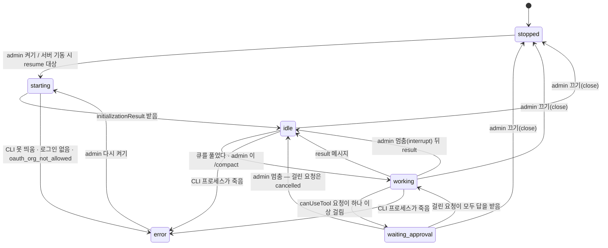

# cockpit — 구조 (ARCHITECTURE)

요구는 `PRD.md`, 까닭은 `ADR.md`. 여기는 **무엇이 어디에 있고 어떻게 흐르나**만 적는다. 뼈는 `../../meta/prodev-review/plans/2026-09-14-web-cockpit/DESIGN.md` 4절이고, 하네스와의 계약은 같은 폴더 `research/coupling-inventory.md` C절이다.

## 1. 한 장 그림

```
사내망 브라우저 (PL = admin · 과제원 = member)
        │ HTTP(S) · SSE
        ▼
┌─ cockpit 서버 (PL 의 윈도우 PC · Node ≥ 22 한 프로세스) ─────────────────────┐
│  웹         정적 화면(web/) · REST(/api/…) · 실시간(/api/stream, SSE)          │
│  계정       accounts · web_sessions · 쿠키 md_session                          │
│  저장소     chat.db (minidiscord 표 여섯) │ cockpit.db (조종석 표 여섯)         │
│  세션 관리자 과제마다 query() 하나 · 큐(bot_inbox) · 상태 · resume              │
│  승인 중계  canUseTool → permission_requests → admin 카드 → 첫 답               │
│  MCP cockpit (프로세스 안) reply · fetch_history                               │
└───────┬───────────────────────────────────────────────────┬──────────────────┘
        │ Agent SDK query() (스트리밍 입력)                   ▲ chat.js 읽기 전용
        ▼                                                     │ (MINIDISCORD_DB = chat.db)
┌─ 봇 세션 (Claude CLI 자식 프로세스 · 과제마다 하나) ────────┴──────────────────┐
│  cwd = bots/prodev-<과제>-bot/ · settingSources project,local                  │
│  CLAUDE.md · 스킬 15 · 훅 3 (session-start · pre-compact · pre-reply) · 도우미 6 │
└───────┬───────────────────────────────────────────────────────────────────────┘
        ▼ 읽고 쓰고 커밋
   과제 폴더 projects/<과제>/ (기억은 여기)
```

읽는 법. 브라우저는 봇 세션에 직접 닿지 않는다. **SDK 세션의 클라이언트는 언제나 서버 하나**다 — 여럿이 한 세션에 동시에 말을 넣는 경쟁을 구조로 없앤다. 봇이 방에 말하는 길은 지금처럼 `reply` 도구이고, 그 도구가 서버 프로세스 안에 있어 봇 설정의 PreToolUse 훅이 그대로 걸린다(실증 2 · 4g). 하네스가 대화를 읽는 길은 `chat.db` 를 읽기 전용으로 여는 것이다.

## 2. 부품 여섯

| 부품 | 하는 것 | 파일 (M1~M3 에 생긴다) |
|---|---|---|
| **웹** | 정적 화면 한 벌 서빙 · REST · SSE 스트림 하나. 프레임워크 없이 `node:http` (ADR-010 · 012) | `src/http/*.js` · `web/*` |
| **계정** | 로컬 계정(아이디 · scrypt 해시 · 역할) · 쿠키 세션 · 첫 admin 명령 (ADR-011) | `src/auth/*.js` · `bin/cockpit.js` |
| **세션 관리자** | 과제마다 `query()` 하나를 띄우고 붙든다. 큐를 푼다. 상태를 들고 브라우저에 알린다. 죽었다 살아나면 되살린다 | `src/session/manager.js` · `src/session/sdk-query.js` |
| **승인 중계** | `canUseTool` 을 받아 적고, admin 에게 띄우고, 첫 답을 SDK 에 돌려준다. 시간 초과면 거부 | `src/permissions/relay.js` |
| **프로세스 안 MCP `cockpit`** | 도구 둘. 처리기는 순수 함수(DB 만 안다), SDK 에 붙이는 얇은 층은 따로 | `src/mcp/tools.js` · `src/session/sdk-query.js` |
| **저장소 둘** | `chat.db`(minidiscord 표 여섯) · `cockpit.db`(조종석 표 여섯). 쓰는 것은 서버뿐 | `src/db/chat-db.js` · `src/db/cockpit-db.js` |

**SDK 를 import 하는 파일은 `src/session/sdk-query.js` 하나뿐이다.** 나머지는 SDK 모양의 함수(`queryFn`)를 주입받는다. 그래서 `npm test` 는 모의 SDK 로 돈다 (VERIFICATION 2절).

## 3. 저장소 둘

### 3.1 `chat.db` — minidiscord 표 여섯, 이름 · 열 그대로 (ADR-003 · 004)

스키마는 `minidiscord/server/src/db.ts:9-65`(핀 `6633f7b`)의 여섯 표를 DDL 까지 그대로 옮긴다. **더하는 열도 빼는 열도 없다.** `sessions` · `room_bots` 두 표는 만들지 않는다 (하네스가 안 읽는다 — 결합 재고 C.3).

| 표 | 열 | cockpit 이 채우는 법 |
|---|---|---|
| `users` | `id · username · created_at` | 계정을 만들 때 한 줄. `username` 은 **charter 의 `PL:` 과 글자 그대로**(결재 대조). 비밀번호 · 역할은 여기 두지 않는다 |
| `rooms` | `id · name · status · created_at · archived_at` | 과제를 열 때 둘: `prodev-<과제>` · `prodev-<과제>/files`. 과제 이름은 방 이름에서 첫 `/` 앞으로 푼다 (`places.js` 의 `roomParts` 와 같은 규칙) |
| `bots` | `id · name · description · token · role · created_at` | 과제마다 한 줄. 이름은 과제를 열 때 준다(기본 `prodev-<과제>-bot`, 옛 대본은 `prodev-worktogether-비서` 꼴이라 그 이름으로 연다). 봉투 · 화면 기본값 · `targets` 칸이 모두 이 이름을 쓴다 — 아래 `prodev-<과제>-bot` 은 이 값의 자리 표시다. `token` 은 `UNIQUE NOT NULL` 이라 **봇마다 다른 uuid** 를 넣는다 (쓰이지 않는다). `role` 은 `orchestrator` |
| `messages` | `id · room_id · author_type(user/bot/system) · author_user_id · author_bot_id · body · created_at` | 사람 글 · 봇 `reply` · system 글(승인 · 압축). `body` 는 봉투 문자열을 그대로 둔다 (`pre-reply.js` 가 벗긴다) |
| `attachments` | `id · message_id · filename · stored_path · size · mime` | 저장명 `<uuid>-<원래 이름>`. **`stored_path` 는 `path.resolve(dirname(chat.db), '..', stored_path)` 가 실제 파일이 되는 상대 경로**다 — `chat.js show`(`chat.js:193`)가 그렇게 푼다. 곧 `path.relative(dirname(dirname(chat.db)), 절대경로)` 로 적는다 |
| `message_targets` | `message_id · bot_id · delivery(to/cc)` | 글을 넣는 같은 트랜잭션에서 봉투 파싱(4.3)의 결과를 넣는다 |

작성자 이름 풀이는 minidiscord 와 같다: `user → users.username` · `bot → bots.name` · `system → '시스템'` (`chat.js` 의 `COALESCE(u.username, b.name, '시스템')`).

`chat.js --json` 의 아홉 칸(`id · room_id · room · author · author_type · created_at · body · attachments · targets`)이 이 표에서 그대로 나오는지는 계약 시험이 진짜 `prodev/scripts/chat.js` 로 본다.

### 3.2 `cockpit.db` — 조종석 표 여섯 (봇이 못 보게 가른다)

| 표 | 열 | 쓰는 곳 |
|---|---|---|
| `accounts` | `user_id`(= chat.db `users.id`, 키) · `role`(admin/member) · `pw_hash` · `created_at` | 계정 |
| `web_sessions` | `token_hash`(키, 쿠키 값의 SHA-256) · `user_id` · `created_at` · `expires_at` | 계정. **쿠키 값 원문은 저장하지 않는다** — 파일이 새도 살아 있는 쿠키가 안 나온다 |
| `agent_sessions` | `project`(키) · `bot_id` · `bot_dir` · `session_id` · `state` · `started_at` · `last_result_at` · `cost_usd` | 세션 관리자 · 조종석 머리 · 재기동 |
| `session_events` | `id` · `project` · `at` · `type` · `json` | 조종석 판 되그리기. 턴 단위로 접어 적는다 (5.3) |
| `permission_requests` | `tool_use_id`(키) · `agent_id` · `project` · `tool` · `input_json` · `card_json` · `asked_at` · `answered_by` · `behavior` · `answered_at` | 승인 중계 · 감사. `card_json` 은 카드 글(`title · displayName · description · decisionReason · blockedPath · suppressAlwaysAllowRule · defaultToNo · suggestions`) — 새로고침 뒤 카드를 되그리려고 둔다 |
| `bot_inbox` | `id` · `message_id` · `bot_id` · `delivery` · `queued_at` · `delivered_at` | 큐. minidiscord 의 `room_bots.last_delivered_id` 를 대신한다 |

`behavior` 값: `allow` · `allow_session`(이번 세션 허용) · `deny` · `timeout`(시간 초과 거부) · `cancelled`(멈춤 · 끄기로 SDK 가 거둬 감).

### 3.3 봇에게서 가르기

- 봇 설정의 `MINIDISCORD_DB` 값은 `chat.db` 경로다. `cockpit.db` 경로는 봇 env 에도 설정에도 없다.
- prodev PR(W2.9)이 봇 설정 `deny` 에 `Read(<cockpit.db>)` · `Edit(<cockpit.db>)` · `Write(<cockpit.db>)` 를 넣는다.
- **이 deny 는 벽이 아니다.** 허용 목록의 `Bash(node:*)` 로 도는 스크립트는 파일을 열 수 있다. 그래서 `cockpit.db` 에는 **해시만** 둔다(비밀번호 scrypt · 쿠키 SHA-256). 새어도 로그인이나 살아 있는 쿠키가 안 나온다. 남는 위험은 봇이 `permission_requests` 를 고치는 것이고, 본방 system 글(🔒)이 둘째 기록이다. meta 의 P-W3.6 이 이 자리를 잰다.

## 4. 글이 흐르는 길

### 4.1 사람 글 → 봇

```
POST /api/rooms/:id/messages (multipart)
  ① 방 검사 (없음 404 · 보관 409) → multipart 파싱 → 첨부를 uploads/<uuid>-<이름> 에 쓴다
  ② 빈 글 400 · 봉투 파싱(4.3) — 이 방의 봇이 아닌 이름이 있으면 400, 아무 행도 안 남긴다
  ③ 트랜잭션: messages · attachments · message_targets · bot_inbox 에 한 번에
  ④ SSE 로 브라우저 전부에 message 사건 · 응답 { ok, message }
  ⑤ 세션 관리자에 "큐에 글이 있다" 를 알린다 → 세션이 idle 이면 곧바로 푼다 (4.4)
```

### 4.2 봇 → 방

```
봇이 mcp__cockpit__reply { chat_id, text, files? } 를 부른다
  ① (Claude CLI 안) PreToolUse 훅 pre-reply.js — 막으면 exit 2, 도구가 안 불린다
  ② (cockpit 안) 방 번호 세 겹: chat_id → 없으면 마지막 to 방 → 그래도 없으면 오류 결과
  ③ files 는 과제 폴더 뿌리(projectsDir)를 실경로로 푼 안쪽만 uploads/ 로 복사해 첨부로
  ④ messages(author_type='bot', author_bot_id) · attachments → SSE message 사건
  ⑤ 도구 결과 content: [{ type:'text', text:'sent' }]
```

**도구 둘의 서명 — 채널 플러그인(`channel-server.ts:136-167`)과 글자 그대로:**

```
mcp__cockpit__reply(chat_id?: string, text: string, files?: string[])
  필수는 text 하나. chat_id 는 받은 글의 chat_id(방 번호). files 는 내 PC 의 절대 경로.
  결과 content: [{ type:'text', text:'sent' }]

mcp__cockpit__fetch_history(chat_id?: string, since_id?: number, since?: string, until?: string, speaker?: string, limit?: number)
  필수 없음. since · until 은 ISO 시각, speaker 는 작성자 이름, limit 기본 100 · 상한 500.
  결과 content: [{ type:'text', text: <JSON 한 건> }]
  JSON 꼴: { "cursor": <실린 것 중 최대 id 또는 null>, "messages": [ { "id", "at", "author", "body" }, … ] }
```

`fetch_history` 의 규칙 (`minidiscord/channel/src/index.ts:85-111` 과 같다): `author` · `body` 는 중화 뒤 절단(이름 256B · 본문 4000B), `id` · `at`(= `created_at`) 은 그대로. JSON 전체가 16000B 를 넘으면 **새것부터** 버린다. 빈 이력도 같은 꼴(`cursor: null`). 한 자리만 다르다: `since_id` · `since` · `until` · `speaker` 를 `limit` 보다 **먼저** 건다(OD-9 를 물려받지 않는다). `since_id` 가 있으면 그 뒤의 오래된 것부터 `limit` 개, 없으면 최근 `limit` 개를 id 오름차순으로 낸다.

봇 글의 봉투(`@TO(…)`)는 첫 판에서 파싱만 하고 **봇에게 되돌려 배달하지 않는다** — 봇이 하나라 받을 봇이 자기 자신뿐이다.

### 4.3 봉투 파싱 규칙

정규식은 minidiscord `server/src/mention.ts` 그대로: `/@(TO|CC)\(([^()\s]+)\)/g`. 등장 순서대로, 중복 제거 없이.

| 경우 | `message_targets` · `bot_inbox` |
|---|---|
| `@TO(prodev-<과제>-bot)` | `to` 한 줄 |
| `@CC(prodev-<과제>-bot)` | `cc` 한 줄 |
| 같은 봇을 `@TO` · `@CC` 둘 다 | 두 줄 (minidiscord 와 같다) |
| 이 방의 봇이 아닌 이름 | 요청 전체 400 `<이름> 봇은 이 방에 초대되지 않았습니다` |
| **본방**, 봉투 없음 | `to` 한 줄 (사람 결정 — 화면이 `@TO(<봇>)` 을 기본으로 채워 주지만, 지워도 간다) |
| 파일방, 봉투 없음 | 행 없음 — 봇에게 안 간다 (minidiscord 와 같다) |

### 4.4 봉투 씌우기 — 봇에게 가는 글의 꼴

채널 플러그인(`minidiscord/channel/src/channel-server.ts:184-214`)이 세션에 넣던 것을 **사용자 메시지 본문**으로 재현한다 (ADR-013). 글 하나가 이 한 덩이다:

```
<channel source="cockpit" chat_id="12" message_id="345" delivery="to" sender="김과제" author_type="user" room_name="prodev-수율/files">
[김과제] @TO(prodev-수율-bot) 이 파일 봐 주세요
(첨부 파일 경로: C:\cockpit-data\uploads\3f2a…-성적서.csv)
→ delivery="to"로 받은 메시지에는 반드시 reply 도구로 답변하세요.
</channel>
```

규칙:
1. 가운데 한 덩이는 채널 플러그인의 `content` 와 **글자 그대로** 같다: `[${이름}] ${본문}${첨부 안내}${to 이면 안내 줄}`. 첨부 안내는 `\n(첨부 파일 경로: <절대경로>, …)`, 안내 줄은 `\n→ delivery="to"로 받은 메시지에는 반드시 reply 도구로 답변하세요.`
2. 이름 · 본문 · 첨부 경로는 **중화 뒤에 절단**한다. 중화는 `<channel` · `</channel`(대소문자 무시)의 `<` 를 `&lt;` 로. 절단은 `truncate.ts` 의 상한 다섯 · 표시 `⟪잘림: N바이트 생략⟫` · 시길 탈출 그대로 (코드를 사본으로 옮기고 출처 핀을 머리에 적는다).
3. meta 여섯은 `<channel …>` 속성으로 **값을 바꾸지 않고** 싣는다. 경계를 지키려고 값 안의 두 글자만 엔티티로 쓴다: `"` → `&quot;` · `<` → `&lt;` (사람 이름에 `</channel>` 을 넣어 봉투를 일찍 닫는 것을 막는다 — M1.4 시험이 찾았다).
4. 첨부 경로는 `stored_path` 를 절대 경로로 풀어 넣는다.
5. `chat_id` 는 방 번호 문자열, `message_id` 는 글 번호 문자열.

연결 시점 지시문(`channel-server.ts:22-37` 의 `INSTRUCTIONS`)은 `query()` 옵션 `systemPrompt: { type:'preset', preset:'claude_code', append: <지시문>, snapshot: true }` 로 싣는다. 문장은 그대로 두고 "minidiscord 채팅방" 과 `source="minidiscord-channel"` 두 자리만 cockpit 으로 바꾼다.

### 4.5 큐를 푸는 규칙

- 세션 상태가 **`idle` 일 때만** 푼다. `working` · `waiting_approval` · `starting` 이면 기다린다. 턴 도중에 넣으면 SDK 가 그 턴에 접어 넣어 봇이 두 일을 한 턴에 섞는다 (DESIGN 4.2).
- 풀 때는 그 봇의 `delivered_at IS NULL` 행을 **id 순서대로 모두**(상한 20) 꺼내 사용자 메시지 **하나**에 4.4 의 덩이를 차례로 담는다. 넣은 즉시 `delivered_at` 을 적고 상태를 `working` 으로.
- `cc` 만 밀려 있어도 푼다 — 채널 판에서도 `cc` 는 세션에 들어갔다.
- **큐를 거치지 않는 것은 멈춤 하나뿐이다**: admin 의 멈춤은 `query.interrupt()` 를 곧바로 부른다. admin 의 압축은 `/compact` 를 걸어 두었다가 **다음 `idle` 에** 밀린 글보다 먼저 넣는다 (meta D0 Q12 — 턴 중 압축은 미실증). 급하면 멈춤 → 압축.
- 사용자 메시지에는 `origin` 을 스탬프한다: 채팅 글은 `{ kind:'channel', server:'cockpit' }`, admin 의 `/compact` 는 `{ kind:'human' }` (ADR-013).
- 재기동 뒤: `resume` 이 `idle` 에 닿으면 남은 행을 같은 규칙으로 푼다. `delivered_at` 을 적은 뒤 턴이 끝나기 전에 서버가 죽은 글은 **다시 넣지 않는다** — 봇이 켜질 때 `chat.js since` 로 따라잡는다 (prodev ADR-010 · 021).

## 5. 세션 생명주기

### 5.1 상태도



`agent_sessions.state` 에는 `stopped · starting · idle · working · waiting_approval · error` 를 적는다. 서버가 꺼질 때는 적힌 값을 그대로 두고, 다시 켜질 때 `stopped` 가 아닌 줄을 전부 `resume` 대상으로 본다.

### 5.2 때마다 하는 것 (DESIGN 4.2 표)

| 때 | 하는 것 |
|---|---|
| 과제 열기 (admin) | `chat.db` 에 `bots` 한 줄 · 방 둘, `cockpit.db` 에 `agent_sessions`(state `stopped`). 봇 폴더는 prodev `setup.js --project` 가 만든다 (M1 은 fixture 폴더) |
| 켜기 | 동시 세션 상한(기본 3) 검사 → `query({ prompt: 입력흐름, options })`. `options` 는 5.4 |
| 켜진 직후 | `initializationResult()` 의 `commands · agents · account · models` 를 조종석 머리에. `account.apiKeySource · subscriptionType` 을 `session_events` 에 한 줄 |
| 큐 | 4.5 |
| 진행 | 5.3 의 메시지를 접어 `session_events` 에 적고 SSE 로 흘린다 |
| 승인 | 6절 |
| 압축 | 자동은 SDK 가 한다(봇 설정 `autoCompactWindow`). 수동은 admin 이 걸고 다음 `idle` 에 들어간다. `system/status` 가 압축 시작을 알리면 본방에 "문맥을 정리 중입니다. 곧 이어서 합니다." system 글, `compact_boundary` 가 오면 "정리가 끝났습니다. 이어서 하려면 말을 걸어 주세요." system 글과 채팅 판 경계 표시 |
| 멈춤 (admin) | `interrupt()`. 걸린 승인 요청은 `cancelled` |
| 끄기 (admin) | 백그라운드 도우미가 있으면 `backgroundTasks()` 목록을 먼저 보이고, 확인 뒤 `close()`. state `stopped` |
| 도우미 멈춤 (admin) | `stopTask(taskId)` |
| 서버 재기동 | `agent_sessions` 에서 `stopped` 가 아닌 줄마다 같은 옵션 + `resume: session_id`. SessionStart(resume) 훅이 되살린다. `resume` 이 실패하면(기록 파일 없음) 새 세션으로 켜고 `session_events` 에 까닭 한 줄 |
| 되감기 | 첫 판은 체크포인트(`enableFileCheckpointing`)만 켠다. 화면은 2판 |

### 5.3 조종석 판의 재료와 적는 법

| SDK 메시지 | 조종석 판 | `session_events.type` |
|---|---|---|
| `assistant` 의 `tool_use` 블록 | 도구 이름 · 입력 요약(200자) · 도우미 안이면 `parent_tool_use_id` | `tool_use` |
| `user` 의 `tool_result` 블록 | 결과 요약(200자) · 걸린 시간 · `is_error` 면 빨강. **훅이 막은 것은 여기서만 보인다** (실증 3 걸림 3 — PreToolUse 는 `hook_started` 를 안 낸다) | `tool_result` |
| `system/hook_started` · `hook_response` | 훅 이름 · exit code | `hook` |
| `task_started · task_updated · task_progress · task_notification` · `background_tasks_changed` | 도우미 진행 | `task` |
| `system/status` · `compact_boundary` | 상태 · 압축 전후 토큰 | `status` · `compact` |
| `result` | 턴 끝 · `total_cost_usd` 누적 · `num_turns` · `duration_ms` · `permission_denials` | `result` |
| `stream_event` | 지금 쓰는 글자(살아 있는 화면만) | **안 적는다** |
| `rate_limit_event` · `auth_status` | 머리의 경고 | `status` |
| 문맥 사용률 | `result` 뒤마다 `getContextUsage({ detail:'summary' })` | `context` |

값은 클라이언트 추정치다(청구액이 아니다). 화면에 그렇게 적는다.

### 5.4 `query()` 옵션 — 한 자리에서만 만든다 (`src/session/sdk-query.js`)

| 옵션 | 값 | 근거 |
|---|---|---|
| `prompt` | 입력흐름 (`AsyncIterable<SDKUserMessage>`, 4.5 가 채운다) | 실증 3 |
| `cwd` | `<botsDir>/prodev-<과제>-bot` | 실증 1 |
| `settingSources` | `['project','local']` | 실증 1 |
| `strictMcpConfig` | `true` | 실증 1 |
| `mcpServers` | `{ cockpit: createSdkMcpServer({ name:'cockpit', tools:[reply, fetch_history] }) }` | 실증 5 |
| `permissionMode` | `'default'` | 실증 4 · ADR-006 |
| `allowedTools` | `['mcp__cockpit__reply', 'mcp__cockpit__fetch_history']` — **이 둘만** | 실증 4b · 4g |
| `canUseTool` | 승인 중계 (6절) | 실증 4 · 4i |
| `permissionPrompts` | 주지 않는다(기본 `'host'`). `'none'` 이면 콜백 없이 거부된다 | 실증 4d |
| `persistSession` | `true` | 실증 5 |
| `env` | 화이트리스트 (5.5) | 실증 5 · ADR-007 |
| `pathToClaudeCodeExecutable` | 설정 `claudePath`. 윈도우에서는 필수 | DESIGN 2.2 |
| `includePartialMessages` | `true` (살아 있는 화면용. 저장 안 함) | DESIGN 4.2 |
| `enableFileCheckpointing` | `true` | DESIGN 4.2 |
| `systemPrompt` | `{ type:'preset', preset:'claude_code', append: 지시문, snapshot: true }` | ADR-013 — **스파이크 조합에 없던 칸이다. M1 스모크가 잰다** |
| `resume` | 재기동 때만 `agent_sessions.session_id` | DESIGN 4.2 |
| `stderr` | 마지막 200줄을 들고 있다가 `error` 때 조종석 판에 | — |

`model` 은 주지 않는다 — 봇 설정과 계정 기본을 따른다.

### 5.5 env 화이트리스트

넘기는 키: `PATH · HOME · USER · SHELL · TMPDIR · LANG · CLAUDE_CONFIG_DIR · USERPROFILE · APPDATA · LOCALAPPDATA · TEMP · TMP · SystemRoot · ComSpec · CLAUDE_CODE_GIT_BASH_PATH` (서버 프로세스에 있는 것만) + `PRODEV_BOT_DIR=<봇 폴더>`. 봇 설정 파일의 `env` 일곱은 Claude CLI 가 설정에서 싣는다. 목록은 `spike5-full-combo.mjs` 의 `WHITELIST` 와 같고, W1.3 이 윈도우에서 빼 보며 잰 결과로만 늘리거나 줄인다 (설정 `extraEnvKeys` 로 더할 수 있다).

## 6. 승인 중계

```
canUseTool(toolName, input, { toolUseID, agentID, title, displayName, description,
                              decisionReason, blockedPath, suggestions,
                              suppressAlwaysAllowRule, defaultToNo, signal })
  ① permission_requests 에 INSERT (키 tool_use_id). state → waiting_approval
  ② 본방에 system 글: 🔒 <tool> 요청 · <title 또는 displayName> [· 도우미 <agentID 앞 8자>]
  ③ SSE permission_request 사건 — 브라우저 전부가 받되 버튼은 admin 화면에만
  ④ 기다린다: 답 · 시간 초과(approvalTimeoutMin, 기본 10분) · signal(abort) 중 먼저 오는 것
  ⑤ 답 = UPDATE … SET behavior, answered_by, answered_at WHERE tool_use_id=? AND answered_at IS NULL
       바뀐 행이 1 이면 이 답이 이긴 것. 0 이면 409 (이미 답이 있다)
  ⑥ SDK 에 돌려준다
       allow          { behavior:'allow', updatedInput: input }
       allow_session  { behavior:'allow', updatedInput: input, updatedPermissions: suggestions }
                      — suppressAlwaysAllowRule 이면 받지 않는다(400)
       deny · timeout { behavior:'deny', message: '<누가> 거부: <이유>' | '승인 시간 초과 (N분)' }
  ⑦ 본방에 system 글: ✅ <누가> 허용|이번 세션 허용 · <tool>  또는  ⛔ <누가> 거부|시간 초과 거부|거둬 감 · <tool>
     (🔒 는 요청 줄에만 — weekly 의 🔒 수 = 요청 수, meta D0 Q7)
  ⑧ SSE permission_resolved — 다른 탭의 카드를 거둔다. 걸린 요청이 0 이면 state → working
```

- 요청은 `toolUseID` 단위다. 도우미 여섯이 동시에 물으면 카드가 여섯 뜬다.
- 카드 글은 SDK 가 준 `title`(없으면 `displayName`) 과 `description` 을 그대로 쓴다. 입력은 JSON 앞 500자.
- `defaultToNo` 면 카드가 열릴 때 초점이 "거부" 에 있고 Enter 한 번으로 허용되지 않는다.
- `AskUserQuestion` · `ExitPlanMode` 도 같은 카드로 온다 (prodev 봇은 쓰지 않는다, DESIGN 6절).
- 답은 admin 만: `POST /api/permissions/:toolUseId` 가 member 면 403.

## 7. 화면 셋 (web/)

한 페이지(`web/index.html`)에 과제 탭 + 판 셋. 순수 ES 모듈, 빌드 없음. 마크다운 표시는 minidiscord `web/markdown.js`(innerHTML 안 씀)를 사본으로 가져오고 머리에 출처 핀을 적는다.

| 판 | 보이는 것 | 누가 |
|---|---|---|
| **채팅** | 과제 탭 · 방 둘 · 글 · 첨부(올리기 · 붙여넣기 · 받기) · `[카드]` `[발송]` 표식 강조 · 봇 상태 칩(생각 중 · 도구 실행 중 · 승인 대기 · 꺼짐) · 압축 경계 · 🔒 system 글 | 전원 |
| **조종석** | 머리(모델 · 계정 종류 · 상태 · 누적 값 · 문맥 사용률) · 이번 턴 도구 호출 목록 · 도우미 진행 · 훅 결과(막힘 빨강) · 승인 카드(버튼은 admin) · 세션 조작 단추(admin): 켜기 · 멈춤 · 압축 · 끄기 · 다시 켜기 · 도우미 멈춤 | 전원 열람, 조작은 admin |
| **파일** | 과제 폴더 읽기 전용 트리(`cards/ · wiki/ · journal/ · analysis/ · report/ …`) · 미리보기: `.md` 글 · `.csv` 앞 50행 표 · `.png/.jpg` 그림 · 그 밖은 크기만 | 전원 |

재접속하면 SSE 가 `Last-Event-ID` 로 놓친 사건을 받고, 조종석 판은 `GET /api/projects/:name/events?after=` 로 턴 단위 기록을 되그린다.

## 8. HTTP · 실시간 API

인증은 쿠키 `md_session` 하나다(ADR-005). 없거나 틀리면 401. JSON 본문을 받는 길은 `content-type: application/json` 만 받는다. 상태를 바꾸는 요청은 `Origin` 헤더가 있으면 서버 주소와 같아야 한다.

### 8.1 minidiscord 와 같은 모양 — 셋 (+ 받기 하나)

| 길 | 받는 것 | 내는 것 |
|---|---|---|
| `GET /api/rooms` | — | `{ active:[{id,name,status,created_at,archived_at}], archived:[…] }` |
| `POST /api/rooms/:id/messages` | **multipart 만** (JSON 이면 406). 텍스트 파트는 `body`, 파일 파트는 이름을 가리지 않는다 | `{ ok:true, message:{ id, room_id, author_type, author_user_id, author_bot_id, body, created_at, author_name, attachments:[{id,filename}] } }` · 404 없는 방 · 409 보관 방 · 400 빈 글/모르는 봇 |
| `GET /api/rooms/:id/messages?after=N` | — | `{ messages:[…위 message 모양…] }` id 오름차순, 최대 200. `stored_path` 는 안 낸다 |
| `GET /api/attachments/:id` | — | 파일 스트림 · `content-disposition: attachment; filename*=UTF-8''…` · 업로드 폴더 밖이면 404 |

### 8.2 cockpit 이 더하는 것

| 길 | 누가 | 하는 것 |
|---|---|---|
| `GET /api/health` | 누구나 | `{ ok:true }` |
| `POST /api/auth/login` | 누구나 | `{ username, password }` → `Set-Cookie: md_session=…; HttpOnly; SameSite=Lax; Path=/` |
| `POST /api/auth/logout` · `GET /api/auth/me` | 로그인 | 끝내기 · `{ id, username, role }` |
| `GET /api/accounts` · `POST /api/accounts` · `POST /api/accounts/:id/password` | admin | 계정 목록 · 만들기 `{username, password, role}` · 비밀번호 바꾸기 |
| `GET /api/projects` | 로그인 | 과제마다 `{ name, bot, rooms:{main, files}, session:{ state, model, cost_usd, context_pct } }` |
| `POST /api/projects` | admin | `{ name }` → 봇 한 줄 · 방 둘 · `agent_sessions` 한 줄 |
| `POST /api/projects/:name/session/{start,stop,interrupt,compact,restart}` | admin | 5.2. 상한 넘으면 409 |
| `POST /api/projects/:name/tasks/:taskId/stop` | admin | `stopTask` |
| `GET /api/projects/:name/events?after=N` | 로그인 | `session_events` 오름차순 최대 500 |
| `GET /api/permissions?pending=1` | 로그인 | 걸린 요청 목록(카드 되그리기) |
| `POST /api/permissions/:toolUseId` | admin | `{ decision:'allow'|'allow_session'|'deny', reason? }` → 200 · 409 이미 답 · 403 member |
| `GET /api/projects/:name/files?path=` | 로그인 | 폴더 한 층 목록 `{ entries:[{name, dir, size, mtime}] }` |
| `GET /api/projects/:name/file?path=` | 로그인 | 미리보기(7절). 과제 폴더 밖(실경로 대조)이면 404 |
| `GET /api/stream` | 로그인 | **SSE 하나**. 사건: `message` · `bot_status` · `session_event` · `partial`(살아 있는 글자, id 없음) · `permission_request` · `permission_resolved` · `session_state`. `Last-Event-ID` 로 이어 받기 |

`POST /api/notify` 는 첫 판에 없다 (ADR-014).

## 9. 폴더 나무

```
cockpit/
  README.md
  package.json                 "type":"module" · engines.node ">=22" · 의존성 둘 · scripts: test · smoke
  cockpit.example.json         설정 틀 (10절)
  bin/cockpit.js               serve · init-admin · add-user · session-token · open-project · chat · check
  src/config.js                설정 읽기 · 경로 검사(공백 · 존재 · 윈도우 claudePath)
  src/db/chat-db.js            여섯 표 DDL · 글 넣기(봉투 → targets · inbox 한 트랜잭션)
  src/db/cockpit-db.js         여섯 표 DDL · 질의
  src/envelope/mention.js      봉투 파싱 (minidiscord mention.ts 사본)
  src/envelope/truncate.js     절단 상한 다섯 (minidiscord channel truncate.ts 사본)
  src/envelope/wrap.js         4.4 봉투 씌우기 · 지시문 문자열
  src/mcp/tools.js             reply · fetch_history 처리기 (순수 함수)
  src/session/manager.js       상태 · 큐 · 켜기/끄기 · 재기동 · 사건 접기
  src/session/input-stream.js  스트리밍 입력 흐름
  src/session/sdk-query.js     SDK 를 import 하는 유일한 파일 (옵션 5.4)
  src/session/env.js           화이트리스트
  src/permissions/relay.js     6절
  src/auth/password.js         scrypt
  src/auth/sessions.js         쿠키 발급 · 대조 · 만료
  src/http/server.js           node:http · 길 나누기 · 정적 서빙
  src/http/routes-*.js         8절의 길들
  src/http/multipart.js        Request.formData() 로 multipart 읽기
  src/http/sse.js              SSE 허브
  web/index.html · app.js · chat.js · cockpit.js · files.js · markdown.js · style.css
  test/*.test.js               npm test (VERIFICATION 2절)
  test/fakes/fake-query.js     모의 SDK
  test/fixtures/               봇 폴더 · 과제 폴더 · 첨부
  test/contract/*.test.js      형제 저장소 prodev 의 chat.js · replay.js 를 붙여 보는 계약 시험
  smoke/*.mjs                  진짜 SDK 스모크 (npm test 에 안 섞인다)
  docs/                        PRD · ARCHITECTURE · ADR · TASKS · VERIFICATION · (M1 부터) as-built · log
```

## 10. 설정 파일 한 장 — `cockpit.json`

```json
{
  "botsDir":     "C:/work/crew-workspace/prodev/bots",
  "projectsDir": "C:/work/crew-workspace/projects",
  "uploadsDir":  "C:/cockpit-data/uploads",
  "claudePath":  "C:/Users/pl/.local/bin/claude.exe",
  "maxSessions": 3,

  "dataDir":     "C:/cockpit-data",
  "host":        "127.0.0.1",
  "port":        3000,
  "approvalTimeoutMin": 10,
  "extraEnvKeys": [],
  "tls": null
}
```

| 키 | 뜻 | 없으면 |
|---|---|---|
| `botsDir` | 봇 폴더들의 부모 (`<botsDir>/prodev-<과제>-bot`) | 기동 안 함 |
| `projectsDir` | 과제 폴더들의 부모. 봇 첨부 뿌리이자 파일 판의 뿌리 | 기동 안 함 |
| `uploadsDir` | 사람 첨부를 쌓는 곳. prodev 설정의 `{{UPLOADS_DIR}}`(`additionalDirectories`)이 이 값이어야 봇이 읽는다 | 기동 안 함 |
| `claudePath` | `pathToClaudeCodeExecutable` | 윈도우는 기동 안 함 · 맥은 SDK 동봉 CLI |
| `maxSessions` | 동시 세션 상한 | 3 |
| `dataDir` | `chat.db` · `cockpit.db` 자리 | 기동 안 함 |
| `host` · `port` | 듣는 주소. 사내망에 열려면 사람이 `0.0.0.0` 으로 바꾼다 | `127.0.0.1` · 3000 |
| `approvalTimeoutMin` | 승인 무응답 거부까지 분 | 10 |
| `extraEnvKeys` | 5.5 에 더할 키 (W1.3 결과로만) | `[]` |
| `tls` | `{ "cert": "<경로>", "key": "<경로>" }` 면 HTTPS | http |

**경로 검사 (`node bin/cockpit.js check` 와 기동 때 같은 함수)**: 경로 키마다 ① 절대 경로 ② 공백 없음 ③ 존재 ④ `uploadsDir` · `dataDir` 쓰기 가능. 하나라도 어긋나면 키 이름과 까닭 한 줄을 내고 exit 1.

## 11. 하네스(prodev)와 맞물리는 자리

cockpit 쪽에서 지키는 계약 (결합 재고 C.8 의 하드 일곱): 도구 이름 · 매개변수 이름 · meta 다섯(+`room_name`) · 첨부 절대 경로 · 표 여섯의 열 · 방 이름 규칙 · 작성자 이름 풀이와 PL 글자 일치 · `chat.js --json` 아홉 칸.

prodev 쪽에서 바뀌는 것은 PR 하나(W2.9, meta 가 따로 지시한다): 도구 이름 치환 · `.mcp.json` 안 만듦 · `MINIDISCORD_DB` = `chat.db` · `{{UPLOADS_DIR}}` = `uploadsDir` · deny 에 `cockpit.db` · 알림은 URL 이 없으면 건너뜀 · 시험 갱신 · ADR 한 절 · `docs/launch.md` 4절. **그 PR 전에는** M1 스모크가 봇 설정 사본의 matcher 를 `mcp__cockpit__reply` 로 바꾼 스크래치 봇 폴더로 돈다 (실증 5 와 같은 방법).

## 12. 알고 두는 것

- 봇 세션 여럿 = Claude CLI 자식 프로세스 여럿. 상한 3 은 추정이고 M4 에서 상주 메모리를 적는다.
- PL 이 PC 를 끄면 전부 멈춘다. 서비스 등록은 2판.
- `cockpit.db` 의 deny 는 벽이 아니다 (3.3).
- `systemPrompt` preset 과 `<channel>` 글 꼴은 스파이크가 안 쟀다. M1 스모크가 첫 확인이다.
- 봇 글의 봉투는 첫 판에서 배달하지 않는다 (봇이 하나).
