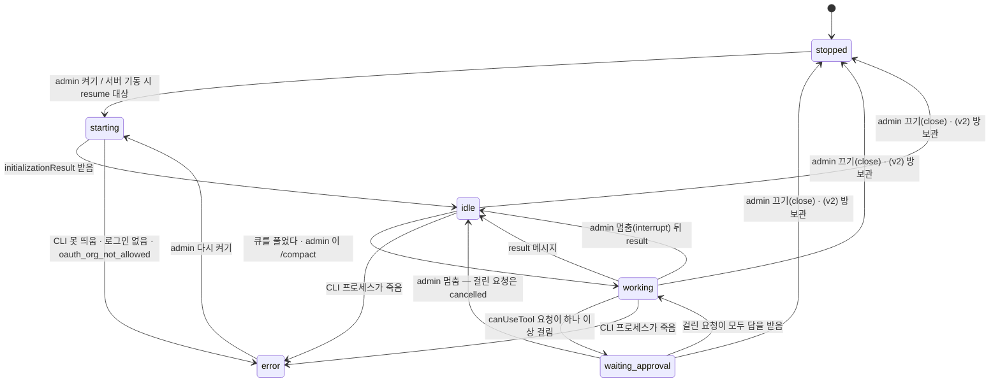

# cockpit — 구조 (ARCHITECTURE)

요구는 `PRD.md`, 까닭은 `ADR.md`. 여기는 **무엇이 어디에 있고 어떻게 흐르나**만 적는다. 뼈는 `../../meta/prodev-review/plans/2026-09-14-web-cockpit/DESIGN.md` 4절이고, 하네스와의 계약은 같은 폴더 `research/coupling-inventory.md` C절이다.

**v2 회차 (2026-09-14 저녁).** 속은 그대로(SDK 세션 · 저장소 둘 · 큐 · 승인 · SSE 하나 · resume), 겉은 minidiscord 화면이다. 방 하나 = 과제 하나 = 전용 봇 하나, files 방은 없다 (ADR-015~020 · `../../meta/prodev-review/plans/2026-09-14-cockpit-후속/AS-IS-TO-BE-v2.md`). 바뀐 절: 1 · 2 · 3.1 · 4.2 · 4.3 · 4.4 예 · **4.6 방 만들기(새)** · **4.7 옛 files 방 이관(새)** · 5.2 · 6 · **7 화면(다시 씀)** · 8 · 9 · 10 · **11 하네스(다시 씀)** · 12. 뒤집힌 줄은 옛 글을 남기고 "대체됨" 을 붙였다.

## 1. 한 장 그림

```
사내망 브라우저 (PL = admin · 과제원 = member)
        │ HTTP(S) · SSE
        ▼
┌─ cockpit 서버 (PL 의 윈도우 PC · Node ≥ 22 한 프로세스) ─────────────────────┐
│  웹         minidiscord 화면(web/) + 접이식 판 · REST(/api/…) · SSE(/api/stream) │
│  계정       accounts · web_sessions · 쿠키 md_session                          │
│  저장소     chat.db (minidiscord 표 여섯) │ cockpit.db (조종석 표 여섯)         │
│  방 만들기  POST /api/rooms → prodev setup.js → 봇 · 방 · 세션 줄 (실패면 되돌림) │
│  세션 관리자 방마다 query() 하나 · 큐(bot_inbox) · 상태 · resume              │
│  승인 중계  canUseTool → permission_requests → admin 카드 → 첫 답               │
│  MCP cockpit (프로세스 안) reply · fetch_history(+첨부)                        │
└───────┬───────────────────────────────────────────────────┬──────────────────┘
        │ Agent SDK query() (스트리밍 입력)                   ▲ chat.js 읽기 전용
        ▼                                                     │ (MINIDISCORD_DB = chat.db)
┌─ 봇 세션 (Claude CLI 자식 프로세스 · 방마다 하나) ──────────┴──────────────────┐
│  cwd = <prodevDir>/bots/prodev-<과제>-bot/ · settingSources project,local      │
│  CLAUDE.md · 스킬 15 · 훅 3 (session-start · pre-compact · pre-reply) · 도우미 6 │
└───────┬───────────────────────────────────────────────────────────────────────┘
        ▼ 읽고 쓰고 커밋
   과제 폴더 projects/<과제>/ (기억은 여기 — retro 로 굳는 자리도 여기)
```

읽는 법. 브라우저는 봇 세션에 직접 닿지 않는다. **SDK 세션의 클라이언트는 언제나 서버 하나**다 — 여럿이 한 세션에 동시에 말을 넣는 경쟁을 구조로 없앤다. 봇이 방에 말하는 길은 지금처럼 `reply` 도구이고, 그 도구가 서버 프로세스 안에 있어 봇 설정의 PreToolUse 훅이 그대로 걸린다(실증 2 · 4g). 하네스가 대화를 읽는 길은 `chat.db` 를 읽기 전용으로 여는 것이다. v2 에서 방은 과제마다 하나이고, 사람끼리의 글(봉투 없음)은 봇 세션에 들어가지 않는다 — 봇은 불렸을 때 `fetch_history` 로 따라잡는다.

## 2. 부품 여섯

| 부품 | 하는 것 | 파일 |
|---|---|---|
| **웹** | 정적 화면 한 벌 서빙 · REST · SSE 스트림 하나. 프레임워크 없이 `node:http` (ADR-010 · 012). (v2) 화면은 minidiscord `web/` 사본 + 접이식 판 (ADR-016 · 019) | `src/http/*.js` · `web/*` |
| **계정** | 로컬 계정(아이디 · scrypt 해시 · 역할) · 쿠키 세션 · 첫 admin 명령 (ADR-011) | `src/auth/*.js` · `bin/cockpit.js` |
| **세션 관리자** | 방(과제)마다 `query()` 하나를 띄우고 붙든다. 큐를 푼다. 상태를 들고 브라우저에 알린다. 죽었다 살아나면 되살린다. (v2) 방 만들기 · 보관 · 이관의 처리기도 여기서 부른다 | `src/session/manager.js` · `src/session/sdk-query.js` · (v2) `src/rooms/create.js` · `src/rooms/migrate.js` |
| **승인 중계** | `canUseTool` 을 받아 적고, admin 에게 띄우고, 첫 답을 SDK 에 돌려준다. 시간 초과면 거부 | `src/permissions/relay.js` |
| **프로세스 안 MCP `cockpit`** | 도구 둘. 처리기는 순수 함수(DB 만 안다), SDK 에 붙이는 얇은 층은 따로 | `src/mcp/tools.js` · `src/session/sdk-query.js` |
| **저장소 둘** | `chat.db`(minidiscord 표 여섯) · `cockpit.db`(조종석 표 여섯). 쓰는 것은 서버뿐 | `src/db/chat-db.js` · `src/db/cockpit-db.js` |

**SDK 를 import 하는 파일은 `src/session/sdk-query.js` 하나뿐이다.** 나머지는 SDK 모양의 함수(`queryFn`)를 주입받는다. 그래서 `npm test` 는 모의 SDK 로 돈다 (VERIFICATION 2절). (v2) 방 만들기의 `setup.js` 부르기도 주입받는다(`runSetup`) — 시험은 가짜를 넘긴다.

## 3. 저장소 둘

### 3.1 `chat.db` — minidiscord 표 여섯, 이름 · 열 그대로 (ADR-003 · 004)

스키마는 `minidiscord/server/src/db.ts:9-65`(핀 `6633f7b`)의 여섯 표를 DDL 까지 그대로 옮긴다. **더하는 열도 빼는 열도 없다.** `sessions` · `room_bots` 두 표는 만들지 않는다 (하네스가 안 읽는다 — 결합 재고 C.3). v2 에서도 표 · 열은 한 칸도 안 바뀐다.

| 표 | 열 | cockpit 이 채우는 법 |
|---|---|---|
| `users` | `id · username · created_at` | 계정을 만들 때 한 줄. `username` 은 **charter 의 `PL:` 과 글자 그대로**(결재 대조). 비밀번호 · 역할은 여기 두지 않는다 |
| `rooms` | `id · name · status · created_at · archived_at` | **(v2) 방을 만들 때 하나: `prodev-<과제>`** (ADR-015). 과제 이름은 방 이름에서 `prodev-` 뒤, 첫 `/` 앞으로 푼다 (`places.js` 의 `roomParts` 와 같은 규칙). 옛 `prodev-<과제>/files` 는 `migrate-v2` 가 `status='archived'` 로 둔다(4.7). ~~v1: 과제를 열 때 둘: `prodev-<과제>` · `prodev-<과제>/files`~~ — **대체됨 → ADR-015** |
| `bots` | `id · name · description · token · role · created_at` | 방마다 한 줄. 이름 기본 `prodev-<과제>-bot`(prodev `setup.js:156` 의 `봇이름` 과 같다). 옛 대본은 `prodev-worktogether-비서` 꼴이라 `--no-setup` 과 그 이름으로 연다(ADR-017 결과). 봉투 · 화면 기본값 · `targets` 칸이 모두 이 이름을 쓴다 — 아래 `prodev-<과제>-bot` 은 이 값의 자리 표시다. `token` 은 `UNIQUE NOT NULL` 이라 **봇마다 다른 uuid** 를 넣는다 (쓰이지 않는다). `role` 은 `orchestrator` |
| `messages` | `id · room_id · author_type(user/bot/system) · author_user_id · author_bot_id · body · created_at` | 사람 글 · 봇 `reply` · system 글(승인 · 압축). `body` 는 봉투 문자열을 그대로 둔다 (`pre-reply.js` 가 벗긴다) |
| `attachments` | `id · message_id · filename · stored_path · size · mime` | 저장명 `<uuid>-<원래 이름>`. **`stored_path` 는 `path.resolve(dirname(chat.db), '..', stored_path)` 가 실제 파일이 되는 상대 경로**다 — `chat.js show`(`chat.js:193`)가 그렇게 푼다. 곧 `path.relative(dirname(dirname(chat.db)), 절대경로)` 로 적는다 |
| `message_targets` | `message_id · bot_id · delivery(to/cc)` | 글을 넣는 같은 트랜잭션에서 봉투 파싱(4.3)의 결과를 넣는다. (v2) 봉투 없는 글은 행 없음 |

작성자 이름 풀이는 minidiscord 와 같다: `user → users.username` · `bot → bots.name` · `system → '시스템'` (`chat.js` 의 `COALESCE(u.username, b.name, '시스템')`).

`chat.js --json` 의 아홉 칸(`id · room_id · room · author · author_type · created_at · body · attachments · targets`)이 이 표에서 그대로 나오는지는 계약 시험이 진짜 `prodev/scripts/chat.js` 로 본다.

### 3.2 `cockpit.db` — 조종석 표 여섯 (봇이 못 보게 가른다)

| 표 | 열 | 쓰는 곳 |
|---|---|---|
| `accounts` | `user_id`(= chat.db `users.id`, 키) · `role`(admin/member) · `pw_hash` · `created_at` | 계정 |
| `web_sessions` | `token_hash`(키, 쿠키 값의 SHA-256) · `user_id` · `created_at` · `expires_at` | 계정. **쿠키 값 원문은 저장하지 않는다** — 파일이 새도 살아 있는 쿠키가 안 나온다 |
| `agent_sessions` | `project`(키) · `bot_id` · `bot_dir` · `session_id` · `state` · `started_at` · `last_result_at` · `cost_usd` | 세션 관리자 · 조종석 머리 · 재기동. (v2) 방 하나에 한 줄 — 열은 그대로 |
| `session_events` | `id` · `project` · `at` · `type` · `json` | 조종석 판 되그리기. 턴 단위로 접어 적는다 (5.3) |
| `permission_requests` | `tool_use_id`(키) · `agent_id` · `project` · `tool` · `input_json` · `card_json` · `asked_at` · `answered_by` · `behavior` · `answered_at` | 승인 중계 · 감사. `card_json` 은 카드 글(`title · displayName · description · decisionReason · blockedPath · suppressAlwaysAllowRule · defaultToNo · suggestions`) — 새로고침 뒤 카드를 되그리려고 둔다 |
| `bot_inbox` | `id` · `message_id` · `bot_id` · `delivery` · `queued_at` · `delivered_at` | 큐. minidiscord 의 `room_bots.last_delivered_id` 를 대신한다 |

`behavior` 값: `allow` · `allow_session`(이번 세션 허용) · `deny` · `timeout`(시간 초과 거부) · `cancelled`(멈춤 · 끄기로 SDK 가 거둬 감).

### 3.3 봇에게서 가르기

- 봇 설정의 `MINIDISCORD_DB` 값은 `chat.db` 경로다. `cockpit.db` 경로는 봇 env 에도 설정에도 없다.
- prodev PR(W2.9)이 봇 설정 `deny` 에 `Read(<cockpit.db>)` · `Edit(<cockpit.db>)` · `Write(<cockpit.db>)` 를 넣는다.
- **이 deny 는 벽이 아니다.** 허용 목록의 `Bash(node:*)` 로 도는 스크립트는 파일을 열 수 있다. 그래서 `cockpit.db` 에는 **해시만** 둔다(비밀번호 scrypt · 쿠키 SHA-256). 새어도 로그인이나 살아 있는 쿠키가 안 나온다. 남는 위험은 봇이 `permission_requests` 를 고치는 것이고, 방의 system 글(🔒)이 둘째 기록이다. meta 의 P-W3.6 이 이 자리를 잰다.

## 4. 글이 흐르는 길

### 4.1 사람 글 → 봇

```
POST /api/rooms/:id/messages (multipart)
  ① 방 검사 (없음 404 · 보관 409) → multipart 파싱 → 첨부를 uploads/<uuid>-<이름> 에 쓴다
  ② 빈 글 400 · 봉투 파싱(4.3) — 이 방의 봇이 아닌 이름이 있으면 400, 아무 행도 안 남긴다
  ③ 트랜잭션: messages · attachments · message_targets · bot_inbox 에 한 번에
     (v2) 봉투가 없으면 message_targets · bot_inbox 행이 없다 — 글과 첨부만 남는다
  ④ SSE 로 브라우저 전부에 message 사건 · 응답 { ok, message }
  ⑤ 큐에 행이 생겼으면 세션 관리자에 알린다 → 곧바로 푼다 (4.5)
```

### 4.2 봇 → 방

```
봇이 mcp__cockpit__reply { chat_id, text, files? } 를 부른다
  ① (Claude CLI 안) PreToolUse 훅 pre-reply.js — 막으면 exit 2, 도구가 안 불린다
  ② (cockpit 안) 방 번호 세 겹: chat_id → 없으면 마지막 to 방 → 그래도 없으면 오류 결과
     (v2) 이 봇에게 허락된 방: 쓰기(reply)는 제 본방 하나(active) · 읽기(fetch_history)는 본방 + 이관된 옛 files 방
  ③ files 는 과제 폴더 뿌리(projectsDir)를 실경로로 푼 안쪽만 uploads/ 로 복사해 첨부로
  ④ messages(author_type='bot', author_bot_id) · attachments → SSE message 사건
  ⑤ 도구 결과 content: [{ type:'text', text:'sent' }]
```

**도구 둘의 서명 — 입력은 채널 플러그인(`channel-server.ts:136-167`)과 글자 그대로:**

```
mcp__cockpit__reply(chat_id?: string, text: string, files?: string[])
  필수는 text 하나. chat_id 는 받은 글의 chat_id(방 번호). files 는 내 PC 의 절대 경로.
  결과 content: [{ type:'text', text:'sent' }]

mcp__cockpit__fetch_history(chat_id?: string, since_id?: number, since?: string, until?: string, speaker?: string, limit?: number)
  필수 없음. since · until 은 ISO 시각, speaker 는 작성자 이름, limit 기본 100 · 상한 500.
  결과 content: [{ type:'text', text: <JSON 한 건> }]
  JSON 꼴: { "cursor": <실린 것 중 최대 id 또는 null>,
             "messages": [ { "id", "at", "author", "body", "attachments"?: [ { "filename", "path" } ] }, … ] }
           (v2) attachments 는 첨부가 있는 글에만 있다 (ADR-020)
```

`fetch_history` 의 규칙 (`minidiscord/channel/src/index.ts:85-111` 과 같다): `author` · `body` 는 중화 뒤 절단(이름 256B · 본문 4000B), `id` · `at`(= `created_at`) 은 그대로. JSON 전체가 16000B 를 넘으면 **새것부터** 버린다. 빈 이력도 같은 꼴(`cursor: null`). 한 자리만 다르다: `since_id` · `since` · `until` · `speaker` 를 `limit` 보다 **먼저** 건다(OD-9 를 물려받지 않는다). `since_id` 가 있으면 그 뒤의 오래된 것부터 `limit` 개, 없으면 최근 `limit` 개를 id 오름차순으로 낸다.

**(v2) `attachments` 칸의 규칙 (ADR-020).** 재료는 `chatDb.attachmentsOf(message_id)`(봉투의 첨부 경로와 같은 함수). `filename` 은 중화 뒤 256B, `path` 는 `stored_path` 를 푼 절대 경로를 중화 뒤 512B 로 자른다. 글 하나에 20개까지 싣고, 넘으면 스물한째 자리에 `{ "filename": "⟪잘림: N개 생략⟫", "path": "" }` 한 원소. 16000B 상한은 이 칸을 더한 JSON 전체에 걸린다 — 새것부터 버리는 규칙 그대로(첨부가 큰 글도 통째로 빠진다, 칸만 떼지 않는다). 첨부가 없는 글에는 칸을 두지 않아, 글만 있는 이력은 v1 과 바이트까지 같다.

봇 글의 봉투(`@TO(…)`)는 첫 판에서 파싱만 하고 **봇에게 되돌려 배달하지 않는다** — 방마다 봇이 하나라 받을 봇이 자기 자신뿐이다.

### 4.3 봉투 파싱 규칙

정규식은 minidiscord `server/src/mention.ts` 그대로: `/@(TO|CC)\(([^()\s]+)\)/g`. 등장 순서대로, 중복 제거 없이.

| 경우 | `message_targets` · `bot_inbox` |
|---|---|
| `@TO(prodev-<과제>-bot)` | `to` 한 줄 |
| `@CC(prodev-<과제>-bot)` | `cc` 한 줄 |
| 같은 봇을 `@TO` · `@CC` 둘 다 | 두 줄 (minidiscord 와 같다) |
| 이 방의 봇이 아닌 이름 | 요청 전체 400 `<이름> 봇은 이 방에 초대되지 않았습니다` |
| **(v2) 봉투 없음 (어느 방이든)** | **행 없음 — 봇에게 안 간다. 사람끼리의 글이다** (ADR-018 · minidiscord `targets.ts:16-27` 과 같다). ~~화면이 `@TO(<봇>)` 을 미리 채우고, 지우면 사람끼리~~ — 미리 채움은 되돌림(2026-09-15, ADR-018 상태). 입력칸은 비어 있고 봇은 `@` 로 부른다 |
| ~~본방, 봉투 없음~~ | ~~`to` 한 줄 (사람 결정 — 화면이 `@TO(<봇>)` 을 기본으로 채워 주지만, 지워도 간다)~~ — **대체됨 → ADR-018** |
| ~~파일방, 봉투 없음~~ | ~~행 없음 — 봇에게 안 간다 (minidiscord 와 같다)~~ — **대체됨 → ADR-015** (파일방이 없다. 규칙은 위 줄로 모든 방에 넓어졌다) |

코드 자리: `chat-db.js resolveTargets` 의 "봉투 없음" 갈래 한 줄(`roomParts(room.name).branch === null ? [to] : []` → `[]`).

### 4.4 봉투 씌우기 — 봇에게 가는 글의 꼴

채널 플러그인(`minidiscord/channel/src/channel-server.ts:184-214`)이 세션에 넣던 것을 **사용자 메시지 본문**으로 재현한다 (ADR-013). 글 하나가 이 한 덩이다 (v2 에서도 꼴은 그대로, 방 이름만 하나):

```
<channel source="cockpit" chat_id="12" message_id="345" delivery="to" sender="김과제" author_type="user" room_name="prodev-수율">
[김과제] @TO(prodev-수율-bot) 이 파일 봐 주세요
(첨부 파일 경로: C:\cockpit-data\uploads\3f2a…-성적서.csv)
→ delivery="to"로 받은 메시지에는 반드시 reply 도구로 답변하세요.
</channel>
```

규칙:
1. 가운데 한 덩이는 채널 플러그인의 `content` 와 **글자 그대로** 같다: `[${이름}] ${본문}${첨부 안내}${to 이면 안내 줄}`. 첨부 안내는 `\n(첨부 파일 경로: <절대경로>, …)`, 안내 줄은 `\n→ delivery="to"로 받은 메시지에는 반드시 reply 도구로 답변하세요.`
2. 이름 · 본문 · 첨부 경로는 **중화 뒤에 절단**한다. 중화는 `<channel` · `</channel`(대소문자 무시)의 `<` 를 `&lt;` 로. 절단은 `truncate.ts` 의 상한 다섯 · 표시 `⟪잘림: N바이트 생략⟫` · 시길 탈출 그대로 (코드를 사본으로 옮기고 출처 핀을 머리에 적는다).
3. meta 여섯은 `<channel …>` 속성으로 **값을 바꾸지 않고** 싣는다. 경계를 지키려고 값 안의 두 글자만 엔티티로 쓴다: `"` → `&quot;` · `<` → `&lt;` (사람 이름에 `</channel>` 을 넣어 봉투를 일찍 닫는 것을 막는다 — M1.4 시험이 찾았다).
4. 첨부 경로는 `stored_path` 를 절대 경로로 풀어 넣는다. (v2) `cc` 글에도 지금처럼 싣는다 — 읽을지는 하네스 규칙이다 (ADR-020 ①).
5. `chat_id` 는 방 번호 문자열, `message_id` 는 글 번호 문자열.

연결 시점 지시문(`channel-server.ts:22-37` 의 `INSTRUCTIONS`)은 `query()` 옵션 `systemPrompt: { type:'preset', preset:'claude_code', append: <지시문>, snapshot: true }` 로 싣는다. 문장은 그대로 두고 "minidiscord 채팅방" 과 `source="minidiscord-channel"` 두 자리만 cockpit 으로 바꾼다. (v2) 지시문의 "멘션 없는 메시지는 이 세션에 전달되지 않습니다 … fetch_history 도구로 놓친 대화를 먼저 확인하세요" 가 v2 규칙과 그대로 맞아 **지시문은 안 고친다**.

### 4.5 큐를 푸는 규칙

- 글이 들어오면 **곧바로** 푼다 — 세션이 `idle` · `working` · `waiting_approval` 이면. `starting` 이면 `idle` 에 닿을 때 푼다. 턴 도중에 넣으면 SDK 가 그 턴에 접어 넣는다 — 옛 채널 플러그인과 같고, prodev orchestrator 가 "한 턴에 여러 방의 `@TO`" 를 전제한다 (ADR-008 되돌림, meta W2r.1. 처음 판의 "idle 에서만" 은 R4 에서 본방 질문을 6분 붙잡았다).
- 풀 때는 그 봇의 `delivered_at IS NULL` 행을 **id 순서대로 모두**(상한 20) 꺼내 사용자 메시지 **하나**에 4.4 의 덩이를 차례로 담는다. 넣은 즉시 `delivered_at` 을 적고, `idle` 이었으면 상태를 `working` 으로(`waiting_approval` 은 그대로).
- `cc` 만 밀려 있어도 푼다 — 채널 판에서도 `cc` 는 세션에 들어갔다.
- 멈춤은 `query.interrupt()` 를 곧바로 부른다. **기다리는 것은 압축 하나뿐이다**: admin 의 압축은 `/compact` 를 걸어 두었다가 **다음 `idle` 에** 밀린 글보다 먼저 넣고, 그 압축 턴의 `result` 까지는 글을 붙잡는다 (meta D0 Q12 — 턴 중 압축은 미실증). 급하면 멈춤 → 압축.
- 사용자 메시지에는 `origin` 을 스탬프한다: 채팅 글은 `{ kind:'channel', server:'cockpit' }`, admin 의 `/compact` 는 `{ kind:'human' }` (ADR-013).
- 재기동 뒤: `resume` 이 `idle` 에 닿으면 남은 행을 같은 규칙으로 푼다. `delivered_at` 을 적은 뒤 턴이 끝나기 전에 서버가 죽은 글은 **다시 넣지 않는다** — 봇이 켜질 때 `chat.js since` 로 따라잡는다 (prodev ADR-010 · 021).
- (v2) 봉투 없는 글은 큐에 행이 없으므로 **세션을 깨우지 않는다** — 사람끼리 글 N 개가 봇 턴 0 개다.

### 4.6 (v2) 방 만들기 = 봇 생성 — 흐름과 되돌림 (ADR-017)

`POST /api/rooms {name}`(admin) · `POST /api/projects {name, bot_name?, bot_dir?}`(admin, 옛 모양) · CLI `open-project <과제> [--no-setup] [--bot-dir] [--bot-name]` 이 **같은 처리기** `src/rooms/create.js createRoom({ project, botName, botDir, setup })` 를 탄다. `setup` 은 주입된 `runSetup` 이고, `--no-setup` · 시험이면 건너뛰거나 가짜다.

```
createRoom({ project, botName = prodev-<과제>-bot, setup = true })
  ⓪ 검사 — 이름 규칙(projectNameProblem: / \ 괄호 공백 제어문자 없음 · 64자 · 'prodev-' 로 시작하면 400 "과제 이름만 주세요")
           · 중복: rooms.name = prodev-<과제> · bots.name · agent_sessions.project 중 하나라도 있으면 409
           · setup 이면: 봇 폴더 <prodevDir>/bots/<봇> 이 이미 있으면 409 (반쯤 남은 폴더를 덮지 않는다)
           · 기억: 과제 폴더 <projectsDir>/<과제> 가 요청 전에 있었나 (had_project_dir)
  ① setup (setup 일 때만)
       node <prodevDir>/scripts/setup.js --project <과제> --cockpit <이 서버의 설정 파일>
       자식 프로세스 · env 는 5.5 화이트리스트 · 상한 60초 · exit 0 이 아니면 실패
       만드는 것 (prodev setup.js install): 과제 폴더(+ 하위 폴더 · house.md · .gitignore · git init) ·
                  봇 폴더 · .claude/settings.json · .claude/settings.local.json
       끝난 뒤 확인: <봇 폴더>/.claude/settings.local.json 이 있다 — 없으면 실패
  ② chat.db 트랜잭션: bots 한 줄(token uuid · role orchestrator) · rooms 한 줄(prodev-<과제>)
  ③ cockpit.db: agent_sessions 한 줄 (project · bot_id · bot_dir · state 'stopped')
  ④ SSE room_created { project, room:{id,name}, bot:{id,name} } · 응답 201 (8.2 모양)

되돌림 — 그 요청이 새로 만든 것만, 뒤에서부터
  ③ 실패  → ② 의 bots · rooms 행을 지운다 (다른 표에 참조가 아직 없다)
  ② · ③ 실패 → ① 이 만든 봇 폴더를 지운다 · had_project_dir 가 거짓이면 과제 폴더도 지운다
  ① 실패  → ① 이 만들다 만 봇 폴더 · (had_project_dir 거짓이면) 과제 폴더를 지운다
  응답: ① 실패 502 { error:'setup 실패: <첫 줄>', setup_tail:[표준 출력·오류 마지막 20줄] } · ② · ③ 실패 500 { error }
  지우기 자체가 실패하면 응답에 left:[<남은 경로>] 를 싣고 서버 로그에 한 줄 — 사람이 치운다
```

알고 둘 것:
- 요청 전에 있던 과제 폴더(재개하는 과제)는 절대 안 지운다. `setup.js` 는 없는 파일만 쓰므로(`없으면쓴다`) 그 폴더에 `house.md` · `.gitignore` 가 새로 생겼을 수 있다 — 되돌림은 그것까지 가려내지 않는다.
- 같은 이름으로 동시에 두 요청이 오면 ⓪ 검사를 과정 안의 잠금(과제 이름 집합) 하나로 막는다 — 둘째는 409.
- `botsDir` 는 `<prodevDir>/bots` 여야 한다(10절 검사). `setup.js` 가 봇 폴더를 **자기 저장소의** `bots/` 에 만들기 때문이다(`setup.js:316`).
- 방 보관 `POST /api/rooms/:id/archive`(admin): 그 방의 세션이 켜져 있으면 끄기(5.2 끄기와 같다 — 도우미가 돌면 409 `TASKS_RUNNING`, `?confirm=1` 로 다시) → `UPDATE rooms SET status='archived', archived_at=datetime('now')` → 걸린 승인 요청은 거둬 감 → SSE `room_archived`. 봇 폴더 · 과제 폴더 · `agent_sessions` 줄은 그대로 둔다(되살리기는 첫 판에 없다). 보관 방 409 · 없는 방 404 · member 403.

### 4.7 (v2) 옛 files 방 이관 — `node bin/cockpit.js migrate-v2 [--apply]` (ADR-015)

v1 판 `chat.db` 에는 과제마다 `prodev-<과제>/files` 방이 있다(W2 재생 · 스모크 · 회사 PC 가 v1 으로 연 과제).

```
migrate-v2            보이기만: 과제마다 "prodev-<과제>/files  id=<N>  글 <수>  첨부 <수>  큐 미배달 <수>  → 보관" 한 줄
migrate-v2 --apply    한 트랜잭션: 그 방들을 status='archived', archived_at=now 로. 글 · 첨부 · message_targets · bot_inbox 는 안 건드린다
                      끝에 "보관 <N>" 한 줄 · exit 0. 이미 보관된 방은 건너뛴다(두 번 돌려도 같다)
```

- **옮기지 않고 합치지 않는다.** 글 번호 · `room_id` 가 바뀌면 카드의 `source_msgs` · `confirmed_at` 과 `chat.js show <id>` 가 가리키는 자리가 깨진다.
- 이관 뒤에도 사람은 사이드바 "보관된 방" 에서 옛 files 방을 열어 읽는다(minidiscord 화면 그대로). 봇은 `fetch_history(chat_id=<옛 방>)` 로 읽는다(4.2 ②). 쓰기는 둘 다 409 · 오류.
- 미배달 큐(`bot_inbox.delivered_at IS NULL`)가 옛 files 방의 글을 가리키면 그대로 배달한다 — 사람이 봇을 부른 글이다.
- `serve` 는 기동 때 활성 `/files` 방이 남아 있으면 `! 옛 files 방 <N> 개 — migrate-v2 --apply 를 돌린다` 한 줄을 내고 **그대로 뜬다**(막지 않는다 — 회사 PC 의 v1 과제가 멈추면 안 된다).
- `GET /api/projects` 의 `rooms.legacy_files` 는 보관 여부와 무관하게 그 방을 가리킨다.

## 5. 세션 생명주기

### 5.1 상태도



`agent_sessions.state` 에는 `stopped · starting · idle · working · waiting_approval · error` 를 적는다. 서버가 꺼질 때는 적힌 값을 그대로 두고, 다시 켜질 때 `stopped` 가 아닌 줄을 전부 `resume` 대상으로 본다. (v2) 방이 보관된 과제는 `stopped` 로 적혀 있어 resume 대상이 아니다.

### 5.2 때마다 하는 것 (DESIGN 4.2 표)

| 때 | 하는 것 |
|---|---|
| **(v2) 방 만들기 (admin)** | 4.6 — `setup.js` 로 봇 폴더 · 과제 폴더, `chat.db` 에 `bots` 한 줄 · 방 하나, `cockpit.db` 에 `agent_sessions`(state `stopped`). 실패하면 되돌림. ~~v1 과제 열기: `chat.db` 에 `bots` 한 줄 · 방 둘, `cockpit.db` 에 `agent_sessions`. 봇 폴더는 prodev `setup.js --project` 가 만든다~~ — **대체됨 → ADR-015 · ADR-017** |
| **(v2) 방 보관 (admin)** | 4.6 끝 — 끄기 → 방 `archived` → SSE |
| 켜기 | 동시 세션 상한(기본 3) 검사 → `query({ prompt: 입력흐름, options })`. `options` 는 5.4 |
| 켜진 직후 | `initializationResult()` 의 `commands · agents · account · models` 를 조종석 머리에. `account.apiKeySource · subscriptionType` 을 `session_events` 에 한 줄 |
| 큐 | 4.5 |
| 진행 | 5.3 의 메시지를 접어 `session_events` 에 적고 SSE 로 흘린다 |
| 승인 | 6절 |
| 압축 | 자동은 SDK 가 한다(봇 설정 `autoCompactWindow`). 수동은 admin 이 걸고 다음 `idle` 에 들어간다. `system/status` 가 압축 시작을 알리면 그 방에 "문맥을 정리 중입니다. 곧 이어서 합니다." system 글, `compact_boundary` 가 오면 "정리가 끝났습니다. 이어서 하려면 말을 걸어 주세요." system 글 |
| 멈춤 (admin) | `interrupt()`. 걸린 승인 요청은 `cancelled` |
| 끄기 (admin) | 백그라운드 도우미가 있으면 그 목록을 먼저 보이고, 확인(`confirm=1`) 뒤 `close()`. state `stopped`. 목록은 `system/background_tasks_changed` 의 마지막 집합(`ambient` 뺌)이다 — SDK 의 `backgroundTasks()` 는 목록이 아니라 앞 작업을 뒤로 보내는 호출이다 (M3.3 에서 바로잡음) |
| 도우미 멈춤 (admin) | `stopTask(taskId)` |
| 서버 재기동 | `agent_sessions` 에서 `stopped` 가 아닌 줄마다 같은 옵션 + `resume: session_id`. SessionStart(resume) 훅이 되살린다. `resume` 이 실패하면(기록 파일 없음) 새 세션으로 켜고 `session_events` 에 까닭 한 줄 |
| 되감기 | 첫 판은 체크포인트(`enableFileCheckpointing`)만 켠다. 화면은 2판 |

### 5.3 조종석 판의 재료와 적는 법

| SDK 메시지 | 조종석 판 | `session_events.type` |
|---|---|---|
| `assistant` 의 `tool_use` 블록 | 도구 이름 · 입력 요약(200자) · 도우미 안이면 `parent_tool_use_id` | `tool_use` |
| `user` 의 `tool_result` 블록 | 결과 요약(200자) · 걸린 시간 · `is_error` 면 빨강. **훅이 막은 것은 여기서만 보인다** (실증 3 걸림 3 — PreToolUse 는 `hook_started` 를 안 낸다) | `tool_result` |
| `system/hook_started` · `hook_response` | 훅 이름 · exit code | `hook` |
| `task_started · task_updated · task_progress · task_notification` · `background_tasks_changed` | 도우미 진행 | `task` |
| `system/status` · `compact_boundary` | 상태 · 압축 전후 토큰 | `status` · `compact` |
| `result` | 턴 끝 · `total_cost_usd` 누적 · `num_turns` · `duration_ms` · `permission_denials` | `result` |
| `stream_event` | 지금 쓰는 글자(살아 있는 화면만 — v2 는 접이식 판의 조종석 머리에만) | **안 적는다** |
| `rate_limit_event` · `auth_status` | 머리의 경고 | `status` |
| 문맥 사용률 | `result` 뒤마다 `getContextUsage({ detail:'summary' })` | `context` |

값은 클라이언트 추정치다(청구액이 아니다). 화면에 그렇게 적는다.

**값의 뜻 (M3.6 발견 · meta N11 인정).** `result.total_cost_usd` 는 한 CLI 프로세스 안의 누적이다 — **재기동 뒤 값 = 정지 시점 값(바닥) + 새 프로세스 누적** (`agent_sessions.cost_usd`, `result` 사건 행에는 SDK 값 그대로). 도우미 값: SDK 형 정의(`@anthropic-ai/claude-agent-sdk` 0.3.270 `SDKResultSuccess.total_cost_usd` · `modelUsage` 주석)대로면 이 값은 `modelUsage` 와 같은 범위라 **도우미(Task 서브에이전트) · 사이드체인 · 압축 호출을 싣고**, 파이프라인 밖 호출(권한 분류기 · 토큰 수 탐침)은 빠지며, 충돌 · 기동 오류 result 는 0 일 수 있다. 표준단가 계측(meta $7.99)과 조종석 값($5.46)의 차이는 이 형 정의로는 도우미 누락으로 설명되지 않는다 — 남는 후보는 단가표 차이 · 파이프라인 밖 호출 · 0 으로 온 result 다. 형 정의를 읽은 것이고 실측으로 가르지는 않았다.

### 5.4 `query()` 옵션 — 한 자리에서만 만든다 (`src/session/options.js`, SDK 에 넘기는 것은 `sdk-query.js`)

| 옵션 | 값 | 근거 |
|---|---|---|
| `prompt` | 입력흐름 (`AsyncIterable<SDKUserMessage>`, 4.5 가 채운다) | 실증 3 |
| `cwd` | `agent_sessions.bot_dir` (기본 `<botsDir>/prodev-<과제>-bot`) | 실증 1 |
| `settingSources` | `['project','local']` | 실증 1 |
| `strictMcpConfig` | `true` | 실증 1 |
| `mcpServers` | `{ cockpit: createSdkMcpServer({ name:'cockpit', tools:[reply, fetch_history] }) }` | 실증 5 |
| `permissionMode` | `'default'` | 실증 4 · ADR-006 |
| `allowedTools` | `['mcp__cockpit__reply', 'mcp__cockpit__fetch_history']` — **이 둘만** | 실증 4b · 4g |
| `canUseTool` | 승인 중계 (6절) | 실증 4 · 4i |
| `permissionPrompts` | 주지 않는다(기본 `'host'`). `'none'` 이면 콜백 없이 거부된다 | 실증 4d |
| `persistSession` | `true` | 실증 5 |
| `env` | 화이트리스트 (5.5) | 실증 5 · ADR-007 |
| `pathToClaudeCodeExecutable` | 설정 `claudePath`. 윈도우에서는 필수 | DESIGN 2.2 |
| `includePartialMessages` | `true` (살아 있는 화면용. 저장 안 함) | DESIGN 4.2 |
| `enableFileCheckpointing` | `true` | DESIGN 4.2 |
| `systemPrompt` | `{ type:'preset', preset:'claude_code', append: 지시문, snapshot: true }` | ADR-013 — **스파이크 조합에 없던 칸이다. M1 스모크가 잰다** |
| `resume` | 재기동 때만 `agent_sessions.session_id` | DESIGN 4.2 |
| `stderr` | 마지막 200줄을 들고 있다가 `error` 때 조종석 판에 | — |

`model` 은 주지 않는다 — 봇 설정과 계정 기본을 따른다. v2 에서 이 표는 안 바뀐다.

### 5.5 env 화이트리스트

넘기는 키: `PATH · HOME · USER · SHELL · TMPDIR · LANG · CLAUDE_CONFIG_DIR · USERPROFILE · APPDATA · LOCALAPPDATA · TEMP · TMP · SystemRoot · ComSpec · CLAUDE_CODE_GIT_BASH_PATH` (서버 프로세스에 있는 것만) + `PRODEV_BOT_DIR=<봇 폴더>`. 봇 설정 파일의 `env` 일곱은 Claude CLI 가 설정에서 싣는다. 목록은 `spike5-full-combo.mjs` 의 `WHITELIST` 와 같고, W1.3 이 윈도우에서 빼 보며 잰 결과로만 늘리거나 줄인다 (설정 `extraEnvKeys` 로 더할 수 있다). (v2) 방 만들기의 `setup.js` 자식 프로세스도 같은 목록 + `extraEnvKeys` 로 띄운다(`PRODEV_BOT_DIR` 은 안 싣는다).

## 6. 승인 중계

```
canUseTool(toolName, input, { toolUseID, agentID, title, displayName, description,
                              decisionReason, blockedPath, suggestions,
                              suppressAlwaysAllowRule, defaultToNo, signal })
  ① permission_requests 에 INSERT (키 tool_use_id). state → waiting_approval
  ② 그 과제의 방에 system 글: 🔒 <tool> 요청 · <title 또는 displayName> [· 도우미 <agentID 앞 8자>]
  ③ SSE permission_request 사건 — 브라우저 전부가 받되 버튼은 admin 화면에만
  ④ 기다린다: 답 · 시간 초과(approvalTimeoutMin, 기본 10분) · signal(abort) 중 먼저 오는 것
  ⑤ 답 = UPDATE … SET behavior, answered_by, answered_at WHERE tool_use_id=? AND answered_at IS NULL
       바뀐 행이 1 이면 이 답이 이긴 것. 0 이면 409 (이미 답이 있다)
  ⑥ SDK 에 돌려준다
       allow          { behavior:'allow', updatedInput: input }
       allow_session  { behavior:'allow', updatedInput: input, updatedPermissions: suggestions }
                      — suppressAlwaysAllowRule 이면 받지 않는다(400)
       deny · timeout { behavior:'deny', message: '<누가> 거부: <이유>' | '승인 시간 초과 (N분)' }
  ⑦ 그 방에 system 글: ✅ <누가> 허용|이번 세션 허용 · <tool>  또는  ⛔ <누가> 거부|시간 초과 거부|거둬 감 · <tool>
     (🔒 는 요청 줄에만 — weekly 의 🔒 수 = 요청 수, meta D0 Q7)
  ⑧ SSE permission_resolved — 다른 탭의 카드를 거둔다. 걸린 요청이 0 이면 state → working
```

- 요청은 `toolUseID` 단위다. 도우미 여섯이 동시에 물으면 카드가 여섯 뜬다.
- 카드 글은 SDK 가 준 `title`(없으면 `displayName`) 과 `description` 을 그대로 쓴다. 입력은 JSON 앞 500자.
- `defaultToNo` 면 카드가 열릴 때 초점이 "거부" 에 있고 Enter 한 번으로 허용되지 않는다.
- `AskUserQuestion` · `ExitPlanMode` 도 같은 카드로 온다 (prodev 봇은 쓰지 않는다, DESIGN 6절).
- 답은 admin 만: `POST /api/permissions/:toolUseId` 가 member 면 403.
- (v2) 카드는 접이식 판 맨 위 접이에 뜬다(7.4). 채팅의 🔒 줄에는 단추가 없다 — minidiscord `rich.js` 의 채팅 줄 단추는 `^승인하려면 "yes ([a-km-z]{5})"…$` 줄에만 붙는데 cockpit 🔒 줄은 그 꼴이 아니라 그려지지 않는다(ADR-019 결과).

## 7. 화면 (web/) — (v2) minidiscord 화면 + 접이식 판

~~v1: 한 페이지(`web/index.html`)에 과제 탭 + 판 셋(채팅 · 조종석 · 파일). 순수 ES 모듈, 빌드 없음~~ — **대체됨 → ADR-016 · ADR-019**. v2 도 순수 ES 모듈 · 빌드 없음 · CDN 없음(ADR-010)은 그대로다.

### 7.1 옮기는 파일 다섯 — 출처와 핀

출처는 형제 저장소 `../minidiscord/web/`(원격 `github.com/bjw202/minidiscord`) 이다.

| 파일 | 줄 (오늘) | 옮기는 법 | cockpit 에서 고치나 |
|---|---:|---|---|
| `design-tokens.css` | 59 (토큰 34) | 사본 | **안 고친다** — 한 글자도 |
| `rich.js` | 214 | 사본 | **안 고친다** |
| `style.css` | 965 | 사본 + 끝에 cockpit 덩이 하나(7.4) | 앞 965줄은 안 고친다 |
| `index.html` | 117 | 사본을 7.3 의 표대로 고친다 | 고친다 |
| `app.js` | 1231 | 사본을 7.3 의 표대로 고친다 | 고친다 |
| (`markdown.js`) | 590 | M2.5 에 이미 옮겼다 (저장소 핀 `dfa33c3`) | 안 고친다 |

**출처 핀.** 지시문(D0-v2)은 출처 sha 를 `6633f7b` 로 적었다. 이 커밋은 오늘(2026-09-14) minidiscord 저장소의 `git log --all` 에서 **찾지 못했다**(v1 문서 · 코드 주석이 `db.ts` · `channel-server.ts` 등의 핀으로 같은 번호를 적었다). 오늘 minidiscord `HEAD` 는 `dfa33c3` 이고 다섯 파일이 마지막으로 바뀐 커밋은 `a44ecf8`(2026-09-11, SPEC-WEBATTACH-001 M3)이며, v1 의 `markdown.js` 사본은 저장소 핀 `dfa33c3` 을 적었다. **파일 머리에 적는 것**(v1 `markdown.js` 규칙): `출처 핀: minidiscord web/<파일> — 저장소 핀 <옮기는 날 HEAD>, 이 파일이 마지막으로 바뀐 커밋 <sha> <날짜>, 원본 sha256 <64자>`. CSS 는 `/* … */`, HTML 은 `<!-- … -->` 로. `design-tokens.css` · `rich.js` 는 머리 주석 한 줄을 더하는 것 말고는 원본과 같아야 하므로, 시험은 **머리 주석 줄을 뺀 나머지**의 sha256 을 적힌 원본 sha256 과 맞댄다. 어느 sha 를 저장소 핀으로 삼을지는 meta 에 물었다(log v2 절 질문 Q1) — 답이 오기 전 기본값은 옮기는 날의 `HEAD`.

### 7.2 그대로 두는 것 (R9)

방 목록 사이드바(`#room-list` · `#archived-list` · 방 이름 세 span · 보관 아이콘) · 아바타 기둥 메시지(`renderMessage` · 턴 묶음 · 봇 배지 · 역할색 다섯) · 작성기 한 덩어리(`#composer-box` · 첨부 칩 줄 · 아이콘 첨부 · 상태 기반 보내기) · 계정 바(`.account-bar`) · 본문 마크다운(`markdown.js`) · `@TO` · `@CC` 칩(WEBMD-002) · `@` 자동완성과 키보드 선택(`onComposerInput` · `acItems` · `commitMention` · `onComposerKeyDown`) · 이미지 붙여넣기 · 끌어놓기 · 썸네일(`onComposerPaste` · `onComposerDrop` · `renderPickedFiles`) · UTC 표기(`displayTime`) · 히스토리 끝까지(`openRoom` 6단계의 커서 반복) · SSE 재연결 백필(`open` 사건의 `?after=`) · 오류 토스트 · 이름 입력 다이얼로그(`#prompt-dialog`).

### 7.3 고치는 자리 — 함수 · 요소 목록 (이 표 밖은 안 고친다)

| 파일 · 자리 | minidiscord | cockpit v2 | 까닭 |
|---|---|---|---|
| `index.html` `<script type="module">import { initApp } …</script>` | 인라인 모듈 | `<script type="module" src="/boot.js"></script>` 한 줄 · 새 파일 `web/boot.js`(두 줄: import · `initApp()`) | cockpit CSP 가 `script-src 'self'` 라 인라인 스크립트가 막힌다 (`src/http/server.js:30`) |
| `index.html` `<title>` · `#login-form h1` | minidiscord | cockpit | PRD N11 |
| `index.html` `#login-form` | 이름 하나 | 이름 + `<input id="login-password" type="password" autocomplete="current-password">` | cockpit 로그인은 비밀번호가 있다 (ADR-011 · F13) |
| `index.html` 사이드바 "봇" `.sidebar-head` · `#new-bot-btn` · `#bot-list` | 있음 | 지운다 | R13 · F23 |
| `index.html` `#invite-btn` · `#invite-dialog` | 있음 | 지운다 | R13 — 봇 배정 · 등록 명령 화면 |
| `index.html` `#room-header` | 제목 · 봇 칩 · 봇 참여 | 제목 · 봇 칩 · **판 접기 단추 `#panel-toggle`** | ADR-019 |
| `index.html` `#main-view` | `#sidebar` · `#chat` | `#sidebar` · `#chat` · **`<aside id="cockpit-panel">`** | ADR-019 |
| `app.js` `login(username)` | `POST /api/auth/login {username}` | `login(username, password)` → `{username, password}` | 위와 같다 |
| `app.js` `initApp()` | `new-bot-btn` 처리 · `initInvite()` · `loadRooms → loadBots → loadMe → showMain` | 봇 처리 · `initInvite` 부름 지움 · `loadRooms → loadProjects → loadMe → showMain → openAppStream → initPanel` · `#new-room-btn` 은 `state.user.role !== 'admin'` 이면 `hidden` · 새 방 이름 묻는 글자 "새 방(과제) 이름" | 봇 화면 없음 · SSE 하나 · 방 만들기는 admin |
| `app.js` `logout()` | `state.bots = []` | `state.projects = []` · 흐름 닫기 | 봇 목록 대신 과제 목록 |
| `app.js` `renderRooms()` | 활성 방마다 보관 아이콘 | admin 에게만 보관 아이콘 | 보관은 admin (F22) |
| `app.js` `loadBots` · `renderBots` · `createBot` · `deleteBot` | 있음 | 지운다 → `loadProjects()`(`GET /api/projects`, 새 함수) | R13 |
| `app.js` `refreshRoomBots()` | `GET /api/rooms/:id/bots` → `[{bot_id, bot_name, online}]` | 네트워크 없이 `state.roomBots = glue.roomBotsOf(state.projects, state.currentRoomId)` — 같은 모양 `[{bot_id, bot_name, online}]`, `online` 은 세션 상태가 `idle · working · waiting_approval · starting` 이면 참 | 칩 · 자동완성(`onComposerInput` 은 `state.roomBots` 만 읽는다)을 한 줄도 안 고치고 살린다 |
| `app.js` `openRoom(id)` | 1단계 방 흐름 닫기 · 9단계 방 흐름 열기 | 1단계 · 9단계는 흐름을 건드리지 않는다(앱 흐름 하나가 이미 열려 있다) · ~~9단계 뒤에 작성기 미리 채움~~(되돌림 2026-09-15 · 7.4) · 판이 그 방의 과제를 따른다(`panel.follow(project)`) | SSE 하나 (ADR-012) |
| `app.js` `openStream()` | `new EventSource('/api/rooms/:id/events')` · `message` 는 글 그대로 · `bot_status {bot_id, state}` | `openAppStream()` 로 이름을 바꾸고 로그인 뒤 **한 번** 연다: `new EventSource('/api/stream')`. `message {project, message}` 는 `glue.messageForRoom(data, state.currentRoomId)` 가 글을 돌려줄 때만 `renderMessage` · `bot_status {project, status}` 는 `glue.botMark(status)` 로 `working`/`idle` 로 바꿔 `markBotStatus(<그 과제 봇 id>, …)` · `room_created` · `room_archived` · `session_state` 는 `loadRooms()` · `loadProjects()` · `permission_*` · `session_event` · `partial` 은 판으로 넘김 · `open`(재연결) 백필은 그대로(`?after=state.lastEventId`) | cockpit 사건 모양 (8.2) |
| `app.js` `markBotStatus(botId, botState)` | 그대로 | 그대로 (부르는 쪽이 바꿔 넘긴다) | — |
| `app.js` `sendMessage()` | 성공하면 입력칸이 빈다 | ~~성공 뒤 작성기 미리 채움~~ — 되돌림(2026-09-15): **원본 그대로**(성공하면 입력칸이 빈다). 고친 함수 목록에서 빠졌다 | ADR-018 상태 |
| `app.js` `onComposerInput()` | 그대로 · 봇마다 `TO` · `CC` 두 항목 | 첫 줄에 `glue.composerHint(box.value, botName)` 로 placeholder 만 바꾸는 한 줄 · 자동완성 항목은 `TO` 하나(`CC` 항목 뺌) | ADR-018 안내 글자 · 방마다 봇 하나라 `CC` 를 고를 일이 없다 (ADR-016 결과). 손으로 친 `@CC(…)` · `@CC` 칩 · 서버 봉투는 그대로. `style.css` 의 `.ac-kind.cc` 는 원본 구간 sha256 핀이라 남긴다(안 쓰임) |
| `app.js` 리치 표면 블록 (`import … from './rich.js'` · `inviteNodes` · `showInviteError` · `hideInviteError` · `pickParticipant` · `showRegistration` · `initInvite`) | 있음 | import 를 `createRichContext, isImageFilename` 둘로 줄이고 나머지 여섯 함수를 지운다. `registerMessageDecorator(createRichContext)` 는 그대로 | R13 — 첨부 장식은 살린다 |
| `style.css` 끝 | — | `/* ── cockpit 더함 (v2) ── */` 한 덩이(7.4) | ADR-019 |

새 파일: `web/boot.js`(두 줄) · `web/glue.js`(아래 순수 함수, DOM 없음) · `web/panel.js`(접이식 판 몸통, DOM). `web/glue.js` 가 내는 함수: `roomBotsOf(projects, roomId)` · `projectOfRoom(projects, roomId)` · `messageForRoom(sseData, roomId)` · `botMark(status)`(`thinking`·`tool`·`approval` → `working`, `idle`·`stopped`·`error` → `idle`) · ~~`composerDefault(bot)`~~(2026-09-15 지움) · `composerHint(value, botName)` · `panelOpenByDefault(role, saved)` · `pendingBadge(count)`.

### 7.4 더하는 것 — 접이식 판 · 작성기 안내 글자 (미리 채움은 2026-09-15 되돌림)

**접이식 판 `#cockpit-panel` (ADR-019).**

```
#main-view
 ├─ nav#sidebar            (minidiscord 그대로 — 너비 --md-sidebar-width)
 ├─ main#chat              (minidiscord 그대로)
 │   └─ header#room-header  … #room-title · #room-bots · [▸ 조종석 (2)] ← #panel-toggle (접혔을 때 걸린 승인 수)
 └─ aside#cockpit-panel    (너비 --md-panel-width · 배경 --md-bg-panel · 경계 --md-border-width solid --md-divider)
     ├─ details.panel-section#panel-cards    승인 카드 — web/card.js (버튼은 admin 만)
     ├─ details.panel-section#panel-cockpit  머리(모델 · 상태 · 값 "추정치" · 문맥) · 이번 턴 도구 · 도우미 · 훅 · 살아 있는 글자 · 세션 조작 단추(admin) — web/cockpit.js
     └─ details.panel-section#panel-files    과제 폴더 트리 · 미리보기 — web/files.js
```

- 접힘은 `#cockpit-panel` 의 `hidden` 하나다. 기본값 `panelOpenByDefault(role, saved)`: 기억한 값(`localStorage['cockpit.panel']` = `'open'|'closed'`)이 있으면 그것, 없으면 admin 펼침 · member 접힘.
- 판은 지금 연 방의 과제를 따른다. 방이 바뀌면 조종석 판은 `GET /api/projects/:name/events?after=` 로 되그리고, 파일 판은 과제 폴더 뿌리로 돌아간다.
- CSS 는 `style.css` 끝 덩이에 `#cockpit-panel` · `.panel-section` · `#panel-toggle` 과 v1 `card.js` · `cockpit.js` · `files.js` 가 쓰는 클래스만. **색 · 글꼴 · 간격 · 모서리는 `var(--md-…)` 로만** — 빨강(훅 막힘 · `is_error`)은 `--md-status-error`, 켜짐은 `--md-status-online`.
- 좁은 화면(`max-width: 900px`)에서는 판이 채팅 위에 겹쳐 뜬다 — 모바일 최적화는 범위 밖.

**작성기 안내 글자 (ADR-018).** ~~방을 열 때(`openRoom` 9단계 뒤)와 보내기가 성공한 뒤, 입력칸이 비어 있으면 `glue.composerDefault(<그 방 봇>)` 을 넣고 커서를 끝에 둔다. 사람이 이미 친 글이 있으면 건드리지 않는다.~~ **미리 채움은 되돌림 (사람, 2026-09-15)** — 입력칸은 방을 열 때도 보낸 뒤에도 비어 있고, 봇은 `@` 자동완성(`TO` 한 줄 → `@TO(<봇>) `)으로 부른다. 입력칸에 봉투(`@TO(`·`@CC(`)가 없으면 placeholder 가 "봇에게 가지 않습니다 — 부르려면 @" , 있으면 minidiscord 원래 글자 "메시지 보내기". 보관 방은 미리 채우지 않는다.

### 7.5 v1 화면 파일의 운명

| v1 파일 | v2 |
|---|---|
| `web/index.html` · `web/app.js` · `web/style.css` | minidiscord 사본으로 **바꾼다** |
| `web/chat.js` · `web/tabs.js` | **지운다** — 방 목록 사이드바 · `renderMessage` 가 대신한다. 시험 `test/web-chat.test.js` · `test/web-tabs.test.js` 는 `test/web-glue.test.js` 가 대신한다 |
| `web/card.js` · `web/cockpit.js` · `web/files.js` | **남긴다** — 접이식 판 섹션 셋이 쓴다. 시험 셋(`web-card` · `web-cockpit` · `http-files`)은 그대로 |
| `web/markdown.js` | 그대로 |

재접속하면 SSE 가 `Last-Event-ID` 로 놓친 사건을 받고, 채팅은 minidiscord 백필(`?after=`)로, 조종석 판은 `GET /api/projects/:name/events?after=` 로 되그린다.

## 8. HTTP · 실시간 API

인증은 쿠키 `md_session` 하나다(ADR-005). 없거나 틀리면 401. JSON 본문을 받는 길은 `content-type: application/json` 만 받는다. 상태를 바꾸는 요청은 `Origin` 헤더가 있으면 서버 주소와 같아야 한다.

### 8.1 minidiscord 와 같은 모양 — 셋 (+ 받기 하나)

| 길 | 받는 것 | 내는 것 |
|---|---|---|
| `GET /api/rooms` | — | `{ active:[{id,name,status,created_at,archived_at}], archived:[…] }` |
| `POST /api/rooms/:id/messages` | **multipart 만** (JSON 이면 406). 텍스트 파트는 `body`, 파일 파트는 이름을 가리지 않는다 | `{ ok:true, message:{ id, room_id, author_type, author_user_id, author_bot_id, body, created_at, author_name, attachments:[{id,filename}] } }` · 404 없는 방 · 409 보관 방 · 400 빈 글/모르는 봇 |
| `GET /api/rooms/:id/messages?after=N` | — | `{ messages:[…위 message 모양…] }` id 오름차순, 최대 200. `stored_path` 는 안 낸다 |
| `GET /api/attachments/:id` | — | 파일 스트림 · `content-disposition: attachment; filename*=UTF-8''…` · 업로드 폴더 밖이면 404 |

### 8.2 cockpit 이 더하는 것

| 길 | 누가 | 하는 것 |
|---|---|---|
| `GET /api/health` | 누구나 | `{ ok:true }` |
| `POST /api/auth/login` | 누구나 | `{ username, password }` → `Set-Cookie: md_session=…; HttpOnly; SameSite=Lax; Path=/` |
| `POST /api/auth/logout` · `GET /api/auth/me` | 로그인 | 끝내기 · `{ id, username, role }` |
| `GET /api/accounts` · `POST /api/accounts` · `POST /api/accounts/:id/password` | admin | 계정 목록 · 만들기 `{username, password, role}` · 비밀번호 바꾸기 |
| **(v2) `POST /api/rooms`** | admin | `{ name: <과제 이름> }` → 4.6. 201 `{ id, name, status, created_at, archived_at, project, bot:{id,name} }`(minidiscord 생성 응답의 다섯 키 + 둘) · 400 이름 규칙 · 403 member · 409 같은 이름 · 봇 폴더 있음 · 502 setup 실패 `{ error, setup_tail }` · 500 저장 실패 |
| **(v2) `POST /api/rooms/:id/archive`** | admin | 4.6 끝. 200 `{ ok:true, id, status:'archived' }` · 404 · 409 이미 보관 · 409 `TASKS_RUNNING`(→ `?confirm=1`) · 403 member |
| `GET /api/projects` | 로그인 | 과제마다 `{ name, bot, rooms:{ main, legacy_files }, session:{ state, session_id, cost_usd, last_result_at, model, context_pct } }`. (v2) ~~`rooms:{main, files}`~~ — **대체됨 → ADR-015** (`legacy_files` 는 이관된 옛 방 또는 `null`) |
| `POST /api/projects` | admin | `{ name, bot_name?, bot_dir? }` → (v2) `POST /api/rooms` 와 같은 처리기(4.6), 응답은 v1 의 과제 모양. ~~v1: 봇 한 줄 · 방 둘 · `agent_sessions` 한 줄~~ — **대체됨 → ADR-017** |
| `POST /api/projects/:name/session/{start,stop,interrupt,compact,restart}` | admin | 5.2. 모양은 8.3 |
| `POST /api/projects/:name/tasks/:taskId/stop` | admin | `stopTask`. 모양은 8.3 |
| `GET /api/projects/:name/events?after=N` | 로그인 | `{ events:[{ id, at, type, data }] }` 오름차순 최대 500. 500 이 차면 마지막 id 로 다시. 없는 과제 404 |
| `GET /api/permissions?pending=1` | 로그인 | 걸린 요청 목록(카드 되그리기) |
| `POST /api/permissions/:toolUseId` | admin | `{ decision:'allow'|'allow_session'|'deny', reason? }` → 200 · 409 이미 답 · 403 member |
| `GET /api/projects/:name/files?path=` | 로그인 | 폴더 한 층 목록 `{ path, entries:[{name, dir, size, mtime}] }` 폴더 먼저 · 점 이름 뺌 |
| `GET /api/projects/:name/file?path=` | 로그인 | 미리보기: 글 `{ path, kind:'text', size, text, truncated }`(앞 256KB) · `.csv` `{ kind:'csv', rows(앞 50행), truncated }` · 그림 바이트(`image/…`) · 그 밖 `{ kind:'other', size }`. 과제 폴더(`<projectsDir>/<과제>`) 밖(실경로 대조)이면 404. 두 주소의 쓰기 메서드는 405 |
| `GET /api/stream` | 로그인 | **SSE 하나**. 사건: `message {project, message}` · `bot_status {project, status, tool?}` · `session_event` · `partial`(id 없음) · `permission_request` · `permission_resolved` · `session_state` · (v2) `room_created` · `room_archived` (v1 의 `project_opened` 는 `room_created` 로 이름을 바꾼다). `Last-Event-ID` 로 이어 받기 |

`POST /api/notify` 는 첫 판에 없다 (ADR-014). (v2) `/api/bots` · `/api/bots/:id` · `/api/rooms/:id/bots` 는 없다 — 404 (R13).

### 8.3 세션 조작 길의 모양 — 대본 재생의 손 걸음을 대신한다 (M3.M)

meta 의 `replay.js` 대본에서 사람이 손으로 하던 걸음(압축 · 끄기 · 켜기)은 이 길로 친다. `replay.js` 의 `manual` 걸음은 `<기록.jsonl>.manual-<id>.ok` 파일이 생길 때까지 기다리므로, 재생하는 쪽이 **길을 치고 · 끝남을 확인하고 · 그 파일을 만든다.** `smoke/m2-compact.mjs` · `smoke/m3-restart.mjs` 가 같은 길을 먼저 밟는다 (`smoke/server.mjs` 의 `httpClient`).

- 쿠키: `node bin/cockpit.js session-token <admin 이름>` 이 낸 값을 `md_session` 으로. member 쿠키면 403.
- 본문은 받지 않는다. 확인은 질의 문자열 `?confirm=1`. `Origin` 머리는 싣지 않거나 서버 주소와 같게.
- 과제 이름은 주소에 넣을 때 인코딩한다(한글 과제).

| 걸음 | 요청 | 성공 | 끝났다고 볼 것 |
|---|---|---|---|
| 켜기 | `POST /api/projects/<과제>/session/start` | 200 `{ ok:true, project, state:'idle', session_id }` — `initializationResult` 뒤에 응답한다. 이미 켜져 있으면 그대로 200. 적힌 `session_id` 가 있으면 resume | 응답이 곧 끝 |
| 압축 | `POST …/session/compact` | 200 `{ ok, project, state, session_id, queued }` — `queued:true` 면 지금 턴이 끝난 뒤(idle) 들어간다 | `GET …/events?after=<치기 전 마지막 id>` 에 `type:'compact'` 와 `type:'result'` 가 있고 `GET /api/projects` 의 그 과제 `session.state` 가 `idle` |
| 끄기 | `POST …/session/stop` | 200 `{ …, state:'stopped' }`. 이미 꺼졌거나 error 여도 200 | 응답이 곧 끝 |
| 끄기 (도우미가 돌 때) | 같은 길 | 409 `{ error, code:'TASKS_RUNNING', tasks:[{ task_id, task_type, description, ambient:false }] }` → 확인했으면 `POST …/session/stop?confirm=1` | 같음 |
| 다시 켜기 | `POST …/session/restart` (`?confirm=1` 규칙 같음) | 200 `{ …, state, session_id, resumed }` — 프로세스를 닫고 같은 `session_id` 로 resume | 응답이 곧 끝 |
| 멈춤 | `POST …/session/interrupt` | 200 `{ …, state }`. 걸린 승인 요청은 거둬 감(⛔) | `events` 에 다음 `result` |
| 도우미 멈춤 | `POST /api/projects/<과제>/tasks/<task_id>/stop` | 200 `{ ok, project, task_id }` | `events` 의 `task` 사건 `status:'stopped'` |

오류: 401 쿠키 없음 · 403 member · 404 과제 없음 · 409 동시 세션 상한(`start`) · 꺼진 세션(`interrupt` · `compact` · `tasks/…/stop`) · `TASKS_RUNNING` · 502 못 켬(`{ error:<까닭 첫 줄>, state:'error' }`).

셸 한 줄 예 (R5 의 s3 압축):

```
curl -s -X POST -b "md_session=$REPLAY_TOKEN_PL" "http://127.0.0.1:3000/api/projects/worktogether/session/compact"
```

### 8.4 (v2) minidiscord 화면이 부르는 길 15 — 있음 · 더함 · 화면 고침

`../minidiscord/web/app.js` 의 `api(…)` · `EventSource(…)` 호출 14 곳(`grep -n "/api/" web/app.js`, 같은 길 둘은 하나로) + `rich.js` 의 첨부 주소 1.

| # | 길 (메서드) | 부르는 곳 (`app.js` 줄) | cockpit v2 | 무엇으로 |
|---|---|---|---|---|
| 1 | `POST /api/auth/login` | `login` :209 | **있음 · 화면 고침** | 본문에 `password` 칸 (7.3) |
| 2 | `POST /api/auth/logout` | `logout` :235 | 있음 | — |
| 3 | `GET /api/auth/me` | `loadMe` :248 | 있음 | 응답에 `role` 칸이 더 있다 — 화면이 판 기본값 · admin 단추에 쓴다 |
| 4 | `GET /api/rooms` | `loadRooms` :154 | 있음 | — |
| 5 | `POST /api/rooms` | `createRoom` :268 | **더함** | 4.6 방 만들기 = 봇 생성 (admin) |
| 6 | `POST /api/rooms/:id/archive` | `archiveRoom` :278 | **더함** | 4.6 끝 방 보관 (admin) |
| 7 | `GET /api/rooms/:id/messages[?after=]` | `openRoom` :350 · 재연결 :673 | 있음 | — |
| 8 | `POST /api/rooms/:id/messages` (multipart) | `sendMessage` :868 | 있음 | — |
| 9 | `GET /api/attachments/:id` | `rich.js attachmentUrl` :20 | 있음 | — |
| 10 | `GET /api/rooms/:id/events` (SSE) | `openStream` :649 | **화면 고침** | `openAppStream` 이 `/api/stream` 하나를 연다 (ADR-012 그대로) |
| 11 | `GET /api/rooms/:id/bots` | `refreshRoomBots` :612 | **화면 고침** (길은 안 더함) | `glue.roomBotsOf(state.projects, roomId)` — `GET /api/projects` 에서 같은 모양을 만든다 (R13) |
| 12 | `POST /api/rooms/:id/bots` | `pickParticipant` :1191 | **화면 고침** (지움) | 봇 참여 단추 · 다이얼로그를 지운다 (R13) |
| 13 | `GET /api/bots` | `loadBots` :200 | **화면 고침** (지움) | `loadProjects` 가 대신한다 |
| 14 | `POST /api/bots` | `createBot` :291 | **화면 고침** (지움) | 봇은 방 만들기가 만든다 (ADR-017) |
| 15 | `DELETE /api/bots/:id` | `deleteBot` :188 | **화면 고침** (지움) | 봇 지우기는 첫 판에 없다 (R13) |

정리: 있음 7(1~4 · 7~9, 그중 1 은 화면도 고침) · 더함 2(5 · 6) · 화면 고침만 6(10~15). 화면이 새로 부르는 cockpit 길: `GET /api/projects` · `GET /api/stream` · 접이식 판의 `GET /api/permissions?pending=1` · `POST /api/permissions/:id` · `GET /api/projects/:name/events` · 세션 조작 여섯 · 파일 판 둘.

## 9. 폴더 나무

```
cockpit/
  README.md
  package.json                 "type":"module" · engines.node ">=22.13" · 의존성 둘 · scripts: test · smoke
  cockpit.example.json         설정 틀 (10절)
  bin/cockpit.js               serve · init-admin · add-user · session-token · open-project(v2: 방 만들기 처리기 · --no-setup) · chat · check · (v2) migrate-v2
  src/config.js                설정 읽기 · 경로 검사(공백 · 존재 · 윈도우 claudePath · v2 prodevDir 와 botsDir 짝)
  src/db/chat-db.js            여섯 표 DDL · 글 넣기(봉투 → targets · inbox 한 트랜잭션) · 방 하나 · 첨부 경로
  src/db/cockpit-db.js         여섯 표 DDL · 질의
  src/envelope/mention.js      봉투 파싱 (minidiscord mention.ts 사본)
  src/envelope/truncate.js     절단 상한 다섯 (minidiscord channel truncate.ts 사본)
  src/envelope/wrap.js         4.4 봉투 씌우기 · 지시문 문자열
  src/mcp/tools.js             reply · fetch_history 처리기 (순수 함수, v2 첨부 칸)
  src/rooms/create.js          (v2) 4.6 방 만들기 · 되돌림 · 보관 — runSetup 주입
  src/rooms/setup-runner.js    (v2) prodev setup.js 자식 프로세스 (상한 60초 · 마지막 20줄)
  src/rooms/migrate.js         (v2) 4.7 옛 files 방 이관
  src/session/manager.js       상태 · 큐 · 켜기/끄기 · 재기동 · 사건 접기
  src/session/input-stream.js  스트리밍 입력 흐름
  src/session/options.js       query() 옵션 (5.4) — SDK 를 import 하지 않아 시험이 곧바로 본다
  src/session/sdk-query.js     SDK 를 import 하는 유일한 파일 (queryFn · makeMcpServer)
  src/runtime.js               설정 → 저장소 둘 + 세션 관리자 조립 · 봇 답 기다리기 (CLI · 스모크 · 서버가 같이 쓴다)
  src/session/env.js           화이트리스트
  src/permissions/relay.js     6절
  src/auth/password.js         scrypt
  src/auth/sessions.js         쿠키 발급 · 대조 · 만료
  src/http/server.js           node:http · 길 나누기 · 정적 서빙 · CSP
  src/http/routes-*.js         8절의 길들 (v2: routes-rooms.js 에 POST 둘)
  src/http/multipart.js        Request.formData() 로 multipart 읽기
  src/http/sse.js              SSE 허브
  web/index.html · app.js · rich.js · style.css · design-tokens.css   (v2) minidiscord 사본 (7.1 · 7.3)
  web/boot.js · glue.js · panel.js                                    (v2) 켜기 한 줄 · 잇는 순수 함수 · 접이식 판
  web/card.js · cockpit.js · files.js · markdown.js                   v1 에서 남는 것
  test/*.test.js               npm test (VERIFICATION 2절)
  test/fakes/fake-query.js     모의 SDK
  test/fakes/fake-setup.js     (v2) 가짜 setup — 폴더를 만들거나 · 실패하거나 · 반쯤 만들고 죽는다
  test/fixtures/               봇 폴더 · 과제 폴더 · 첨부 · (v2) minidiscord 원본 sha256 표
  test/contract/*.test.js      형제 저장소 prodev 의 chat.js · replay.js · (v2) setup.js 를 붙여 보는 계약 시험
  smoke/*.mjs                  진짜 SDK 스모크 (npm test 에 안 섞인다)
  docs/                        PRD · ARCHITECTURE · ADR · TASKS · VERIFICATION · INSTALL-WINDOWS · as-built · log
```

## 10. 설정 파일 한 장 — `cockpit.json`

```json
{
  "prodevDir":   "C:/work/crew-workspace/prodev",
  "botsDir":     "C:/work/crew-workspace/prodev/bots",
  "projectsDir": "C:/work/crew-workspace/projects",
  "uploadsDir":  "C:/cockpit-data/uploads",
  "claudePath":  "C:/Users/pl/.local/bin/claude.exe",
  "maxSessions": 3,

  "dataDir":     "C:/cockpit-data",
  "host":        "127.0.0.1",
  "port":        3000,
  "approvalTimeoutMin": 10,
  "extraEnvKeys": [],
  "tls": null
}
```

| 키 | 뜻 | 없으면 |
|---|---|---|
| **(v2) `prodevDir`** | prodev 저장소 뿌리. 방 만들기가 `<prodevDir>/scripts/setup.js` 를 부른다 | `botsDir` 의 부모로 본다. 거기에 `scripts/setup.js` 가 없으면 기동은 하되 방 만들기가 502 `setup.js 가 없다` |
| `botsDir` | 봇 폴더들의 부모 (`<botsDir>/prodev-<과제>-bot`). **(v2) `<prodevDir>/bots` 와 같아야 한다** | 기동 안 함 |
| `projectsDir` | 과제 폴더들의 부모. 봇 첨부 뿌리이자 파일 판의 뿌리 | 기동 안 함 |
| `uploadsDir` | 사람 첨부를 쌓는 곳. prodev 설정의 `{{UPLOADS_DIR}}`(`additionalDirectories`)이 이 값이어야 봇이 읽는다 | 기동 안 함 |
| `claudePath` | `pathToClaudeCodeExecutable` | 윈도우는 기동 안 함 · 맥은 SDK 동봉 CLI |
| `maxSessions` | 동시 세션 상한 | 3 |
| `dataDir` | `chat.db` · `cockpit.db` 자리 | 기동 안 함 |
| `host` · `port` | 듣는 주소. 사내망에 열려면 사람이 `0.0.0.0` 으로 바꾼다 | `127.0.0.1` · 3000 |
| `approvalTimeoutMin` | 승인 무응답 거부까지 분 | 10 |
| `extraEnvKeys` | 5.5 에 더할 키 (W1.3 결과로만) | `[]` |
| `tls` | `{ "cert": "<경로>", "key": "<경로>" }` 면 HTTPS | http |

**경로 검사 (`node bin/cockpit.js check` 와 기동 때 같은 함수)**: 경로 키마다 ① 절대 경로 ② 공백 없음 ③ 존재 ④ `uploadsDir` · `dataDir` 쓰기 가능. (v2) ⑤ `prodevDir` 를 주었으면 같은 ①~③ · ⑥ `path.resolve(botsDir) === path.resolve(prodevDir, 'bots')`. 하나라도 어긋나면 키 이름과 까닭 한 줄을 내고 exit 1. (v2) `check` 는 `✓ prodevDir <경로> — setup.js 있음` 또는 `✗ prodevDir …` 한 줄을 더 낸다.

## 11. 하네스(prodev)와 맞물리는 자리

cockpit 쪽에서 지키는 계약 (결합 재고 C.8 의 하드 일곱): 도구 이름 · 매개변수 이름 · meta 다섯(+`room_name`) · 첨부 절대 경로 · 표 여섯의 열 · 방 이름 규칙 · 작성자 이름 풀이와 PL 글자 일치 · `chat.js --json` 아홉 칸. **v2 에서 일곱 모두 그대로다** — 방 이름 규칙은 "갈래 없는 방 하나" 로 쓰임이 좁아질 뿐 풀이는 같다. 더해지는 계약 둘: `fetch_history` 결과의 `attachments` 칸(4.2) · 방 만들기가 부르는 `setup.js --project <과제> --cockpit <설정>` 의 명령 줄과 "exit 0 이면 `bots/prodev-<과제>-bot/.claude/settings.local.json` 이 있다".

v1 에서 바뀐 것은 prodev PR 둘(#17 W2.9 · #18 M3)이었다: 도구 이름 치환 · `.mcp.json` 안 만듦 · `MINIDISCORD_DB` = `chat.db` · `{{UPLOADS_DIR}}` = `uploadsDir` · deny 에 `cockpit.db` · 알림은 URL 이 없으면 건너뜀 · 권한은 `settings.local.json` · `find.log` 자리 · ADR-038 · `docs/launch.md` 4절. 둘 다 머지됐다(1e02367).

### 11.1 (v2) prodev 가 고칠 자리 11 — prodev PR 하나 · 새 ADR (M5 제작 때, 관문 사이에 worktree)

**cockpit 은 D0-v2 에서 prodev 를 고치지 않는다.** 아래는 `DIRECTION-v2.md` 2.3 표를 옮기고, 오늘(2026-09-14, prodev `1e02367`) grep 으로 줄을 대조해 "무엇으로" 를 적은 것이다. PR 은 M5 제작 때 `../prodev-wt-cockpit-v2/`(가지 `cockpit-v2`) worktree 에서 연다.

| # | 자리 (줄 · 오늘) | 지금 | v2 에서 | 무엇으로 |
|---|---|---|---|---|
| 1 | `common/hooks/pre-reply.js` 확정 조건 ② — :64 주석 · :106-110 검사 · :188 fail-closed 주석 | "같은 과제의 `/files` 방" 이어야 확정 | **"같은 과제의 방"** — 갈래를 보지 않고 `roomParts(방).과제 === 과제이름` 만 본다. 조건 ① ③ ④ ⑤ 는 그대로 | 조건 ② 두 줄 · 오류 문장 · 주석 셋. `test/hooks.test.js` 의 확정 시험 방 이름을 `prodev-<과제>` 로, "files 방이 아니면 막는다" 시험은 "다른 과제의 방이면 막는다" 로 |
| 2 | `common/hooks/places.js` :56-66 (`갈래들 · 파일방 · roomParts`) · :78 · :98 (`알릴방` 4번 "접미어 없는 방") | "과제 하나 = 방 둘(ADR-022)" · 갈래 `files` | 방 하나. `roomParts` 는 **남긴다**(옛 files 방 이름을 풀어야 한다) · `파일방` 상수는 pre-reply 가 안 쓰게 되면 지운다 · `알릴방` 4번은 그대로 돈다(방이 하나라 늘 맞다) | 주석 · 상수 · `module.exports`. 시험 `places` 칸 |
| 3 | `.claude/skills/intake/SKILL.md` :3 description · :78 · :188-190 | "files 방에 올라온 자료" · 카드 공지를 files 방에 | **"방에 올라온 자료(부른 글의 첨부 · 따라잡기로 끌어온 첨부)"** · 카드 공지도 그 방에 | description 첫 문장 · 흐름 한 줄 · "카드 공지 한 줄" 절의 방 이름. "files 방에 실험 자료 첨부가 오면" → "`@TO` 로 부른 글에 실험 자료 첨부가 오면" |
| 4 | `.claude/skills/prodev-orchestrator/SKILL.md` :3 description · :12 첫 줄 · :14-15 `files` 줄 둘 · :48-50 | "본방 + 첨부 → '파일은 files 방에' 안내, **읽지 않는다**" · 분기에 `files` 방 | **뒤집힌다**: ① 첫 줄을 지운다 ② `files` + 첨부 줄 둘을 "**`to` 글 + 첨부**" 로 ③ 새 줄 "**따라잡기** — '위 파일 봐 줘' · '위 내용 봤지' · '진행해줘' · '올린 거'" → `fetch_history`(시작점: 마지막 봇 답의 `message_id` 뒤, 없으면 최근 100) → 결과의 `attachments` 를 한 턴에 한 건씩 intake · report 로 → "이렇게 이해했습니다" 한 줄 확인 ④ `cc` 첨부는 경로만 알고 읽지 않는다 ⑤ :48-50 "방은 하나다" | ADR-020 · 후속 README 3.3 넣을 절차 후보. 스킬 시험(`skill-matrix`) 줄 |
| 5 | `.claude/skills/research/SKILL.md` :62 · :67 | 카드 공지를 files 방에 · "(ADR-022 ④)" | 공지도 그 방에 · ADR 번호를 새 ADR 로 | 두 줄 |
| 6 | `.claude/skills/charter/SKILL.md` :3 description "방 둘을 연다" · :78-80 | "방 둘은 … 조종석이 과제를 열 때 만들었다" · "말은 아무 데서나, 파일은 files 에" | "방은 하나 — 조종석에서 방을 만들면 봇 · 과제 폴더와 함께 생긴다" · 알리는 한 줄을 "**봇을 부를 때는 @TO, 사람끼리는 @ 없이**" 로 | description · 세 줄 |
| 7 | `.claude/skills/close/SKILL.md` :54 · :57 | "PL 에게 방 둘(본방 · files)을 닫아 달라" · "둘 다 닫거나 둘 다 둔다" | "PL 에게 조종석에서 **이 방을 보관**해 달라고 한 줄로" · :57 지움 | 두 줄 |
| 8 | `CLAUDE.md` :5 "방은 둘뿐이다" · :7 "파일은 files 방에서 읽는다" · :17 목표 "cockpit 방 둘(본방 · files)" · :26 변경표 | 방 둘 | :5 "방은 하나다" · :7 "**파일은 부른 글의 것만 읽는다. 나머지는 부르면 따라잡는다**" · :17 "cockpit 방 하나" · :26 아래 v2 한 줄 | 지침 열한 줄의 낱말만 — 줄 수 그대로 |
| 9 | `scripts/find.js` · `scripts/index.js` | DIRECTION 2.3 은 "방 이름 갈래" 라 적었다 | 오늘 grep 으로는 방 갈래 코드가 **보이지 않는다** — `find.js:11` · `index.js:165` 의 `files.md` 는 `inbox/*/files.md` 사이드카 이름이다 | **고칠 것이 없을 수 있다.** PR 에서 `grep -n "roomParts\|/files'\|갈래" scripts/` 를 다시 돌려 0 이면 "고칠 것 없음" 을 PR 본문에 적는다 |
| 10 | `design/v3/ADR.md` :140 ADR-022 · :394 ADR-038 ⑤ | 방 둘 · 조종석 `open-project` · 웹 과제 열기가 방 둘을 만든다 · 사람이 setup 을 따로 친다 | **새 ADR 하나**(다음 번호)가 둘을 대체한다: 방 하나 · 방 만들기가 setup 을 부른다 · 확정 조건 ② · 부른 글의 첨부 + 따라잡기. 옛 절에 "대체됨 → ADR-0xx" | 새 절 · 옛 절 두 줄. `docs/launch.md` 4절 "open-project" → "웹에서 방 만들기" · `setup.js` 안내 문장(:353-354 · :362) |
| 11 | `meta/prodev-review/scripts/tools/weekly.sh` "카드 없는 첨부" (R14) | files 방 첨부 기준 | 본방 첨부 기준 | **meta 의 파일이다** — prodev PR 이 아니라 meta 가 고친다. retro 스킬이 같은 계측을 읽는 줄이 있으면 PR 에서 함께 |

그리고 meta 대본 · 채점표(R2 · R5 가 files 방에 올린다)는 meta 가 v2 판으로 고친다(새 기준선) — cockpit · prodev 몫이 아니다.

**PR 전과 뒤에 cockpit 이 도는 법.** M5 제작 중 스크래치 · 계약 시험은 `COCKPIT_PRODEV_DIR=../prodev-wt-cockpit-v2` 로 돈다(v1 의 #17 · #18 과 같다). 1 · 4 가 안 들어간 prodev 로도 cockpit 은 돈다 — 다만 확정 조건 ② 가 본방의 "확정" 을 막아 카드 공지가 안 나간다. 그래서 **M5.M 재생은 PR 머지 뒤**(또는 그 가지)에서 해야 한다 (TASKS M5.9).

## 12. 알고 두는 것

- 봇 세션 여럿 = Claude CLI 자식 프로세스 여럿. 상한 3 은 추정이고 M4 에서 상주 메모리를 적었다(이 맥 판).
- PL 이 PC 를 끄면 전부 멈춘다. 서비스 등록은 2판.
- `cockpit.db` 의 deny 는 벽이 아니다 (3.3).
- `systemPrompt` preset 과 `<channel>` 글 꼴은 스파이크가 안 쟀다. M1 스모크가 첫 확인이다.
- 봇 글의 봉투는 첫 판에서 배달하지 않는다 (방마다 봇이 하나).
- (v2) **사람이 봉투를 지우고 봇에게 말하면 봇이 조용하다.** 안내 글자(7.4)와 따라잡기가 그 값이다. 실전에서 몇 번 헷갈리는지는 W4 가 잰다.
- (v2) **방 만들기가 수 초 걸린다** (`setup.js` 의 `git init` · 파일 쓰기). 윈도우 · 회사 PC 에서 60초 상한이 넉넉한지는 모른다.
- (v2) **되돌림은 요청 전에 있던 과제 폴더 안에 새로 생긴 `house.md` · `.gitignore` 를 가려내지 않는다** (4.6).
- (v2) 옮긴 `app.js` 는 minidiscord 에서 jsdom 시험(형제 SPEC 의 계약)으로 덮였다. cockpit 은 jsdom 을 안 들이므로 **DOM 이 붙는 몸통은 정적 검사와 사람 눈으로만** 본다 — 잇는 판단은 `web/glue.js` 순수 함수로 빼서 시험한다.
- (v2) minidiscord `app.js` 머리 주석의 "형제 SPEC 계약(아홉 함수 본문 동결)" 은 minidiscord 저장소의 규칙이다. cockpit 사본은 7.3 표의 자리를 고치므로 그 계약에서 벗어난다 — 머리의 출처 핀 줄 아래에 "7.3 표의 자리를 고쳤다" 한 줄을 적는다.
- (v2) 출처 sha `6633f7b` 를 minidiscord 저장소에서 못 찾았다 (7.1).
