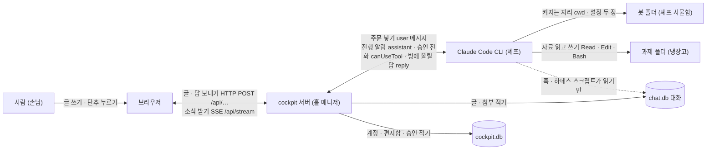
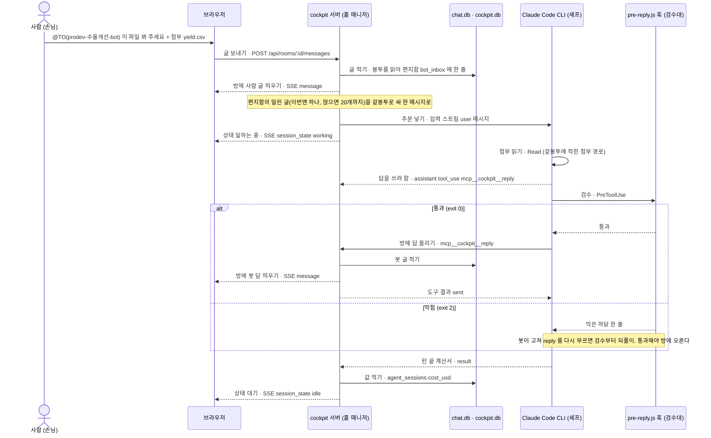
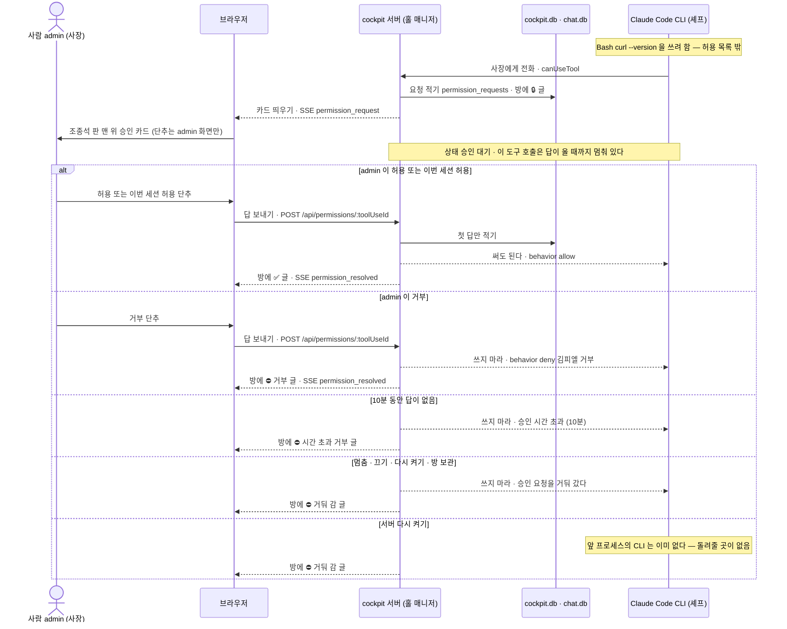
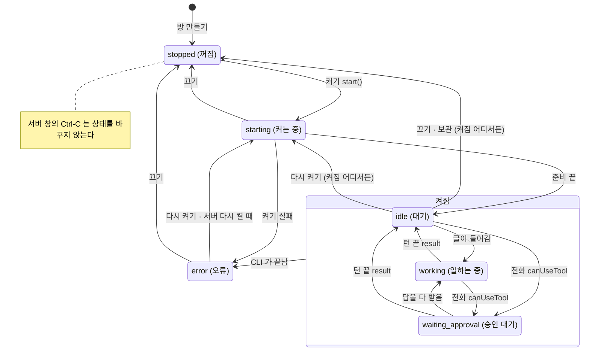
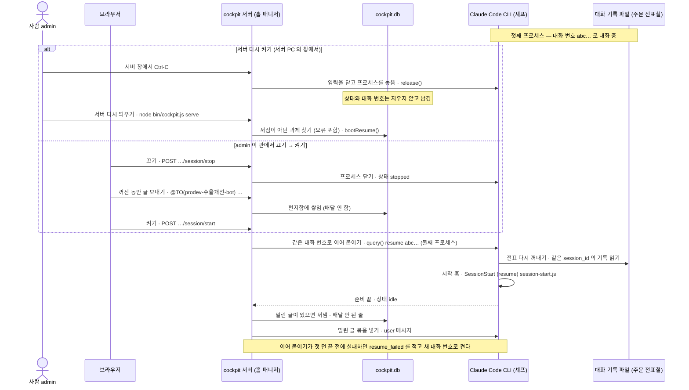
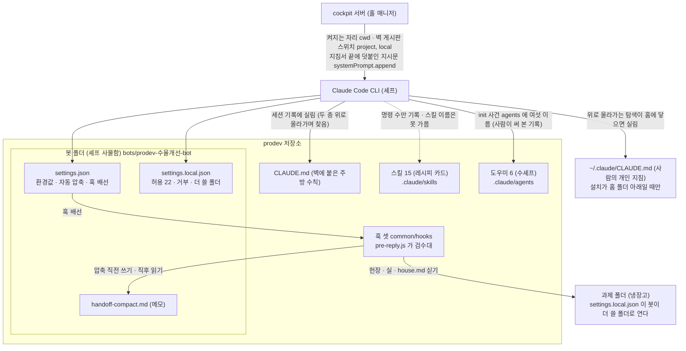
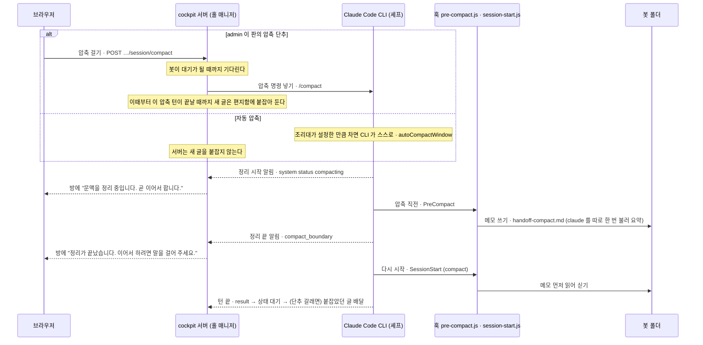

# cockpit 은 어떻게 돌아가나 — 공방 비유로 읽는 구조 설명

이 문서는 cockpit 을 처음 보는 사람을 위한 설명서다. 설계 원문은 `ARCHITECTURE.md`(구조), `ADR.md`(결정의 까닭), `as-built.md`(지금 코드 모양)에 있고, 이 문서의 사실은 모두 그 셋과 코드에서 가져왔다.

**괄호 안의 `파일:줄` 과 `ADR-0xx` 는 근거 표시다.** 몰라도 읽는 데 지장이 없다. 코드를 열어 확인하고 싶은 사람만 쓰면 된다.

비유는 `~/orca/projects/agent-sdk-study/index.html`("에이전트 SDK 공방")의 낱말을 이어받는다. 셰프 · 주방 · 조리대 · 수셰프 · 검수대 같은 말이다. 따옴표 안은 원문 그대로다. 원문에 없는 비유를 새로 붙인 곳에는 **"이 문서에서 새로 붙인 비유"** 라고 적었다.

---

## 1. 한 줄 답

> **이것은 Claude Code 세션이다 — 서버가 대신 켜고 붙들 뿐.**

"붙든다" 는 켜 둔 채 끄지 않고 계속 들고 있다는 뜻이다. 터미널에서 `claude` 를 켜고 말을 거는 것과 속은 같다. 다른 점은 셋뿐이다.

1. 사람이 터미널 대신 **브라우저**로 말한다.
2. 세션을 켜고 붙드는 쪽이 사람이 아니라 **cockpit 서버**다.
3. 셰프(Claude)가 사장에게 "이 도구 써도 돼요?" 하고 거는 전화가, 브라우저의 **승인 카드**로 온다.

예: 과제원(member)이 방에 `@TO(prodev-수율개선-bot) 이 파일 봐 주세요` 라고 쓴다. 이 글은 서버를 거쳐, 이미 켜져 있는 Claude Code 세션에 사용자 메시지 하나로 들어간다. 봇의 답은 세션 안의 도구 `reply` 를 거쳐 방에 올라온다.

더 깊이: SDK 가 코드에서 실제로 불리는 여섯 장면 → [docs/eli5-cockpit-sdk.html](eli5-cockpit-sdk.html)

## 2. 처음 나오는 낯선 말

| 말 | 한 줄 풀이 |
|---|---|
| **SDK** | 다른 프로그램이 Claude Code 를 부품처럼 켜고 조종하게 해 주는 부품 묶음(라이브러리)이다. 여기서는 `@anthropic-ai/claude-agent-sdk` 다 (ADR-001). |
| **프로세스** | 컴퓨터에서 돌고 있는 프로그램 하나다. **자식 프로세스**는 어떤 프로그램이 새로 띄운 프로그램이다. |
| **세션 · 턴** | 세션은 봇과의 대화 한 줄기다. 턴은 글을 받아 일하고 답을 마칠 때까지의 한 바퀴다. |
| **MCP** | Claude 에게 새 도구를 붙이는 표준 규격이다. cockpit 은 도구 둘(`reply` · `fetch_history`)을 이 규격으로 붙인다. |
| **SSE** | 브라우저가 한 번 열어 두면, 서버가 계속 소식을 흘려보내 주는 통로다 (ADR-012). |
| **HTTP** | 브라우저가 서버에게 "이것 해 주세요" 를 한 번씩 보내는 보통의 요청 방식이다. |
| **큐 · 편지함** | 줄 서서 기다리는 자리다. 봇에게 갈 글은 `cockpit.db` 의 `bot_inbox`(봇 편지함)에 먼저 줄을 선다. |
| **resume** | 끊겼던 대화를 대화 번호(`session_id`)로 다시 이어 붙이는 SDK 기능이다. |
| **훅** | Claude Code 가 정해진 순간(도구 쓰기 직전, 압축 직전 등)에 반드시 돌리는 작은 프로그램이다. |
| **봉투** | 글 안에 적는 받는 봇 표시 `@TO(봇)` · `@CC(봇)` 이다. `@TO` 는 "답해 주세요", `@CC` 는 "참고만 하세요" (ADR-018). 이 뜻을 봇에게 알리는 자리는 6.2 에 있다. |
| **겉봉투** | 서버가 봇에게 넘길 때 글을 감싸는 `<channel …>` 꼴이다. 방 번호 · 보낸 사람 등을 적는다 (ADR-013). |
| **하네스** | 봇이 따르는 지침 · 설정 · 훅 · 스킬 묶음이다. 여기서는 cockpit 폴더 옆에 나란히 받아 둔 저장소 **prodev** 가 그 묶음이다. |
| **cwd** | 프로그램이 켜지는 폴더다. Claude Code CLI 의 cwd 는 봇 폴더다. |
| **채널 플러그인 · minidiscord** | minidiscord 는 cockpit 전에 쓰던 채팅 프로그램이고, 채널 플러그인은 그 채팅방과 Claude Code 를 잇던 부품이다. cockpit 은 그 화면과 도구 모양을 이어받았다. |
| **스모크** | 가짜가 아니라 실제 Claude 로 짧게 돌려 본 시험이다. 결과는 `as-built.md` 에 기록돼 있다. |
| **사람이 써 본 자리** | 사람이 이 맥에서 화면을 직접 눌러 써 본 설치 자리(`~/cockpit-try-v2`)다. 스모크와 달리 대본 없이 사람이 썼다. |
| **재생** | 예전에 실제로 오간 대화 기록을 cockpit 에 다시 흘려 넣어 돌려 본 시험이다. |
| **SDK 형 정의** | SDK 가 옵션과 값의 모양 · 뜻을 적어 둔 설명 파일(`sdk.d.ts`)이다. 코드가 아니라 설명서다. |
| **CSP** | (이 문서 주제와는 거리가 멀다) 브라우저에게 "이 화면에서는 우리 서버의 스크립트만 돌려라" 라고 알리는 머리말이다. Q12 참고. |

## 3. 등장인물 여섯

| 등장인물 | 누구 · 무엇 | 하는 일 |
|---|---|---|
| **사람** | PL(admin) · 과제원(member) | 글을 쓴다. admin 은 승인 카드에 답하고 세션을 켜고 끈다 |
| **브라우저** | `web/` 화면 (minidiscord 화면 사본 + 오른쪽 조종석 판) | HTTP 로 글 · 답을 보내고, SSE 로 소식을 받는다 |
| **cockpit 서버** | Node 한 프로세스 (`node bin/cockpit.js serve`) | 계정 · DB 둘 · 큐 · 승인 전달(중계) · 세션 붙들기 |
| **Claude Code CLI** | SDK 가 띄우는 자식 프로세스, 과제마다 하나 | 실제로 생각하고 도구를 쓰는 봇 세션 |
| **봇 폴더** | `prodev/bots/prodev-<과제>-bot` — prodev 저장소 **안** | CLI 가 켜지는 자리(cwd). 설정 두 장이 여기 있다 |
| **과제 폴더** | `projects/<과제>` | 봇이 읽고 쓰는 일감. 파일 판도 여기를 보여 준다 |

DB 는 둘이다. 봇이 읽어도 되는 대화 DB `chat.db` 와, 봇에게서 막아 둔 계정 · 승인 · 큐 DB `cockpit.db` 다. 막아 두었지만 완전히 막힌 것은 아니다 (ADR-003 · Q6).

**그림 1** 은 여섯 등장인물과 DB 둘이 어떤 선으로 이어지는지 보여 준다.



**읽는 법.** 왼쪽 사람에서 시작해 브라우저 → cockpit 서버 → Claude Code CLI 로 간다. 눈여겨볼 점은 **브라우저와 CLI 사이에 선이 없다**는 것이다. 세션에 말을 거는 쪽은 언제나 서버 하나다 (ADR-002). 점선은 prodev 의 훅 · 스크립트(`chat.js` 등)가 `chat.db` 를 읽기만 하는 길이다. 봇 도구 `fetch_history` 와는 다른 길이다.

## 4. 공방 비유 대응표 — 공방에서 배운 말이 cockpit 에서는 무엇인가

공방에서 **셰프**는 Claude, **사장**은 규칙을 정하는 개발자였다. cockpit 에서 사장 자리는 둘로 나뉜다(이 문서의 해석). 표에서는 줄마다 어느 쪽인지 적었다.

- **사장(규칙)** — 규칙을 미리 적어 둔 쪽. cockpit 코드와 prodev 설정이다.
- **사장(admin)** — 전화를 받는 쪽. 브라우저 앞의 admin 이다.

| SDK 개념 | 공방 비유 (원문 낱말) | 우리 cockpit 에서는 | 코드 자리 |
|---|---|---|---|
| `query()` | "주방 문 열기" · "주문서와 영업 조건을 건네면 셰프가 조리를 시작한다." | 과제마다 **한 번만** 부르고, 문을 연 채로 둔다 | `src/session/manager.js:231` |
| 입력 스트림 | "계속 들어오는 주문은 문을 열어 둔 채 받는다." | 넣는 곳은 서버 한 곳뿐이라, 여러 사람이 동시에 넣는 경쟁이 없다. 밀린 글은 최대 20개까지 한 메시지로 묶여 들어간다 | `src/session/input-stream.js:3-32` |
| `resume` | "세션은 주문 전표철이다." · "resume은 전표를 다시 꺼내고, fork는 전표를 복사해 다른 버전을 만든다." | 서버를 다시 켜거나 켜기 단추를 누르면, 적어 둔 대화 번호로 이어 붙인다 | `manager.js:111, 117-125` |
| `settingSources` | "벽 게시판 스위치는 어느 벽의 수칙을 읽힐지 정한다." | 스위치에서 `project` · `local` 두 벽을 켠다. 봇 폴더의 `settings.json` · `settings.local.json` 이 읽힌다 (사장(규칙)) | `src/session/options.js:14` |
| `CLAUDE.md` | "벽에 붙은 주방 수칙" | 수칙 종이는 봇 폴더가 아니라 두 층 위 prodev 뿌리에 붙어 있다. SDK 형 정의상 `project` 를 켜면 싣고 cockpit 은 켠다. **실린 것을 세션 기록으로 확인했다.** 홈 아래 설치면 사람의 `~/.claude/CLAUDE.md` 도 실린다 (10절) | prodev `CLAUDE.md` · SDK `sdk.d.ts:2094` |
| 시스템 프롬프트 | "셰프 근무 지침서" | 세션을 켤 때 **한 번**, Claude Code 기본 지침서 끝에 cockpit 지시문 묶음을 덧붙인다: `systemPrompt: { type: 'preset', preset: 'claude_code', append: INSTRUCTIONS, snapshot: true }`. `to` 에는 reply 로 답하고 `cc` 에는 답하지 말라는 규칙이 여기 있다 (사장(규칙)) | `options.js:25` · `src/envelope/wrap.js:18-31` |
| 훅 | "검수대" · "검수대는 칼을 들기 직전과 직후에 반드시 지나가는 자리다." | 검수대는 `pre-reply.js` 이고, prodev 가 봇 폴더 `settings.json` 에 세운다. 다른 훅 둘(시작 · 압축 직전)은 막지 않고 자료를 싣거나 메모를 쓰므로 이 문서는 검수대라 부르지 않는다. cockpit 은 훅을 등록하지 않고 지켜보며 적기만 한다 | `manager.js:393-396` · prodev `common/settings.template.json:14-27` |
| MCP `reply` · `fetch_history` | "사장이 만든 전용 도구" | 서버 프로세스 안에 붙인 도구 둘. 봇이 방에 말하는 **유일한** 길이 `mcp__cockpit__reply` 다 (사장(규칙)) | `src/mcp/tools.js:112-147` |
| 마지막 응답 | "접시를 낸다" | 공방에서는 접시를 내면 끝이지만, cockpit 에서 도구 없이 낸 이 접시는 **주방 안에 머문다**. 손님에게 가는 것은 `reply` 에 담은 것뿐이다 | `manager.js:343-350` · `tools.js:116` |
| `allowedTools` | "허락 없이 쓸 도구" · "허용 목록" | 코드가 주는 목록은 도구 둘뿐이다. 봇 폴더 `settings.local.json` 의 허용 22건(같은 MCP 도구 둘 포함 · `Read` · `Bash(git:*)` 등)이 나머지를 푼다 (사장(규칙)) | `options.js:9, 18` · ADR-006 |
| `permissionMode` | "영업 모드" · "첫날은 칼 쓸 때마다 묻게" | `'default'` — 넓히지 않는다 (사장(규칙)) | `options.js:17` |
| `canUseTool` | "셰프가 확신이 없으면 사장에게 전화한다." | 전화가 브라우저 판의 **승인 카드**로 온다. 10분 안에 답이 없으면 거부 (사장(admin)) | `manager.js:279-290` · `src/permissions/relay.js:63-82` |
| 서브에이전트 | "수셰프" · "수셰프는 주문 쪽지 한 장만 받아 자기 조리대에서 요리한다." | 화면 이름 **도우미**에 들어간다. 도우미 = 수셰프(서브에이전트) + 백그라운드 작업이고, 서브에이전트가 아닌 백그라운드 작업은 수셰프가 아니다(원문에 비유 없음). prodev 도우미 여섯이 실린 것은 기록으로 확인했다(10절) | `manager.js:400-413` |
| 스킬 | "레시피 카드는 목차만 벽에, 본문은 서랍에 둔다." | prodev `.claude/skills/` 15개. 실렸는지는 기록으로 가를 수 없다 (10절) | prodev `.claude/skills/` |
| 압축(compact) | "조리대 정리" · "조리대가 꽉 차면 셰프가 다 쓴 재료를 치우고 메모만 남긴다." | 자동으로, 또는 admin 이 판의 `압축` 단추로 한다. 메모가 `handoff-compact.md` 다 | `manager.js:164-171, 298-306, 387-392` |
| 컨텍스트 창 | "조리대" | 판 머리의 **문맥** 칸(몇 % 찼나) | `manager.js:418-427` |
| 메시지 스트림 | "주방 모니터에는 조리 과정이 한 줄씩 올라오고 끝에 계산서가 뜬다." | 서버가 한 줄씩 받아 `session_events` 에 적고 SSE 로 판에 흘린다 | `manager.js:251-254, 329-379` |
| 값 (`total_cost_usd`) | "재료비 장부는 어림값으로 적고 청구서와 맞춘다." | 판 머리 **값** 칸 `$0.04 추정치` 가 장부의 어림값이다. 청구액이 아니다 | `manager.js:213, 365` · `web/cockpit.js:17-20` |
| `interrupt()` | "계속 들어오는 주문은 중간에 \"잠깐!\"도 외칠 수 있다." | 판의 `멈춤` 단추. 편지함을 거치지 않는 유일한 조작이다 | `manager.js:157-161` |
| 작업 폴더의 파일 | "냉장고 속 재료" | 과제 폴더. 대화 기록이 아니라 폴더에 남는다 | `src/rooms/create.js:57` · `src/http/routes-files.js:29-37` |
| `cwd`(봇 폴더) · usage 토큰 수 | **원문에 비유가 없다** | 봇 폴더는 이 문서에서 **셰프 사물함**이라 부른다(새 비유, 아래). 토큰 수는 "문맥" 칸의 재료일 뿐 "값" 이 아니다 | `options.js:13` · `manager.js:425` |

**이 문서에서 새로 붙인 비유** 넷:

- **손님 = 사람.** 이 문서에서 "손님" 은 이 뜻으로만 쓴다. admin 도 사람이라, 방에 글을 쓸 때는 손님이고 승인 카드에 답하거나 세션을 켜고 끌 때는 사장(admin) 자리에 앉는다.
- **셰프 사물함 = 봇 폴더.** 셰프가 출근해 서는 자리(cwd)이고, 그 셰프의 설정 두 장과 메모가 들어 있다. 요리 재료가 든 냉장고(과제 폴더)와는 다르다.
- **홀 매니저 = cockpit 서버.** 손님의 주문을 받아 모아 두었다가 셰프에게 한 묶음씩 넘기고, 셰프의 전화를 사장(admin)에게 돌려 준다.
- **받는 사람 딱지 = 봉투.** `@TO` · `@CC` 딱지가 둘 다 없는 주문서는 주방에 들어가지 않는다.

비유가 아니라 **쉬운 말로 붙인 이름**도 있다: 편지함(`bot_inbox`) · 겉봉투(`<channel …>`) · 출입증(쿠키 `md_session`). 공방 원문에는 없는 말이다.

## 5. 글 한 번 왕복 — 사람의 글이 봇의 답이 되기까지

**그림 2** 는 글 하나가 봉투 → 편지함 → CLI 턴 → 훅 → `reply` → DB → SSE 차례로 도는 길을 보여 준다.



**읽는 법.** 위에서 아래로 시간이 흐른다. 사람의 글은 먼저 편지함에 줄을 서고, 그다음에야 CLI 로 들어간다. 눈여겨볼 화살표는 `C->>H` 다. 봇의 답은 방에 오르기 **전에** 반드시 `pre-reply.js` 검수대를 지난다. 막히면 봇이 고쳐 다시 불러 통과할 때까지 답은 방에 오르지 않는다.

알아 둘 것:

- **글은 기다리지 않고 곧바로 들어간다.** 봇이 대기 · 일하는 중 · 승인 대기 중 어느 상태든, 서버는 새 글을 곧바로 세션에 넣는다 (`manager.js:22, 293-297`). 처음 만든 판(버전)은 대기일 때만 넣었으나, 재생(2절) 시험에서 봇이 도우미를 돌리는 동안 PL 의 질문 둘이 6분 붙잡힌 일이 있어 바꿨다 (ADR-008 되돌림).
- **예외는 압축 하나다.** admin 이 건 `/compact` 가 들어간 뒤 그 압축 턴이 끝날 때까지는 새 글을 편지함에 붙잡아 둔다 (`manager.js:298-306, 364`). 11절 참고.
- **봉투가 없는 글은 편지함에 줄이 생기지 않는다.** 그래서 CLI 쪽 화살표가 하나도 없다 (`src/db/chat-db.js:179` · ADR-018).
- **도구 없이 낸 접시는 손님에게 안 나간다.** 봇이 도구 없이 쓴 마지막 말은 방에 오르지 않는다. 방에 오르는 것은 `reply` 에 담은 것뿐이다 (4절 "접시를 낸다" 줄).

## 6. 통신 경로 넷 — 경로마다 실제 메시지 한 토막

> **실제 메시지 모양이 궁금한 사람만 읽는다. 건너뛰어도 7절부터 이어진다.**

"코드에서 재구성" 은 코드 · 시험에 글자 그대로의 예가 없어서, 코드가 만드는 모양을 옮겨 적었다는 뜻이다. 예는 한 이야기로 맞췄다(과제 `수율개선`, 방 번호 1, 윈도우 PC). 다만 시험에서 옮긴 토막(6.1 글자 조각 · 6.2 CLI 메시지 · `canUseTool`)은 시험 값 그대로다.

### 6.1 브라우저 ↔ cockpit 서버 — HTTP 와 SSE

브라우저 → 서버는 드문 요청이라 HTTP 다. 서버 → 브라우저는 계속 흐르므로 SSE 하나에 다 싣는다 (ADR-012). 로그인 표시는 쿠키(브라우저가 들고 다니는 출입증) `md_session` 하나다 (ADR-005).

방 만들기 요청 (코드에서 재구성 — 모양은 `src/http/routes-rooms.js:16-21`, 실측은 `as-built.md:171` 의 `prodev-smoke` 방이다. 이름은 이 이야기에 맞춰 바꿨다). `201` 은 "만들었다" 는 응답 번호다:

```
POST /api/rooms HTTP/1.1
cookie: md_session=<64자 출입증 값>
content-type: application/json

{"name":"수율개선"}
→ 201 {"id":1,"name":"prodev-수율개선","status":"active", … ,"project":"수율개선","bot":{"id":1,"name":"prodev-수율개선-bot"}}
```

SSE 한 덩이 — 승인 요청 system 글 (코드에서 재구성, `src/http/sse.js:14` · `relay.js:31-33`):

```
id: 1757900000123
event: message
data: {"project":"수율개선","message":{"id":7,"room_id":1,"author_type":"system","body":"🔒 Bash 요청 · Claude wants to run curl --version", … }}
```

봇이 답을 쓰는 중에 흘려보내는 글자 조각(`partial`)은 번호(id) 없이 흐른다. 시험이 id 없음과 data 값을 확인한다 (`test/sse.test.js:100, 105`). 아래 글자 꼴은 `src/http/sse.js:14` 가 만든다:

```
event: partial
data: {"project":"시험","text":"안녕"}
```

### 6.2 cockpit 서버 ↔ Claude Code CLI — SDK 메시지

서버는 입력 스트림에 **user 메시지**를 넣고, CLI 는 **system · assistant · user(도구 결과) · result** 메시지를 흘려보낸다.

서버가 넣는 user 메시지 한 개 (코드에서 재구성, `wrap.js:62-84`). 겉봉투 안 마지막 줄 `→ delivery="to"…` 는 `to` 글에만 서버가 붙이는 지시 한 줄이다(`wrap.js:13-14, 52`). 글마다 붙는 지시는 이 한 줄뿐이다. `cc` 글에는 아무 줄도 붙지 않고, "cc 에는 답하지 말라" 는 규칙은 세션을 켤 때 한 번 덧붙인 지시문 묶음(셰프 근무 지침서 끝, `wrap.js:22` · `options.js:25`)에만 있다:

```js
{
  type: 'user', session_id: '', parent_tool_use_id: null,
  message: { role: 'user', content: [{ type: 'text', text:
`<channel source="cockpit" chat_id="1" message_id="2" delivery="to" sender="김과제" author_type="user" room_name="prodev-수율개선">
[김과제] @TO(prodev-수율개선-bot) 이 파일 봐 주세요
(첨부 파일 경로: C:\cockpit-data\uploads\3f2a…-yield.csv)
→ delivery="to"로 받은 메시지에는 반드시 reply 도구로 답변하세요.
</channel>` }] },
  origin: { kind: 'channel', server: 'cockpit' },
}
```

CLI 가 내는 메시지 — 시험용 가짜 SDK 가 쓰는 모양. 앞 두 줄은 변수 자리에 실제로 들어가는 값을 채웠고, 셋째 줄은 시험 글자 그대로다 (`test/fakes/fake-query.js:55, 88` · `test/session-manager.test.js:264`):

```js
{ type: 'system', subtype: 'init', session_id, model: 'fake', permissionMode: 'default' }
{ type: 'result', subtype: 'success', session_id, total_cost_usd: 0.01, num_turns: 1, duration_ms: 5 }
{ type: 'system', subtype: 'compact_boundary', compact_metadata: { trigger: 'manual', pre_tokens: 23614, post_tokens: 2404 } }
```

CLI 가 서버에 거는 전화 `canUseTool` — 시험이 쓰는 모양. 셋째 인자의 뼈대는 24-26줄, `agentID` · `title` 은 부르는 자리 66줄의 값이다 (`test/permissions.test.js:24-26, 66`):

```js
canUseTool('Bash', { command: 'curl --version' },
  { signal, requestId: 'req-…', toolUseID, agentID: 'agent-0123456789', title: 'Claude wants to run curl --version' })
```

### 6.3 Claude Code CLI ↔ 하네스 — 파일과 훅

CLI 는 켜질 때 봇 폴더의 설정 두 장을 읽는다. 훅은 그 설정에 적힌 명령을 CLI 가 직접 돌린다. cockpit 서버는 이 길에 끼지 않는다. `matcher` 는 "언제 이 훅을 돌릴지 고르는 조건", `{{HOOKS}}` 는 설치 때 prodev 훅 폴더 경로로 바뀌는 자리다.

봇 폴더 `.claude/settings.json` 의 훅 부분 — prodev 틀 그대로 (`common/settings.template.json:14-27`):

```json
"hooks": {
  "SessionStart": [ { "matcher": "startup|resume|clear|compact", "hooks": [ { "type": "command", "command": "node {{HOOKS}}/session-start.js" } ] } ],
  "PreCompact":   [ { "matcher": "", "hooks": [ { "type": "command", "command": "node {{HOOKS}}/pre-compact.js", "timeout": 180 } ] } ],
  "PreToolUse":   [ { "matcher": "mcp__cockpit__reply", "hooks": [ { "type": "command", "command": "node {{HOOKS}}/pre-reply.js" } ] } ]
}
```

훅이 돌면 서버가 적는 사건 한 줄의 모양 (코드에서 재구성, `manager.js:395`):

```js
{ type: 'hook', data: { subtype: 'hook_response', hook_event: 'SessionStart', hook_name: …, exit_code: 0 } }
```

주의: 검수대(`pre-reply.js`)가 답을 막았을 때는 판에 훅 줄이 따로 뜨지 않고, 도구 결과 줄로만 보인다. 압축 직전 훅도 판에 훅 줄로 안 보인다 (`ARCHITECTURE.md` 5.3 · `as-built.md` 6절).

### 6.4 봇 ↔ 방 — `reply` 와 `fetch_history`

봇은 방에 **말할 때** `mcp__cockpit__reply`, 놓친 대화를 **읽을 때** `mcp__cockpit__fetch_history` 를 부른다. 이름과 입력 모양은 옛 채널 플러그인과 글자 그대로 같다 (`tools.js:3-6`).

`reply` (코드에서 재구성, 답 본문은 `as-built.md:171` 실측, `tools.js:112-119`):

```
입력:  { "chat_id": "1", "text": "파일 첫 줄은 \"lot,yield\" 입니다." }
성공:  { content: [ { type: 'text', text: 'sent' } ] }
실패:  { content: [ { type: 'text', text: '방 3 은 이 봇의 방이 아니다' } ], isError: true }
```

`fetch_history` (코드에서 재구성, `tools.js:122-147`):

```
입력:  { "chat_id": "1", "since_id": 0, "limit": 100 }
결과:  {"cursor":2,"messages":[
         {"id":1,"at":"2026-09-15 01:00:00","author":"김과제","body":"어제 라인 3 수율이 좀 낮았어요"},
         {"id":2,"at":"2026-09-15 01:02:00","author":"김과제","body":"@TO(prodev-수율개선-bot) 이 파일 봐 주세요",
          "attachments":[{"filename":"yield.csv","path":"C:\\cockpit-data\\uploads\\3f2a…-yield.csv"}]} ]}
```

## 7. 승인 카드 — 셰프가 사장에게 전화할 때

**그림 3** 은 허용 목록 밖의 도구를 봇이 쓰려 할 때, 전화(`canUseTool`)가 카드가 되어 admin 에게 갔다가 답이 되돌아오는 길을 보여 준다.



**읽는 법.** 다른 그림처럼 왼쪽이 사람이다. 오른쪽 끝 CLI 의 전화에서 시작해 왼쪽 사람까지 갔다가 되돌아온다. 눈여겨볼 곳은 `alt` 다섯 갈래다.
- 앞 세 갈래(허용 · 거부 · 시간 초과): CLI 는 답 하나를 받고 **턴을 잇는다**. 거부면 그 까닭 글이 봇의 다음 행동에 힌트가 된다(공방 M5·4).
- 넷째 갈래: 거부를 받은 뒤 **턴이 멈추거나**(멈춤) **프로세스가 닫힌다**(끄기 · 다시 켜기 · 보관) (`manager.js:138-143, 157-161, 186-196`).
- 마지막 갈래(서버 다시 켜기): CLI 가 이미 없어 방에 기록만 남긴다 (`relay.js:98-101, 115-121`).

예: 봇이 `Bash(curl --version)` 을 쓰려 한다. `curl` 은 허용 목록(`Bash(node:*)` · `Bash(git:*)` …)에 없다. 방에 `🔒 Bash 요청 · Claude wants to run curl --version` 줄이 오르고, admin 판에 카드가 뜬다. 카드 제목은 SDK 가 주는 글이라 영어로 뜰 수 있다.

사실 몇 가지:

- 기본 기다림은 **10분**이다 (`src/config.js:15` · `relay.js:74`). 설정 `approvalTimeoutMin` 으로 바꾼다.
- 답은 **admin 만** 한다. member 가 답하면 거절된다(403). 두 탭이 동시에 답하면 먼저 온 답만 먹고, 나중 답은 "이미 답이 있음"(409)이다 (`relay.js:86, 93` · ADR-009).
- "이번 세션 허용" 은 지금 켜진 세션 동안만 허용한다. 봇 폴더 설정 파일에 영구 규칙으로 적지 않는다 (`relay.js:131` · ADR-009 바뀐 자리).
- **허용 목록 안의 도구는 보통 카드 없이 돈다** — 실험 기록(ADR-006)에서 그랬다. 다만 명령 모양이 복잡하면 규칙에 있어도 카드로 올 수 있다. 예: `mkdir`, 따옴표, 명령을 글자로 넘기는 옵션 `-e` 가 든 Bash (ADR-006 결과). 이것을 강제하는 줄은 cockpit 코드에 없다. SDK 동작이다.

## 8. 세션 수명 — 여섯 상태와 옮겨 가는 조건

**그림 4** 는 DB 에 실제로 적히는 상태값 여섯(`src/db/cockpit-db.js:11`)과, 상태를 바꾸는 조건을 보여 준다. 괄호 안은 화면에 뜨는 글자다 (`web/cockpit.js:10-12`).



**읽는 법.** `stopped (꺼짐)` 에서 시작해 `starting (켜는 중)` 을 지나 `idle (대기)` 에 닿는다. 그 뒤로는 **켜짐** 상자 안의 셋이 돈다. 상자에서 나가는 화살표 셋(끄기 · CLI 끝남 · 다시 켜기)은 상자 안 어느 상태에서든 일어난다. 그림이 겹치지 않게 끄기 · 다시 켜기는 `idle` 에서 그리고 "(켜짐 어디서든)" 을 붙였다. 눈여겨볼 화살표는 `error --> starting` 이다. 오류로 멈춘 세션도 다시 켜기와 서버 기동으로 되살아난다.

풀어 둘 것 둘:

- **대기인데 봇이 말하기 시작하는 때**가 있다. 턴 도중에 넣은 글을, SDK 가 턴이 끝난 뒤 새 턴으로 이어 돌 때다. 그래서 대기 중에 봇의 말이 오면 일하는 중으로 바꾼다 (`manager.js:334-338`).
- **이어 붙이기(resume) 실패.** 첫 턴이 끝나기 전에 resume 이 실패하면, 상태는 그대로 두고 `resume_failed` 를 적은 뒤 새 대화로 다시 켠다 (`manager.js:256-258, 264-270`).

예: 판에서 `켜기` 를 누르면 `꺼짐 → 켜는 중 → 대기` 로 바뀐다. 사람이 `@TO` 글을 보내면 `일하는 중`, 봇이 `Bash(curl …)` 를 물으면 `승인 대기`, 턴이 끝나면 다시 `대기` 다. 상태를 바꾸는 코드 자리는 13절 표에 모았다.

## 9. 끄기 → 켜기 — resume 이 대화를 이어 붙이는 법

**그림 5** 는 세션이 꺼졌다 켜질 때 **프로세스는 바뀌어도 대화 번호(`session_id`)는 이어지고**, 밀린 글은 다시 배달된다는 것을 보여 준다.



**읽는 법.** 위의 `alt` 두 갈래(서버 다시 켜기 · 판에서 끄기 → 켜기) 중 어느 쪽이든 아래의 같은 줄 "같은 대화 번호로 이어 붙이기" 로 모인다. 눈여겨볼 화살표는 `C->>F` 다. 기억은 프로세스가 아니라 기록 파일에 있다. 공방 말로 resume 은 전표를 다시 꺼내는 일이다. 서버 다시 켜기 갈래에서도, 꺼지기 전에 배달 못 한 글이 편지함에 남아 있었다면 아래에서 배달된다.

사실 몇 가지:

- 서버 Ctrl-C 는 서버 PC 의 서버 창에서 친다. 상태를 바꾸지 않으므로 다음 `serve` 가 알아서 이어 붙인다 (`manager.js:147-154` · `bin/cockpit.js:234-252`).
- 판의 켜기 단추도 이어 붙이기로 켠다 (`src/http/routes-session.js:36-39`).
- 스모크에서 확인했다. 끄고 켜도 같은 대화로 이어졌고, 서버를 강제로 죽인 뒤 밀린 글 둘을 넣고 켜자 답 둘이 왔다 (`as-built.md:172` — `same_session=yes` · `REDELIVERED 2` · `BOT_REPLIES_AFTER_RESTART 2`).
- **기록 파일은 보통 `~/.claude/projects/` 아래에 있다** (SDK 형 정의 `sdk.d.ts:1685-1686`).
- cockpit 은 자리를 정하지 않고 기록 남기기만 켠다 (`persistSession: true`, `options.js:20`).
- 설정값 `CLAUDE_CONFIG_DIR` 가 있으면 그 아래로 바뀐다 (`sdk.d.ts:1694`). 이 값은 봇에게 넘기는 설정값에 들어 있다 (`env.js:8`).
- 앞 프로세스에서 답을 못 받은 승인 요청은 `거둬 감` 으로 닫는다 (`relay.js:98-102`).

## 10. 하네스 로딩 — CLI 가 켜질 때 무엇을 읽나

**그림 6** 은 CLI 가 봇 폴더에서 켜진 뒤 무엇을 읽는지 보여 준다. 봇 폴더가 **prodev 저장소 안**에 있다는 것이 핵심이다. **점선은 실제로 실렸다는 기록이 없는 길**이다(안 실린다는 뜻이 아니다).



**읽는 법.** 위의 cockpit 서버가 넘기는 것은 셋뿐이다: 켜지는 자리(cwd) · 벽 게시판 스위치 · 덧붙인 지시문. 나머지는 CLI 가 스스로 읽는다. 눈여겨볼 선은 `SJ --> HK` 다. 검수대(훅)는 서버가 아니라 prodev 의 `settings.json` 이 세운다. 봇 폴더가 prodev 상자 안에 있어서, 두 층 위(prodev 뿌리)의 CLAUDE.md · 스킬 · 도우미에 닿을 수 있다.

사실 몇 가지:

- **덧붙인 지시문**은 파일이 아니라 서버 코드 안의 글 묶음(`wrap.js:18-31`, "이 세션은 cockpit 채팅방에 봇으로 참여 중입니다. …")이다. SDK 옵션 `systemPrompt` 의 `append` 로 세션을 켤 때 한 번, Claude Code 기본 시스템 프롬프트(셰프 근무 지침서) 끝에 붙는다 (`options.js:25`). 겉봉투 형식 · `to` 와 `cc` 를 대하는 법 · `fetch_history` 로 따라잡는 법이 여기 있다.
- 봇 폴더에 prodev `setup.js` 가 쓰는 파일은 **설정 두 장뿐**이다. 봇 폴더에 `CLAUDE.md` 는 없다 (prodev `scripts/setup.js:329-331`). `ARCHITECTURE.md:26` 은 "CLAUDE.md · 스킬 15 · 훅 3 · 도우미 6" 이라 적었다.
- **도우미는 기록으로 확인했다.** 사람이 눌러 본 자리(`~/cockpit-try-v2`)의 `cockpit.db` 에서, 켤 때 적힌 `init` 사건의 `agents` 에 `data-reader` · `paper-writer` · `patent-analyst` · `report-writer` · `researcher` · `reviewer` 여섯이 모두 있었다. 그 봇 폴더의 `.claude` 에는 설정 두 장뿐이므로, 여섯은 상위 `prodev/.claude/agents` 에서 실린 것이다.
- **CLAUDE.md** 는 SDK 형 정의가 "`settingSources` 에 `'project'` 가 있어야 CLAUDE.md 를 싣는다" 고 적었고(SDK `sdk.d.ts:2094`) cockpit 은 `'project'` · `'local'` 만 준다(`options.js:14`, `'user'` 는 없다). **실린 것을 세션 기록으로 확인했다.** CLI 는 켜지는 자리에서 위 폴더로 올라가며 CLAUDE.md 를 찾는다. 사람이 눌러 본 자리의 기록(`~/.claude/projects/-Users-byunjungwon-cockpit-try-v2-prodev-bots-prodev------bot/43b089b6-….jsonl`)에는 `Contents of …/cockpit-try-v2/prodev/CLAUDE.md` 와 `Contents of /Users/byunjungwon/.claude/CLAUDE.md` 가 둘 다 "(project instructions, checked into the codebase)" 표시로 실렸다.
- **`'user'` 가 없어도 사람의 개인 지침이 실릴 수 있다.** 조건은 설치 자리다. 같은 스모크(`m1-hello`, haiku)를 두 자리에서 돌렸다. 홈 밖(`/private/tmp/…/n18/out`)의 기록에는 봇 폴더 · prodev 뿌리의 CLAUDE.md 둘만 있었다. 홈 아래(`~/cockpit-n18-home-tmp`)의 기록에는 `~/.claude/CLAUDE.md` 가 셋째로 같은 "project instructions" 표시로 붙었다. 올라가는 탐색이 홈 폴더에 닿아 그 `.claude/CLAUDE.md` 를 과제 지침처럼 읽은 것이다. 그래서 cockpit · 작업판은 홈 밖에 세운다 (README 2.2). `init` 사건에는 어느 CLAUDE.md 가 실렸는지 적히지 않는다 (`manager.js:243`).
- **스킬** 은 `init` 사건에 명령(`commands`) **수**만 있고 이름이 없어(`manager.js:243`), 스킬 15개가 들었는지 기록으로 가를 수 없다.
- 과제 헌장(`charter.md`) · 실(`threads/` — prodev 가 쓰는 이름. 이야기 줄기마다 하던 말이 어디서 끊겼는지 적어 두는 파일들, `session-start.js`) · 이 과제의 일하는 규칙(`house.md`)은 과제 폴더에 있고, 시작 훅이 켜질 때마다 싣는다 (prodev `common/hooks/places.js:6` · `session-start.js:1-24`).
- 허용 규칙은 `settings.local.json` 에만 넣는다. `settings.json` 에 넣으면 이 세션은 무시한다 (prodev 실측 기록, `scripts/setup.js:256-259`).

## 11. 압축 — 조리대를 치울 때

**그림 7** 은 압축이 시작되고 끝날 때 방에 두 줄이 오르고, 그 사이에 훅이 메모(`handoff-compact.md`)를 남기는 길을 보여 준다.



**읽는 법.** 위의 `alt` 에서 압축이 시작되는 두 갈래를 고르고, 아래로 내려가며 방에 오르는 두 줄을 따라간다. 눈여겨볼 곳은 `H->>BD` 두 번이다. 조리대를 치우기 직전에 메모를 쓰고, 치운 직후에 그 메모를 다시 읽는다.

풀어 둘 것:

- **붙잡기는 admin 이 건 압축에만 있다.** 붙잡는 표시는 서버가 `/compact` 를 넣을 때만 켜진다 (`manager.js:298-306, 364`). 압축을 걸어만 두고 대기를 기다리는 동안에는 새 글이 평소처럼 들어간다.
- **메모는 누가 쓰나.** 압축 직전 훅이 Claude 를 따로 한 번 더 불러(`claude -p --model sonnet`) 대화 꼬리를 요약하게 하고, 그 결과를 봇 폴더에 파일로 떨군다 (prodev `common/hooks/pre-compact.js:1-13`).
- 방 두 줄 문구는 `manager.js:19-20` 에 있다. 훅과 system 메시지의 정확한 순서는 CLI 가 정하므로 cockpit 코드가 재지 않는다. 스모크는 방 글 두 줄과 메모가 정상으로 쓰인 것을 확인했다 (`as-built.md:184`).

## 12. 자주 묻는 것

**Q1. 브라우저를 닫아도 왜 세션이 안 죽나?**
세션을 붙든 쪽이 브라우저가 아니라 서버이기 때문이다. 서버는 과제마다 `query()` 를 한 번 부르고, 입력 스트림을 끝내지 않은 채 들고 있다 (ADR-002). 입력 스트림이 끝나는 것은 끄기 · 서버 종료 · 다시 켜기와, 세션이 오류로 멈추거나 resume 실패로 새로 켤 때뿐이다 (`manager.js:139, 151, 190, 267, 274`). 서버를 Ctrl-C 로 꺼도 상태를 그대로 두었다가 다음 `serve` 가 이어 붙인다 (9절). 예: 퇴근 때 브라우저를 닫고 아침에 열면, 봇은 어제 대화를 기억한 채 `대기` 다.

**Q2. 서버를 다시 켜면 값이 0 부터 다시 시작하나?**
**DB 에는 맞게 쌓인다. 다만 판의 값은 재기동 뒤 잠깐 작게 보일 수 있다.**
- DB: SDK 의 값은 CLI 프로세스마다 0 에서 다시 센다. 그래서 서버는 켤 때 적힌 값 위에 새 프로세스의 값을 얹어 적는다 (`manager.js:211-213, 365`). 예: 끄기 전 $0.0319, 켠 뒤 새 프로세스가 $0.0102 면 DB 에는 $0.0421 이다.
- 판: 턴이 끝날 때 판은 SDK 원래 값(새 프로세스 것만)으로 칸을 바꾼다 (`web/panel.js:250`). 과제 목록을 새로 받기 전까지는 $0.0102 처럼 작게 보일 수 있다. 코드를 읽어 확인했고 화면으로는 보지 않았다.

**Q3. 승인 카드는 얼마나 기다리나? 그동안 온 글은?**
기본 10분이다 (`src/config.js:15`). 10분 안에 admin 이 답하지 않으면 봇에게 `승인 시간 초과 (10분)` 거부가 가고, 방에 `⛔ 시간 초과 거부 (10분) · <도구>` 줄이 오른다 (`relay.js:39, 74, 133`). `cockpit.json` 의 `approvalTimeoutMin` 으로 바꾼다. 기다리는 동안 그 도구 호출은 답이 올 때까지 멈춰 있다. 그 사이에 온 새 글도 서버가 곧바로 세션에 넣는다 (`manager.js:22, 324`). 봇이 그 글을 지금 턴에 섞어 읽을지, 턴이 끝난 뒤 읽을지는 Claude Code 가 정한다 — cockpit 코드로는 알 수 없다 (`manager.js:334-335`).

**Q4. `@TO` 를 지우고 보낸 글은 어디로 가나?**
방에만 남고 봇에게는 안 간다. 봉투가 없으면 편지함에 줄이 생기지 않아, 세션이 깨지 않고 턴도 돌지 않는다 (`chat-db.js:179` · ADR-018). 스모크에서 사람끼리 글 둘을 보냈을 때 편지함 줄 0 · 봇 턴 0 이었다 (`as-built.md:171`). 나중에 `@TO(prodev-수율개선-bot) 위 파일 봐 줘` 로 부르면, 봇은 `fetch_history` 로 사람끼리 나눈 글과 첨부 경로를 따라잡는다 (ADR-020). 화면은 방을 열 때 입력칸에 `@TO(<봇>) ` 을 미리 채워 실수를 줄인다.

**Q5. 봇이 못 보거나 못 하는 것은 무엇인가?**
여섯이다.
- ① 서버의 설정값(환경변수) — 봇에게는 미리 고른 15개 · 설정 `extraEnvKeys` 에 적은 것 · 봇 폴더 경로(`PRODEV_BOT_DIR`)만 넘긴다 (`env.js:7-21` · ADR-007).
- ② `cockpit.db` — 봇 설정의 거부 목록에 읽기 · 고치기 · 쓰기가 있다. 다만 봇이 `node` 스크립트를 돌리면 열 수 있어 **완전히 막힌 것은 아니다**. 그래서 비밀번호와 출입증은 원래 글자 대신 되돌릴 수 없게 바꾼 값(해시)만 둔다 (ADR-003 · `ARCHITECTURE.md` 3.3).
- ③ 봉투 없는 글 — 부르기 전에는 안 온다.
- ④ 다른 방 — `reply` 는 제 방에만 쓴다 (`tools.js:81-89`).
- ⑤ 과제 폴더들의 부모(`projectsDir`) 밖 파일의 첨부 — 조용히 뺀다. 대조 기준이 `projectsDir` 전체라서, 다른 과제 폴더의 파일은 통과한다 (`tools.js:95, 100`).
- ⑥ 허용 목록 밖 도구 — 승인 카드를 지나야 한다.

**Q6. 압축할 때 무슨 일이 생기나?**
방에 system 글 두 줄이 오른다: `문맥을 정리 중입니다. 곧 이어서 합니다.` 와 `정리가 끝났습니다. 이어서 하려면 말을 걸어 주세요.` (`manager.js:19-20`). admin 이 건 압축은 봇이 대기가 될 때까지 기다렸다 들어가고, 그 압축 턴이 끝날 때까지 새 글을 붙잡는다 (`manager.js:298-306`). 봇이 일하는 중에 바로 압축하고 싶으면 `멈춤` 을 누른 뒤 `압축` 을 누른다 (ADR-008). 공방 말로 "다 쓴 재료를 치우고 메모만 남긴다" 의 **메모**가 `handoff-compact.md` 다. 훅이 압축 직전에 이 메모를 쓰고 직후에 먼저 읽으므로, 봇은 메모를 보고 이어서 한다 (11절).

**Q7. 봇에게 도구를 붙이면 보통 Claude Code 와 달라지나?**
아니다. 도구(MCP)는 차이가 아니다. 옛 채널 플러그인도 MCP 도구 `reply` · `fetch_history` 로 방에 말했고, cockpit 은 이름 · 입력 모양을 글자 그대로 같게 두었다 (`tools.js:3-6` · ADR-013). 달라진 것은 도구가 **서버 프로세스 안**에 붙었다는 자리뿐이다. 그래도 도구 호출은 CLI 를 거치므로 검수대 `pre-reply.js` 가 그대로 걸린다 (`ARCHITECTURE.md` 1절). 진짜 차이는 1절의 셋(브라우저 · 서버가 붙듦 · 승인 카드)이다.

**Q8. "도우미"는 무엇인가?**
화면에서 서브에이전트(수셰프)와 백그라운드 작업을 함께 부르는 이름이다. prodev 에는 `.claude/agents/` 에 여섯(`data-reader` · `paper-writer` · `patent-analyst` · `report-writer` · `researcher` · `reviewer`)이 있고, 실제로 실린 것을 기록으로 확인했다(10절). 서버는 진행을 `task` 사건으로 적어 판에 보인다 (`manager.js:400-413`).
- 도우미가 도는 중에 끄기 · 다시 켜기를 누르면, 판이 "백그라운드 도우미 N개가 돌고 있습니다 — 확인하려면 confirm=1" 과 도우미 목록을 보이며 "그래도 끌까요?(다시 켤까요?) 도우미의 일은 사라집니다." 라고 한 번 더 묻는다. 확인하면 끄기는 끄고 다시 켜기는 다시 켜며, 돌던 도우미의 일은 사라진다 (`routes-session.js:22-27, 41-47, 62-69` · `web/panel.js:176-179`).
- 방 보관은 확인 창 없이 같은 문구의 알림으로 멈춘다 (`routes-rooms.js:34-37` · `web/app.js:239-246`).
- 도우미가 승인을 물으면 카드와 🔒 줄에 `도우미 <번호 앞 8자>` 가 붙는다 (`relay.js:32`).

**Q9. prodev 지침에 "한 턴에 들이기는 한 건" 이 있던데, cockpit 규칙인가?**
아니다. **cockpit 코드에는 그런 규칙이 없다.** 오히려 서버는 밀린 글을 최대 20개까지 사용자 메시지 **하나**에 담아 넣는다 (`manager.js:18, 307-323`). 그 문장은 하네스 지침이다 (prodev `CLAUDE.md:10` · `.claude/skills/prodev-orchestrator/SKILL.md:39, 64`). 예: 두 사람이 연달아 `@TO` 글을 보내면 둘이 한 턴에 함께 들어가고, 그 안에서 어떻게 나눠 답할지는 봇이 지침대로 정한다. 처음 만든 판(버전)은 대기일 때만 넣었으나 질문이 6분 붙잡힌 일이 있어 되돌렸다 (5절 · ADR-008 되돌림).

**Q10. 세션이 꺼져 있을 때 보낸 글은 사라지나?**
사라지지 않는다. 글은 편지함에 쌓이고, 세션이 켜져 대기에 닿으면 배달된다 (`manager.js:89-91, 248-250`). 서버가 켜질 때 꺼짐으로 적힌 과제는 스스로 켜지지 않으니, admin 이 `켜기` 를 눌러야 한다 (`manager.js:120`).

**Q11. (옛 판을 쓰던 사람만) 파일만 올리는 방(files 방)은 왜 없나?**
v2(두 번째 판)에서 이 프로젝트의 결정권자가 뺐다. 방이 둘이면 "위 파일 봐 줘" 가 두 단계가 되기 때문이다 (ADR-015). 과제 하나에 방 하나 `prodev-<과제>` 이고, 첨부도 그 방에 올린다. v1 에서 만든 옛 `prodev-<과제>/files` 방은 `migrate-v2 --apply` 가 보관한다. 봇은 옛 방을 읽을 수만 있고, 쓰려 하면 `방 N 은 옛 files 방이다 — 읽기만 된다` 오류를 받는다 (`tools.js:86`).

**Q12. CSP 는 봇과 상관있나?**
없다. CSP 는 브라우저 화면만 지킨다. 정적 파일(`/app.js` 등) 응답에만 붙고, 데이터(JSON) 응답에는 없다 (`server.js:30, 59`). 화면 안에 직접 적은 스크립트가 막히므로, 화면을 켜는 두 줄을 `web/boot.js` 파일로 뺐다 (`web/index.html:10-11`).

## 13. 코드 자리 표 — 어디를 열면 무엇이 있나

> **코드를 직접 열어 볼 사람만 쓴다. 건너뛰어도 14절로 이어진다.**

| # | 무엇 | 파일:줄 |
|---|---|---|
| 1 | 서버 켜기 · Ctrl-C · 되살리기 순서 | `bin/cockpit.js:215-259` |
| 2 | DB 둘 · 승인 중계 · 세션 관리자 조립 | `src/runtime.js:14-32` |
| 3 | `query()` 를 부르는 한 자리 | `src/session/manager.js:231` · `src/session/sdk-query.js:20` |
| 4 | `query()` 옵션 전부 (cwd · settingSources · allowedTools …) | `src/session/options.js:11-32` |
| 5 | 입력 스트림 | `src/session/input-stream.js:3-32` |
| 6 | 사람 글 받기 → 편지함 | `src/http/routes-messages.js:22-37` · `src/session/manager.js:81-92` |
| 7 | 봉투 파싱 (`@TO` · `@CC`) · 봉투 없는 글 | `src/envelope/mention.js:5-13` · `src/db/chat-db.js:176-186` |
| 8 | 겉봉투 씌우기 · 지시문 | `src/envelope/wrap.js:18-31, 62-84` |
| 9 | 편지함 풀기 (최대 20 을 한 메시지로 · 압축 중 붙잡기) | `src/session/manager.js:296-326` |
| 10 | SDK 메시지 → 사건 · 방 system 글 | `src/session/manager.js:329-415` |
| 11 | `canUseTool` → 승인 중계 | `src/session/manager.js:279-290` · `src/permissions/relay.js:63-136` |
| 12 | 승인 기다림 기본 10분 | `src/config.js:15` · `src/permissions/relay.js:60, 74` |
| 13 | MCP 도구 `reply` · `fetch_history` | `src/mcp/tools.js:71-150` · `src/session/sdk-query.js:9-18` |
| 14 | SSE 허브 · 사건 이름 | `src/http/sse.js:16-99` |
| 15 | 상태값 여섯 | `src/db/cockpit-db.js:11, 35` |
| 16 | 상태 바꾸기: 켜기 · 준비 끝 · 실패 | `src/session/manager.js:95-114, 239-250, 255-277` |
| 17 | 상태 바꾸기: 승인 · 턴 끝 · 대기 중 말 시작 | `src/session/manager.js:279-290, 334-338, 362-371` |
| 18 | 끄기 · 서버 종료 · 다시 켜기 · 되살리기 | `src/session/manager.js:117-154, 186-196` |
| 19 | resume 실패 → 새 세션 | `src/session/manager.js:256-258, 264-270` |
| 20 | 값 (켤 때 값 + 이 프로세스) · 판이 덮어쓰는 자리 | `src/session/manager.js:213, 365` · `web/panel.js:250` |
| 21 | 압축 걸기 · 붙잡기 · 방 두 줄 | `src/session/manager.js:164-171, 298-306, 383-392` |
| 22 | 도우미 목록 · 끄기 전 확인 | `src/session/manager.js:173-183` · `src/http/routes-session.js:22-27` |
| 23 | 봇에게 넘기는 설정값 목록 | `src/session/env.js:7-21` |
| 24 | 세션 조작 길 (start · stop · interrupt · compact · restart) | `src/http/routes-session.js:36-75` |
| 25 | CSP · 정적 파일 머리말 | `src/http/server.js:30, 59` |

## 14. 이 문서가 단정하지 않은 자리

코드로 확인하지 못했거나, 기록만 있고 실행하지 않은 것이다. 무엇을 믿어도 되는지 먼저 적는다.

1. **스킬이 봇 세션에 실리는지.** 믿어도 되는 것: 도우미 여섯은 사람이 써 본 자리(2절)의 `init` 사건으로, CLAUDE.md 는 세션 기록 `.jsonl` 로 실린 것을 확인했다. 설치가 홈 아래면 사람의 `~/.claude/CLAUDE.md` 도 실린다는 것은 맥에서 홈 밖 · 홈 아래 두 번 돌려 봤다. 모르는 것: 스킬이 실렸는지는 기록이 없다. 윈도우에서 홈(`C:\Users\<이름>`) 아래에 세우면 같은 일이 생기는지도 재지 않았다 (4 · 10절).
2. **허용 목록 안 도구가 카드 없이 도는지.** 믿어도 되는 것: 실험 기록(ADR-006)에서는 그랬다. 모르는 것: 이것을 강제하는 줄은 cockpit 코드에 없고 SDK 동작이다 (7절).
3. **재기동 뒤 판의 값 표시.** `web/panel.js:250` 을 읽고 적었고 화면으로 보지 않았다 (Q2).
4. **압축 때 훅과 system 메시지의 정확한 순서.** CLI 몫이다. 11절 그림은 훅 이름(압축 직전 · 다시 시작)이 뜻하는 순서로 그렸다.
5. **대화 기록 파일의 정확한 이름.** 자리는 SDK 형 정의대로면 `~/.claude/projects/`(또는 `CLAUDE_CONFIG_DIR`) 아래다 (SDK `sdk.d.ts:1685-1686`). 맥에서는 `~/.claude/projects/<봇 폴더 경로의 / 를 - 로 바꾼 이름>/<session_id>.jsonl` 이었다 (N18 실증의 두 기록). 윈도우 이름은 확인하지 않았다 (9절).
6. **승인 대기 중 넣은 새 글을 봇이 언제 읽는지.** 서버가 곧바로 넣는 것까지는 코드로 확인했다. 그 뒤는 Claude Code 가 정한다 (Q3).
7. **로그인이 없을 때 CLI 가 내는 실제 오류 문구.** 서버는 예외의 첫 줄을 `error` 사건에 적을 뿐이다 (`manager.js:273`).
